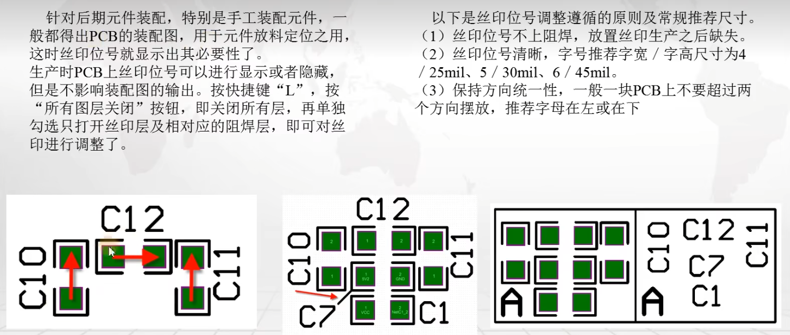

## 1 电气间隙规则

一般最小设置为6mil、铺铜跟其他的间隙10mil

## 2 线宽规则

信号线一般选择6mil、8mil

线宽和载流关系（大部分都是1Oz）

## 3 过孔规则

下图是嘉立创过孔、钻孔工艺、过孔盖油参数

过孔内径一般设置有 8mil、10mil、12mil、16mil、20mil、24mil

过孔外径计算公式： （2 * 过孔内径）- 2mil 或 （2 * 过孔内径）+ 2mil

我们一般使用：内径12mil、外径22mil

设置完成之后，还需进行默认设置和盖油设置

## 4 面规则

## 5 阻焊规则

1. 阻焊选择2.5mil，可以给单片机引脚中间留出一些盖油，反正引脚粘连。

2. 一定不能选盖油，否则就不会油阻焊。只有过孔盖油，其他焊盘都不。

## 6 丝印规则

丝印推荐大小

- 丝印到焊盘最小2mil

   

- 丝印到丝印最小2mil

   

## 参考

[参考1： AltiumDesigner PCB设计规则深入解析（中文说明）](https://www.gofarlic.com/techArticleDetail?noticeId=146965)

[参考2： 设计规则参考](https://blog.51cto.com/u_16213612/11900791)

[参考3： 嘉立创PCB工艺参数](https://www.jlc.com/portal/vtechnology.html?spm=PCB.Neworder)