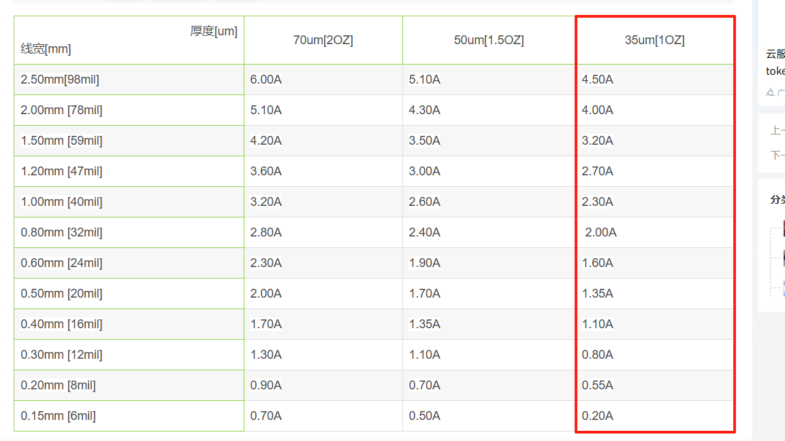
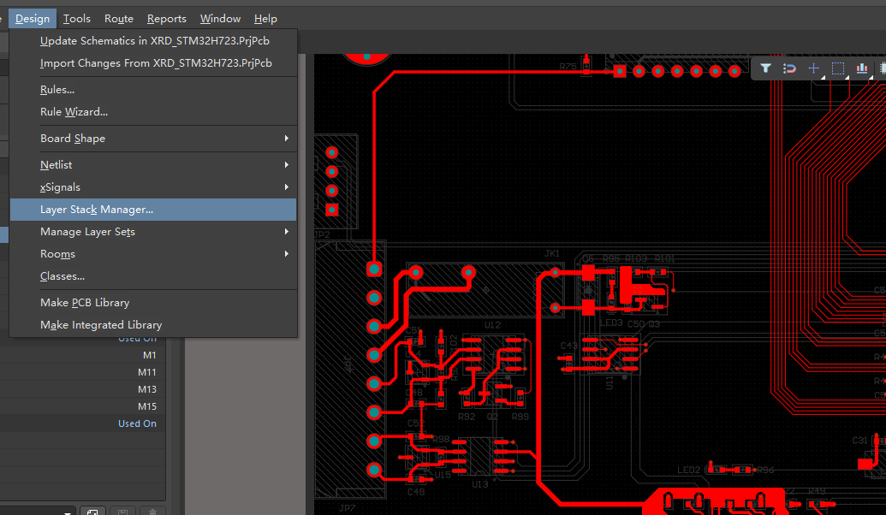
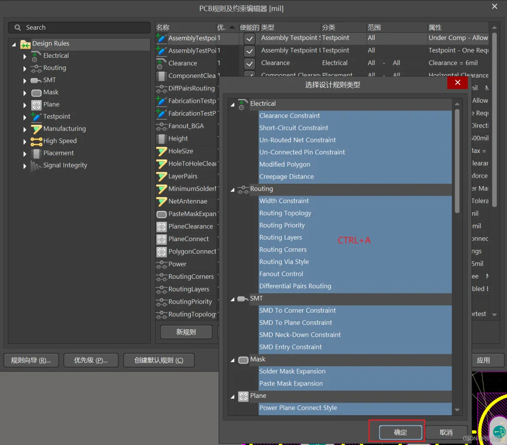

## 1 电气间隙规则

一般最小设置为6mil、铺铜跟其他的间隙10mil

## 2 线宽规则

信号线一般选择6mil、8mil

线宽和载流关系（大部分都是1Oz）

## 3 过孔规则

下图是嘉立创过孔、钻孔工艺、过孔盖油参数

过孔内径一般设置有 8mil、10mil、12mil、16mil、20mil、24mil

过孔外径计算公式： （2 * 过孔内径）- 2mil 或 （2 * 过孔内径）+ 2mil

我们一般使用：内径12mil、外径22mil

设置完成之后，还需进行默认设置和盖油设置

## 4 阻焊规则

1. 阻焊选择2.5mil，可以给单片机引脚中间留出一些盖油，反正引脚粘连。

2. 一定不能选盖油，否则就不会油阻焊。只有过孔盖油，其他焊盘都不。

## 5 丝印规则

丝印推荐大小

- 丝印到焊盘最小2mil

   

- 丝印到丝印最小2mil

   

## 6 四层板层叠设置

Design -> Layer Stack Manager

注意：Dielectric 是电介质，介于Top Layer与Bottom Layer之间的绝缘材料，不用进行操作。四层板设计需要在Top Layer与Bottom Layer之间添加两层中间层。

如下图所示，创建第一个负片层，选择Top Layer所在行 -> 右键选择Insert layer below -> 选择Plane

下面是层叠管理，中间层选择类型：

| 可选类型               | 含义         | 说明与应用                                                                                        |
| ------------------ | ---------- | -------------------------------------------------------------------------------------------- |
| **Signal**         | 信号层（正片层）   | 和 **Top Layer**、**Bottom Layer** 一样，是用来走信号线的铜层；在多层板中，Signal 层可以放高速信号、差分对、时钟线等。               |
| **Plane**          | 平面层（负片层）   | 用于电源（VCC、3V3）或地（GND）的整面敷铜；**负片**表示设计时只画“留空”的地方，实际生产时整面是铜，空白区域是去掉的部分。常用于 4 层及以上 PCB 的内层供电和接地。 |
| **Core**           | 基材         | 制作 PCB 的基础材料，双面都包铜（Copper Clad Laminate, CCL），有固定厚度和硬度，起绝缘和支撑作用。多层板里，**Core 是内层铜+绝缘基板的组合**。  |
| **Prepreg**        | 半固化片（绝缘胶片） | 多层板层压时，用来粘合内层铜板（Core）之间的绝缘材料，同时提供电气绝缘；加热压合后固化成绝缘层。                                           |
| **Copper Plating** | 镀铜         | 表示在孔或外表面增加铜厚的工艺，不是一个“材料层”，所以在 AD 中通常不选作中间层类型。通常不使用                                         |

1. **Signal**：这是正片层，也就是画线（走线）地方就是走铜了。

2. **Plane**：这是负片层，画线的地方是没有铜，其他未画线的地方有铜。

设置GND层和POWER层的内缩值，GND层内缩20mil，PWR层内缩设置60mil。

要取消勾选Stack Symmetry层叠对称性，否则设置GND的内缩的时候，PWR内缩会设置成一样参数

同理，POWER层内缩：

## 7 面规则

### 7.1 PlaneConnect

**PlaneConnect**是负片层覆铜与过孔和焊盘连接方式。

十字连接容易出现孤铜，一般选择直接连接。

### 7.2 PlaneClearance

**PlaneClearance**是负片层与过孔和焊盘直接的间隙。（过孔和焊盘不属于负片层网络的时候，需要有间隙隔离开负片层）

一般设置为7mil

下图是过孔GND在PWR03层间隙7mil

### 7.3 PolygonConnect

**PolygonConnect**是正片层过孔和焊盘与覆铜的连接方式设置。

## 8 差分走线

## 10 导入导出规则

通过上面的PCB规则配置，基本上已经满足我们的需求了，但是每个PCB工程都需要重新配置一遍规则未免太麻烦了。所以我们需要学会PCB规则导入与导出，只需要设置好一遍以后，后面进行PCB设计时，只需要将之前配置好的规则导入即可。

### 10.1 PCB规则导出

点击设计->规则->Design Rules那里右击鼠标，选择Export Rules导出规则。 

点击Export Rules后Ctrl+A全选规则，点击确定，将RUL文件保存到本地路径即可。

### 10.2 PCB规则导入

点击设计->规则->Design Rules那里右击鼠标，选择Import Rules导入规则。  

点击Import Rules后Ctrl+A同样全选规则，点击确定，选择本地保存的RUL文件即可导入规则。

## 参考

[参考1： AltiumDesigner PCB设计规则深入解析（中文说明）](https://www.gofarlic.com/techArticleDetail?noticeId=146965)

[参考2： 设计规则参考](https://blog.51cto.com/u_16213612/11900791)

[参考3： 嘉立创PCB工艺参数](https://www.jlc.com/portal/vtechnology.html?spm=PCB.Neworder)

[参考4： AD四层板设计（Altium Designer）](https://blog.csdn.net/weixin_44887565/article/details/130839479)