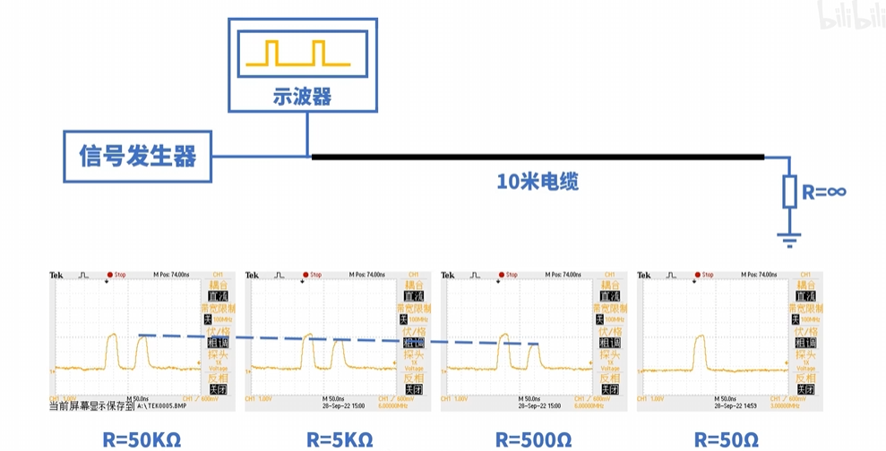
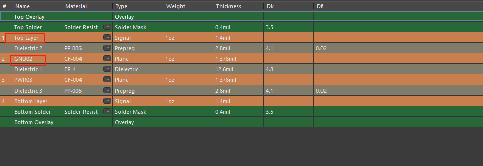
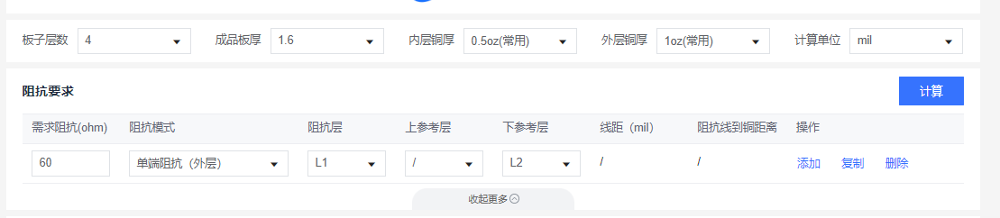
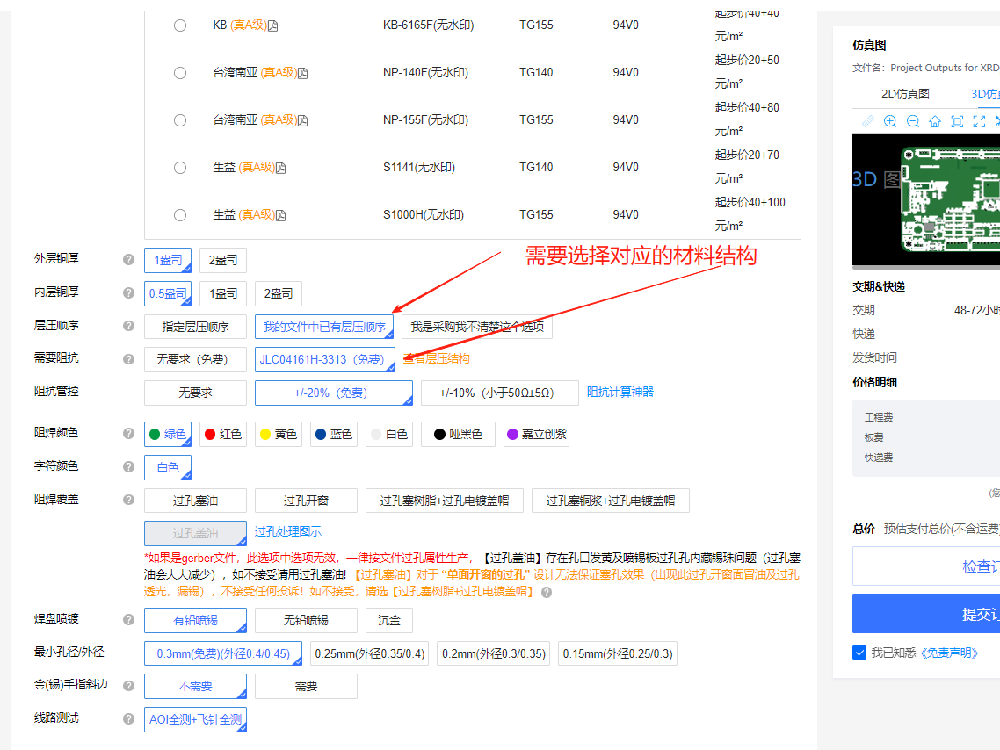
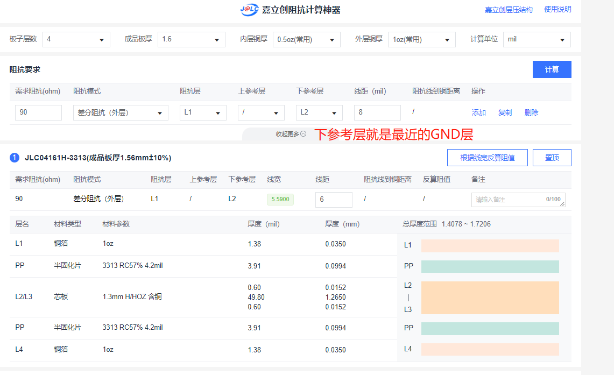

## 1 阻抗匹配

阻抗要求是为确保电路板上高速性号的完整性而提出，它对高速数字系统正常稳定运行起到了关键性因素，在高速系统中，关键信号线不能当成是普通的传输线来看待，必需要考虑其特性阻抗，若关键传输线的阻抗没有达到匹配，可能会导致信号反射、反弹，损耗，原本良好的信号波形变形（上冲、下冲、振铃现象），其将直接影响电路的性能甚至功能。

下面示波器、信号发射器、同轴电缆都是50Ω，如果10米同轴电缆另一个的电阻接不通阻值，回造成高速信号反射。所以必须要阻抗匹配。

## 2 单端阻抗

**单端阻抗**是信号线与地（或者参考平面）之间的阻抗。

嘉立创阻抗计算单端阻抗（外层）的时候，如果是多层板，比如第一层阻抗计算，下参考层就是最层地平面（比如L2层）。

## 3 差分阻抗

**差分阻抗**是两根信号线之间的阻抗。适用于差分信号（两根信号线上的信号电压相反）传输的情况。

### 3.1 常用阻抗

RJ45网口：100

USB：90