## 1  二极管特性

1. 正向偏置导通后，硅管的管压降约为0.7V，锗管的管压降约为0.3V。

2. 注意反向击穿电压。

3. 电路符号。

    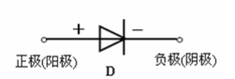

## 2 PN结形成

P（Positive）型和N（Negative）型可根据它们的载流子（载流子说得比较学术，其实就是导体里面能流动的带电粒子，为电子或者是空穴，空穴可以看作是带正电的电子）来区分。

- P型掺杂三价元素主要包括硼（B）、铝（AI），容易得到自由电子，变成负离子。

- N型掺杂五价元素主要是磷（P），容易失去自由电子，变成是正离子。

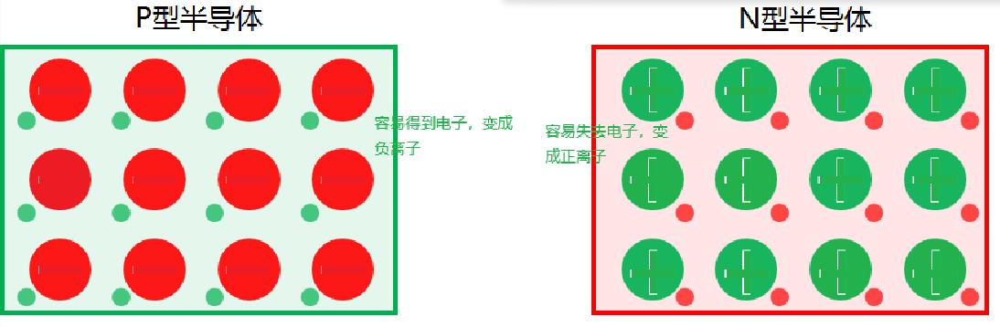

当P型半导体和N型半导体相接触时，由于两种半导体的掺杂原子种类和浓度不同，会产生电子和空穴的扩散运动。在P型半导体中，空穴浓度较高，电子浓度较低，而在N型半导体中，电子浓度较高，空穴浓度较低。

由于电子和空穴的扩散运动，P型半导体和N型半导体之间形成了一个电势差，并产生了电场。这个电势差和电场在PN结的两侧形成了一个电势垒。

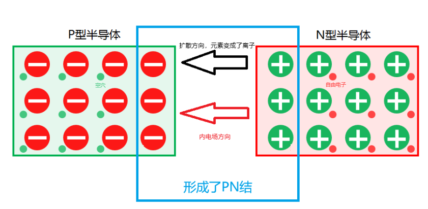

### 1.1 PN结接正向电压

当PN结接正向电压时，即P型区接电源的正极，N型区接电源的负极。这时外加电源形成的电场就会与内电场方向相反，而当外电场的强度超过内电场的时候，PN结就导通了，这时电子就可以从PN结通过。

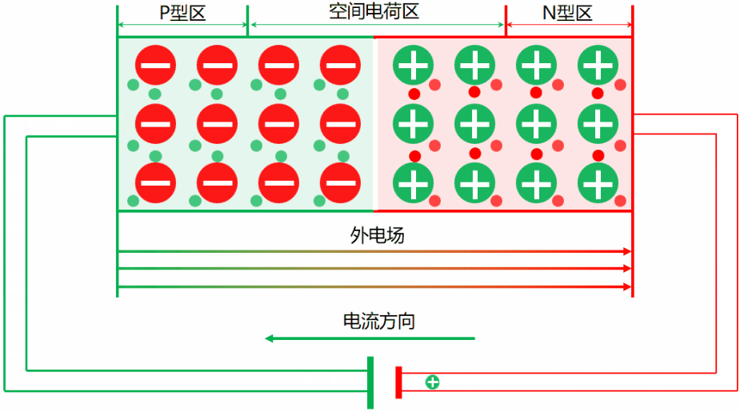

### 1.2 PN结接反向电压

当PN结接反向电压时，P型区的空穴会被电子抵消掉，而N型区电子会流动到电源的正极，这样一来，会有助于内电场强度增强，更不利于电子通过PN结。内电场不停地增强，会超过外部电源形成的电场强度，超过之后，电子就不能够通过PN结了。在外部看来，就是反向电阻无穷大了。

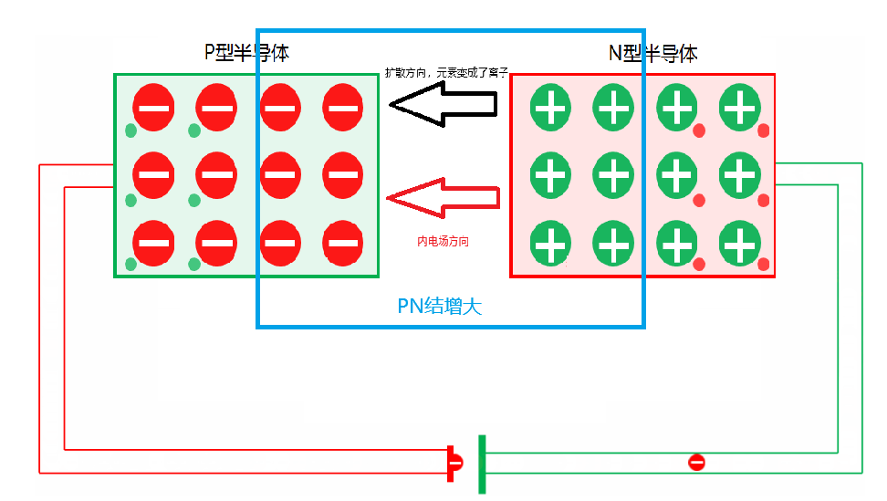

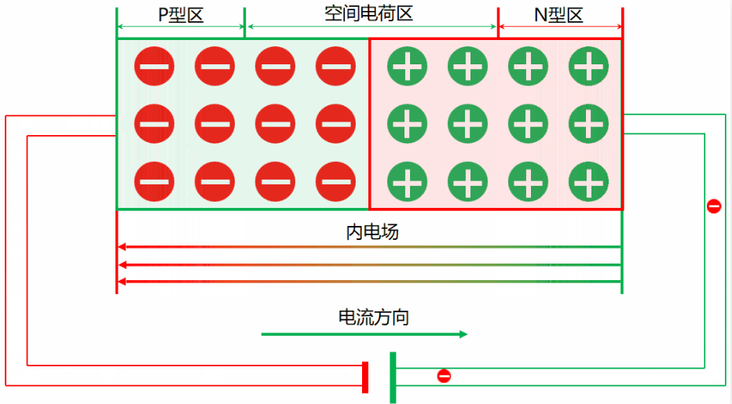

## 2 二极管的伏安特性

二极管的伏安特性是指加在二极管两端电压和流过二极管的电流之间的关系，用于定性描述这两者关系的曲线称为伏安特性曲线。通过晶体管图示仪观察到硅二极管的伏安特性如下图所示。

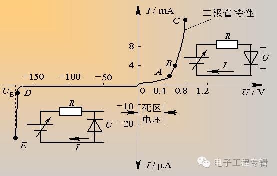

1. 当外加正向电压超过死区电压时，PN结内电场几乎被抵消，二极管呈现的电阻很小，正向电流开始增加，进入正向导通区，但此时电压与电流不成比例如AB段。随外加电压的增加正向电流迅速增加，如BC段特性曲线陡直，伏安关系近似线性，处于充分导通状态。

2. 二极管导通后两端的正向电压称为正向压降(或管压降)，且几乎恒定。硅管的管压降约为0.7V，锗管的管压降约为0.3V。

3. 当反向电压增大到一定数值时(图中D点)，反向电流急剧加大，进入反向击穿区，D点对应的电压称为反向击穿电压。二极管被击穿后电流过大将使管子损坏，因此除稳压管外，二极管的反向电压不能超过击穿电压。

## 3 肖特基二极管

肖特基二极管比普通二极管具备以下特性：

1. 具有低正向压降。肖特基二级管端子上有一个小的电压降。普通二极管的电压压降在0.6V-1.7V之间，而肖特基二极管的电压降通常在0.15V-0.45V之间。

2. 非常快速的开关动作。这种较低的电压降提供了更好的系统效率和更高的开关速度。在肖特基二极管中，半导体和金属之间形成了一个半导体-金属结，从而形成了肖特基势垒。N型半导体作为阴极，金属侧作为二极管的阳极。这种肖特基势垒导致低正向电压降和非常快速的开关。

    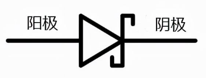

### 3.1 肖特基二极管伏安特性曲线

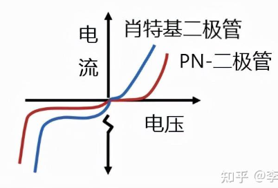

1. 肖特基二极管的正向压降比普通的PN结二极管低。

2. 由于存储电荷量少，恢复时间快，这意味着它可以用于高速开关应用。

### 3.2 肖特基二极管用途举例

常用的肖特基二极管

| 型号         | 最大反向耐压 VR | 平均整流电流 IF(av) | 正向压降 Vf (典型) | 封装           |
| ---------- | --------- | ------------- | ------------ | ------------ |
| **1N5817** | 20V       | 1A            | \~0.45V      | DO-41（直插）    |
| **1N5819** | 40V       | 1A            | \~0.45V      | DO-41（直插）    |
| **1N5822** | 40V       | 3A            | \~0.5V       | DO-201AD（直插） |
| **1N5825** | 40V       | 5A            | \~0.55V      | DO-201AD（直插） |
| **SS24**   | 40V       | 2A            | \~0.5V       | SMA（贴片）      |
| **SS34**   | 40V       | 3A            | \~0.5V       | SMB（贴片）      |
| **SS54**   | 40V       | 5A            | \~0.55V      | SMB（贴片）      |

**1. 二极管整流**

高频开关电源、DC-DC 转换器等场合，用于快速整流输出，因为恢复时间快（ns 级）。

**2. 续流作用**

在降压（Buck）、升压（Boost）、电机驱动等电路中，当开关器件关断时，肖特基为电感电流提供回路。

**3. 反接保护**

低压电路中用作输入端防反接保护，因压降低损耗少；

**4. 防反灌**

并联到电源输出端防止电流倒灌。

**5. 信号钳位保护**

MCU GPIO、通信接口。

## 4 稳压二极管（齐纳二极管）

‌齐纳二极管（又称稳压二极管）的工作原理是利用PN结的反向击穿特性，在反向电压达到击穿电压（齐纳电压）时，电流急剧增大而电压保持稳定，从而实现稳压功能。

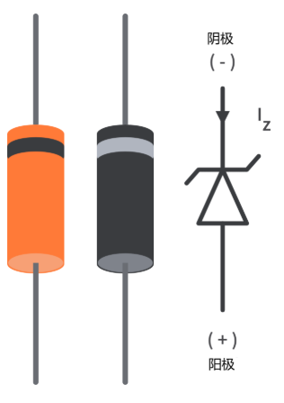

电路符号

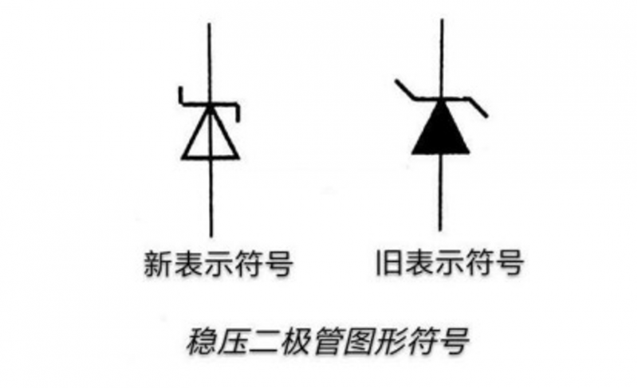

### 4.1 什么是齐纳二极管

齐纳二极管与普通二极管之间的区别主要有2点：

1. 掺杂程度。简单二极管是中度掺杂，齐纳二极管是重掺杂，以实现更高的击穿电压。掺杂程度的不同这有助于它们在不同电压水平下工作的规格。

2. 导电情况，由于齐纳二极管高掺杂，与普通二极管的PN结相比，齐纳二极管PN结的耗尽层很薄，这为齐纳二极管提供了特殊的特性，在正向和反向偏置条件下都可以导电。

### 4.2 齐纳二极管工作原理

齐纳二极管工作在反向偏置区，超过Vz开始工作，使得电压稳定在Vz。

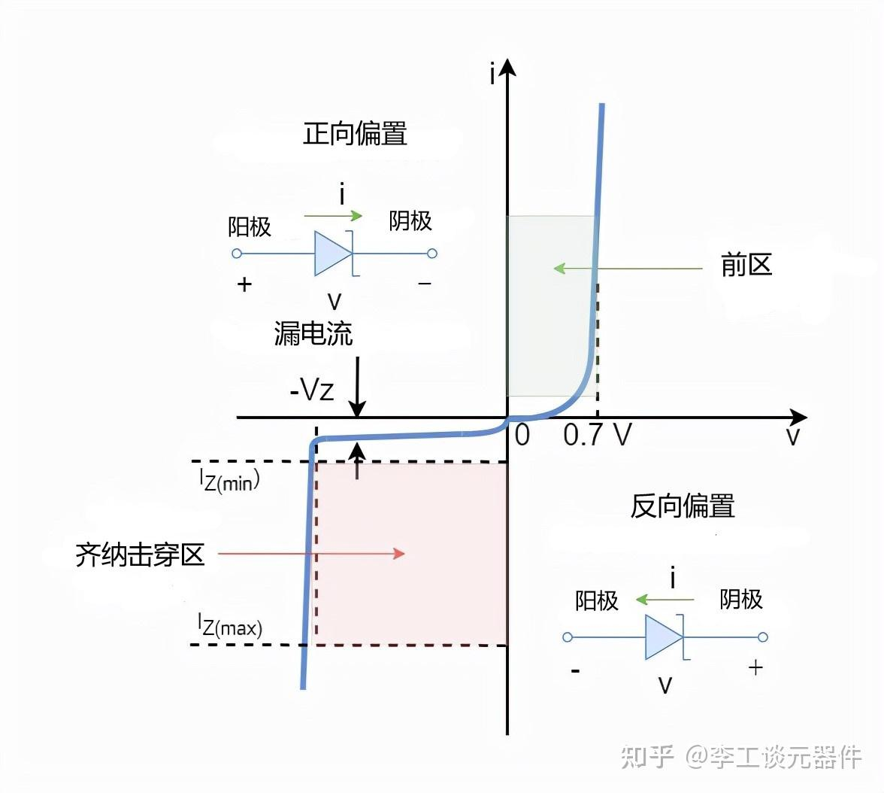

### 4.3 齐纳击穿和雪崩击穿

- 齐纳击穿：在强电场作用下，价带电子隧穿效应跃迁到导带，形成导电。发生在高掺杂、结宽较窄的PN结中。

- 雪崩击穿：在高反向电压下，少数载流子加速，撞击价带电子，产生碰撞电离，形成电子倍增效应。发生在轻掺杂、结宽较宽的PN结中。

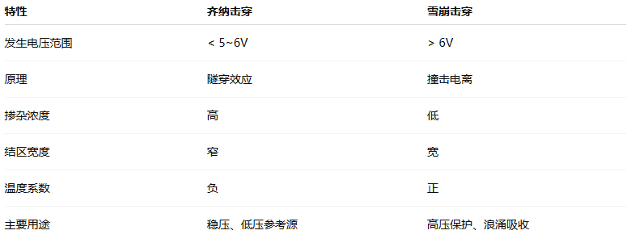

## 5 TVS瞬态抑制二极管

瞬态抑制二极管是在稳压二极管的工艺上发展起来的,一种用途广泛的高效能保护器件。

当TVS二极管的两极受到反向瞬态高能量冲击时，它能以皮秒量级的速度，将其两极间的高阻抗变为低阻抗，吸收瞬间大电流，使两极间的电压钳位于一个预定值，有效地保护后端的电子元器件不被损坏，可用于防雷击、防过压、防静电、吸收浪涌电流等。

按极性分为单极性和双极性两种：

1. 双向TVS适用于交流电路。
   
2. 单向TVS适用于直流电路。

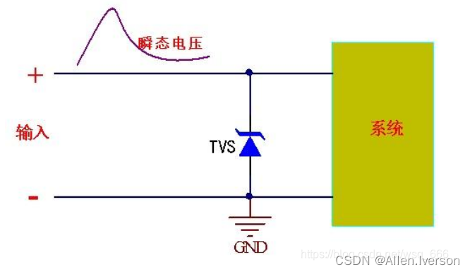

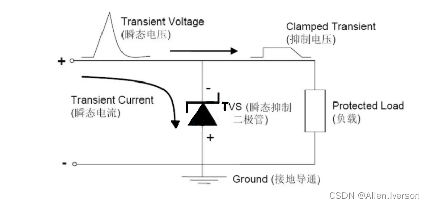

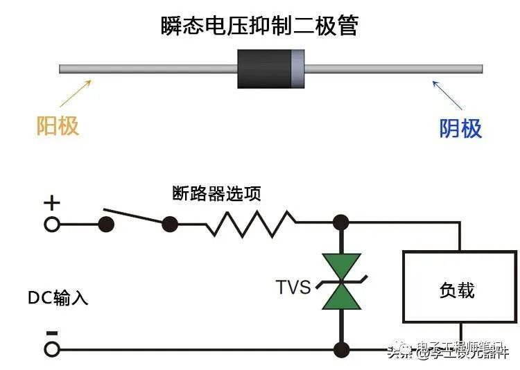

### 5.1 关键参数

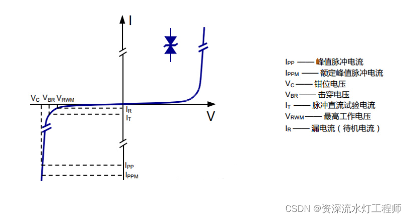

TVS二极管基本是工作在反向偏执的情况，所以X轴正半轴基本就不用看了。

1. Vrwm：TVS二极管的最高反向工作电压，就是只要不超过这个电压，TVS二极管的漏电流都保持在很小的范围；
2. Vbr：TVS二极管的击穿电压，到了这个电压，TVS二极管的反向电流开始增加，雪崩击穿快发生了；
3. Vc：TVS二极管的钳位电压，就是二极管击穿之后，二极管能保持的一个电压；
4. Ipp：是峰值脉冲电流，所对应的就是钳位电压，也就是TVS二极管被击穿后，达到钳位电压时，所对应的电流；
5. Ippm：额定峰值脉冲电流，超过这个电流，TVS二极管就可能被干废了。

## 6 续流二极管

快恢复二极管、肖特基二极管都可以作为续流二极管使用。

续流二极管（Freewheeling Diode）是一种常用的电子元件，主要用于电路中的续流和保护。它通常与电感、变压器等元件一起使用，以实现能量的转换和传输。

配合感性负载使用，吸收感性负载的反电动势。续流二极管在电路中反向并联在继电器或电感线圈的两端,当电感线圈断电时其两端的电动势并不立即消失,此时残余电动势通过一个二极管释放,起这种作用的二_极管叫续流二极管。

### 6.1 续流二极管继电器电路使用

续流二极管主要起到为较大的感应电压提供一个由感应电压和续流二极管共同组成的泄放回路，使得感应电压在回路中以电流方式消耗掉，从而保护电路中元件不被感应电压损坏。较大的感应电压一般是由于感性负载（例如继电器线圈）失电引起的。在电路中一般选择快速恢复二极管或者是肖特基二极管作为续流二极管。特别需要注意的是续流二极管的极性不能接反，否则不仅起不到保护作用，还会形成短路。

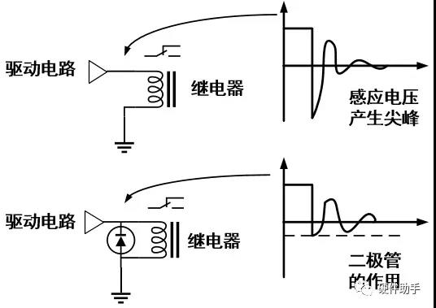

### 6.2 续流二极管降压电路使用

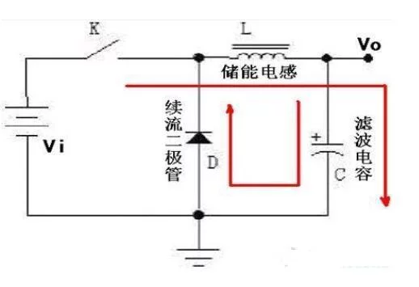

## 参考

[参考1： 二级管工作原理（PN结原理）学习](https://www.cnblogs.com/endlesscoding/p/6766843.html)

[参考2： 什么是肖特基二极管？肖特基二极管工作原理详解](https://zhuanlan.zhihu.com/p/501004353)

[参考3： 稳压二极管（齐纳二极管）](https://zhuanlan.zhihu.com/p/506517518)

[参考4： 一文读懂瞬态抑制二极管工作原理！](https://www.eet-china.com/mp/a178044.html)

[参考5: 二极管：TVS瞬态抑制二极管](https://blog.csdn.net/m0_49968063/article/details/134792144)