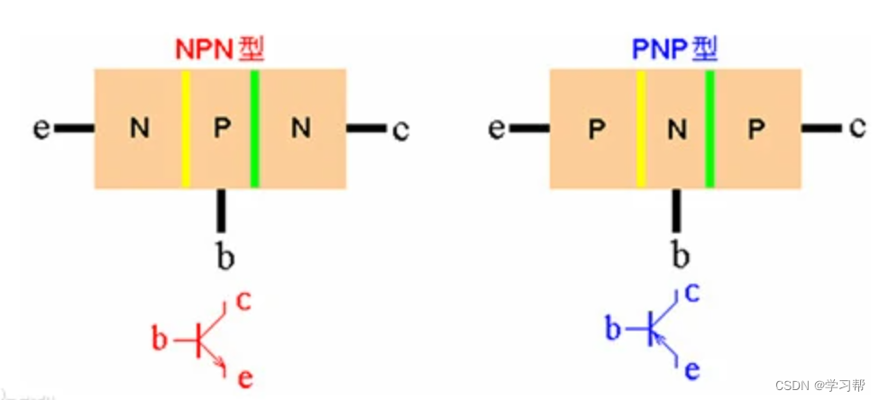
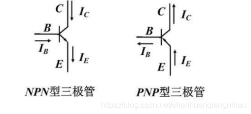
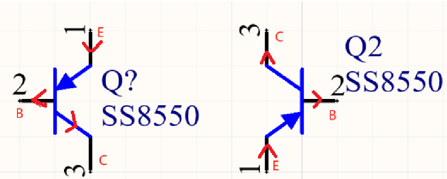
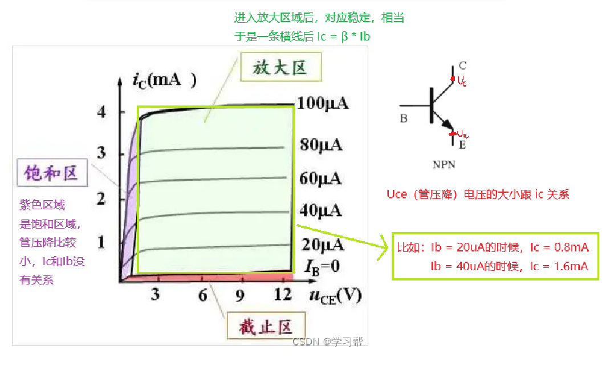
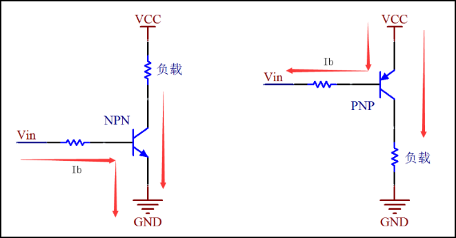
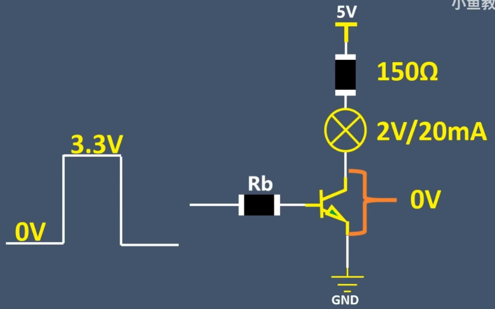
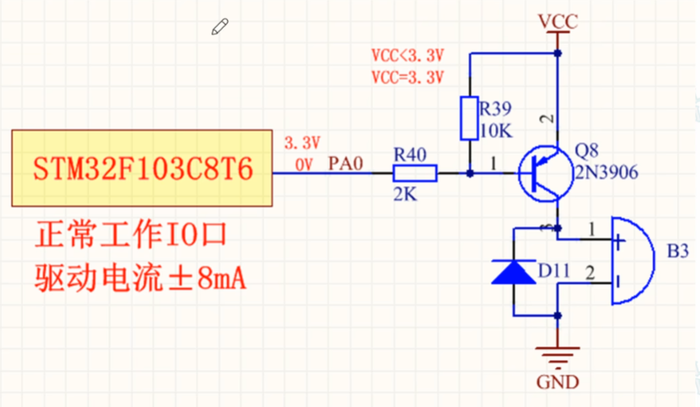
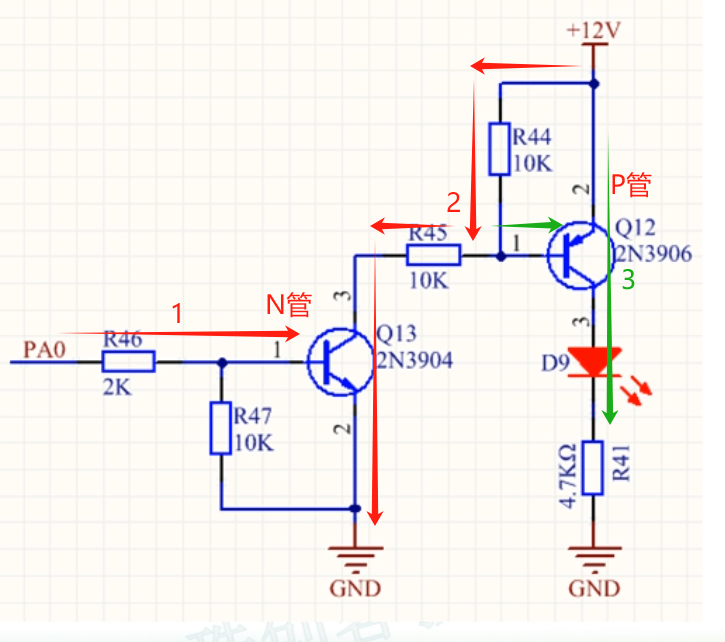
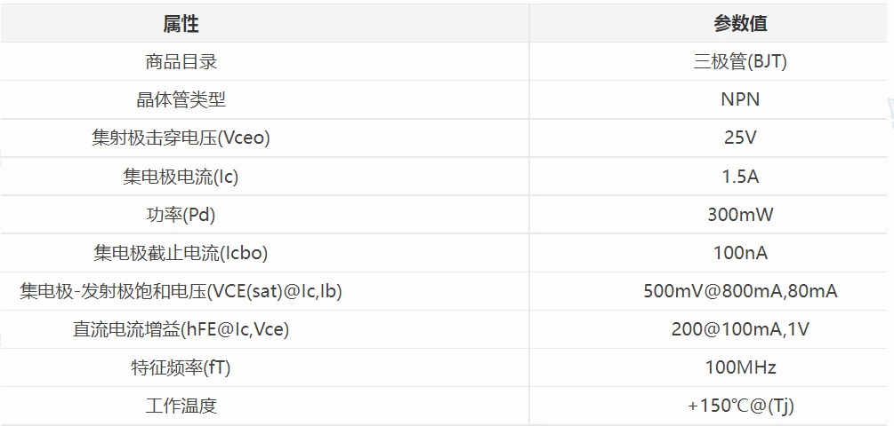

## 1 三极管基本概念

1. NPN三极管被控部分放在集电极C，是因为$V_{BE} \approx 0.7\,\text{V}$导通，如果放在下部，需要考虑被控部分损耗电压才能确定是否导通，此时导通电压就会大于0.7V。

2. PNP三极管被控部分放在集电极原因和NPN一样。

3. NPN三极管BE通常加10K电阻是为了在截止的时候，可以把基极固定在 低电平，保证三极管在无控制信号时可靠截止。
   
   有时候基极是由单片机或逻辑芯片驱动的。当驱动端口变成高阻态时，基极上残余的电荷没有地方泄放，会让三极管维持导通一段时间。加一个 10k 电阻相当于提供了一个 泄放电流的通道，让三极管快速关闭。

## 2 NPN三种工作状态

### 2.1 NPN截止状态

- 条件：$V_{BE} < 0.6\,\text{V}$

- 特性：三极管不导通，$I_C \approx 0$

- 管压降：$V_{CE} \approx V_{CC}$

### 2.2 NPN放大状态

- 条件：$V_{BE} \approx 0.7\,\text{V}$，且 $V_{CE} > V_{CE(sat)}$

- 集电极电流：$I_C = \beta I_B$

- 发射极电流：$I_E = I_B + I_C = (\beta + 1) I_B$

- 管压降（假设发射极接地）：$V_{CE} = V_{CC} - I_C R_C$

### 2.3 NPN饱和状态

- 条件：$V_{BE} \approx 0.7\,\text{V}$ 且 $I_B$ 足够大

- 特性：三极管完全导通，$I_C < \beta I_B$

- 管压降（饱和压降）：$V_{CE(sat)} \approx 0.1 \sim 0.3\,\text{V}$

## 3 PNP三种工作状态

对于 PNP 三极管：

- 电流方向为：
  - 发射极 → 基极：$I_E$
  - 发射极 → 集电极：$I_C$
  - 基极电流：$I_B$ 向外流出

- 电流关系式：
$$
I_E = I_C + I_B
$$
$$
I_C = \beta I_B
$$

---

### 3.1 PNP截止区

- **条件：**
  - $V_{EB} < 0.6\,\text{V}$（基极电压高于发射极不足以导通）
  - 三极管不导通

- **特性：**
  - $I_E \approx 0$
  - $I_C \approx 0$

- **管压降（发射极对集电极）**：
$$
V_{EC} \approx V_{CC}
$$

---

### 3.2 PNP放大区

- **条件：**
  - $V_{EB} \approx 0.6 \sim 0.7\,\text{V}$
  - 且 $V_{EC} > V_{EC(sat)}$

- **特性：**
  - $I_C = \beta I_B$
  - $I_E = (\beta + 1) I_B$

- **电压关系（基极比发射极电压低约 0.6~0.7V）**：
$$
V_{EB} = V_E - V_B \approx 0.7\,\text{V}
$$

- **电压降（集电极负载 $R_C$，假设发射极连接电源 $V_{CC}$）：**
$$
V_{EC} = V_E - V_C = V_{CC} - I_C R_C
$$

---

### 3.3 PNP饱和区

- **条件：**
  - $V_{EB} \approx 0.7\,\text{V}$，且 $I_B$ 足够大
  - $I_C < \beta I_B$

- **特性：**
  - 三极管充分导通
  - 管压降最小

- **饱和压降（典型值）：**
$$
V_{EC(sat)} \approx 0.1 \sim 0.3\,\text{V}
$$

---

## 4 三极管输出伏安特性曲线

## 5 用作开关的基本电路

### 5.1 NPN 开关电路

#### 5.1.1 导通过程

1. STM32的PA0口电压为3.3v时，be导通→ce导通→蜂鸣器发声

2. STM32的PA0口电压为0v时，be截止→ce截止→蜂鸣器无声

#### 5.1.2 基极电阻大小选择

基极电阻大小的选择，也就是上图的R37

假设PA0的低电平为0，高电平为3.3v；灯（同上的蜂鸣器）的参数2V/20mA

为了让三极管CE间的电压尽可能小，三极管处于一个深度饱和的状态。

$$
\text{灯的限流电阻为 } \frac{5\,\text{V} - 2\,\text{V}}{20\,\text{mA}} = 150\,\Omega
$$

$$
\text{一般 } I_B = \frac{1}{10} I_C = 2\,\text{mA}，\text{三极管导通电压 } V_{BE} = 0.7\,\text{V}
$$

$$
R_b = \frac{3.3 - 0.7}{2\,\text{mA}} = 1.3\,\text{k}\Omega
$$

#### 5.1.3 下拉电阻

也就是上图中的R38，一般是10K，作用如下：

1. 由于STM32上电时，其状态一般为输入状态，为了让三极管上电时有一个稳定的电平，不会误动作。采用下拉电阻，一般是10K，会分走基级约0.07mA的电流，可以忽略。

2. BE之间有等效电容，下拉电阻也用于放电。

#### 5.1.4 注意事项

1. STM32正常工作的IO口驱动电流为正负8mA，只当做信号，不要用该口去驱动。一方面是电流太小根本驱动不了；另一方是即使驱动，增加单片机的功耗，单片机是一个信号芯片。

2. VCC电压不受单片机IO的限制。简而言之是因为VCC的电流不流向单片机，两者无电气连接，故VCC可以是12V、24V。

### 5.2 PNP 开关电路

只使用PNP三极管，如果调整电阻的大小，可以关掉三极管，但是会存在不能完全关断。基本不会仅使用PNP三极管。

单片机和VCC有电气连接，VCC的电流会流向单片机，VCC的电压值不能超过3.3v

- 单片机无法控制蜂鸣器开关
  
  1. 当单片机的IO口为3.3v时，VCC为5v时，eb导通，蜂鸣器发声。
  
  2. 当单片机的IO口为0v时，VCC为5v时，eb导通，蜂鸣器发声。

-  VCC=12V或者其他更高电压值，经过电阻支路，超过单片机IO的耐压，烧坏单片机的IO口。

### 5.3 NPN驱动PNP

前面说到PNP管（上）驱动有很多问题，上图的双管齐下可以避免这个问题。

1路：PA0→驱动N管

2路：+12V得以导通，P管的基级也有电流

3路：P 管导通，灯亮

## 6 三极管选型

需要特别关注下面的参数

## 参考

[参考1： 一篇文章将三极管讲透：三极管从原理到应用，从参数到特性，从入门到精通](https://blog.csdn.net/qq_40693786/article/details/134416264)

[参考2： NPN和PNP三极管的基本原理及差异](https://blog.csdn.net/u011942101/article/details/143693516)

[参考3： 三极管开关继电器基极电阻大小计算](https://blog.csdn.net/qq_25814297/article/details/109837931)

[参考4：基于三极管的开关电路，STM32](https://blog.csdn.net/Xuexi_touteng/article/details/136310294)