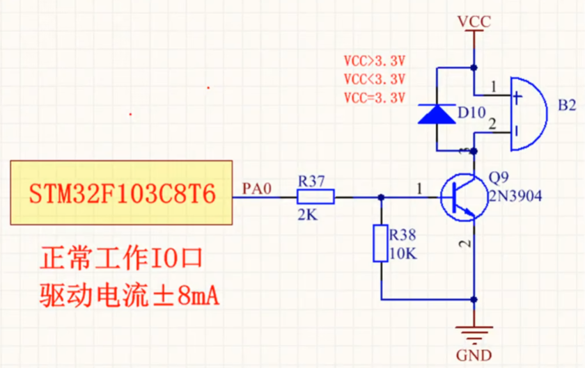

## 1 三极管基本概念

## 2 NPN三种工作状态

### 2.1 NPN截止状态

- 条件：$V_{BE} < 0.6\,\text{V}$

- 特性：三极管不导通，$I_C \approx 0$

- 管压降：$V_{CE} \approx V_{CC}$

### 2.2 NPN放大状态

- 条件：$V_{BE} \approx 0.7\,\text{V}$，且 $V_{CE} > V_{CE(sat)}$

- 集电极电流：$I_C = \beta I_B$

- 发射极电流：$I_E = I_B + I_C = (\beta + 1) I_B$

- 管压降（假设发射极接地）：$V_{CE} = V_{CC} - I_C R_C$

### 2.3 NPN饱和状态

- 条件：$V_{BE} \approx 0.7\,\text{V}$ 且 $I_B$ 足够大

- 特性：三极管完全导通，$I_C < \beta I_B$

- 管压降（饱和压降）：$V_{CE(sat)} \approx 0.1 \sim 0.3\,\text{V}$

## 3 PNP三种工作状态

对于 PNP 三极管：

- 电流方向为：
  - 发射极 → 基极：$I_E$
  - 发射极 → 集电极：$I_C$
  - 基极电流：$I_B$ 向外流出

- 电流关系式：
$$
I_E = I_C + I_B
$$
$$
I_C = \beta I_B
$$

---

### 3.1 PNP截止区

- **条件：**
  - $V_{EB} < 0.6\,\text{V}$（基极电压高于发射极不足以导通）
  - 三极管不导通

- **特性：**
  - $I_E \approx 0$
  - $I_C \approx 0$

- **管压降（发射极对集电极）**：
$$
V_{EC} \approx V_{CC}
$$

---

### 3.2 PNP放大区

- **条件：**
  - $V_{EB} \approx 0.6 \sim 0.7\,\text{V}$
  - 且 $V_{EC} > V_{EC(sat)}$

- **特性：**
  - $I_C = \beta I_B$
  - $I_E = (\beta + 1) I_B$

- **电压关系（基极比发射极电压低约 0.6~0.7V）**：
$$
V_{EB} = V_E - V_B \approx 0.7\,\text{V}
$$

- **电压降（集电极负载 $R_C$，假设发射极连接电源 $V_{CC}$）：**
$$
V_{EC} = V_E - V_C = V_{CC} - I_C R_C
$$

---

### 3.3 PNP饱和区

- **条件：**
  - $V_{EB} \approx 0.7\,\text{V}$，且 $I_B$ 足够大
  - $I_C < \beta I_B$

- **特性：**
  - 三极管充分导通
  - 管压降最小

- **饱和压降（典型值）：**
$$
V_{EC(sat)} \approx 0.1 \sim 0.3\,\text{V}
$$

---

## 4 三极管输出伏安特性曲线

## 5 用作开关的基本电路

### 5.1 负载位置

为什么不管是NPN还是PNP，电路对应的负载要放到集电极C，而没有放到发射极E呢？

因为三极管的输入回路是从基级B控制发射极E，负载如果放到发射极E，那就会对输入回路造成影响。

比如说，Ube>0.7V可以导通，但是由于负载接到了发射极E和GND之间，那么仍然想导通的话B点的电位就不止0.7V了，因为负载也会产生压降。

## 参考

[参考1： 一篇文章将三极管讲透：三极管从原理到应用，从参数到特性，从入门到精通](https://blog.csdn.net/qq_40693786/article/details/134416264)

[参考2： NPN和PNP三极管的基本原理及差异](https://blog.csdn.net/u011942101/article/details/143693516)

[参考3： 三极管开关继电器基极电阻大小计算](https://blog.csdn.net/qq_25814297/article/details/109837931)

