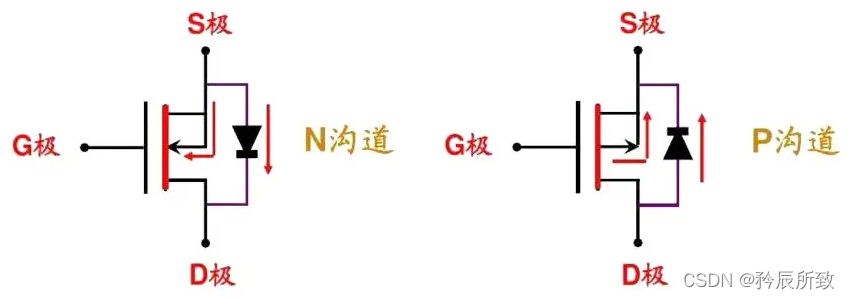
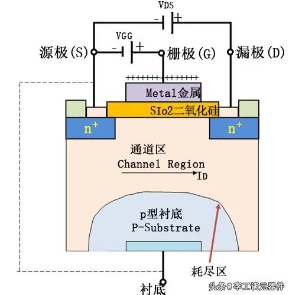
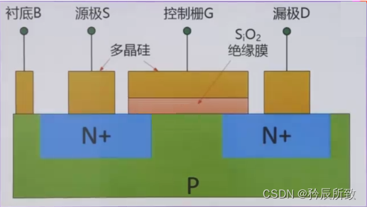
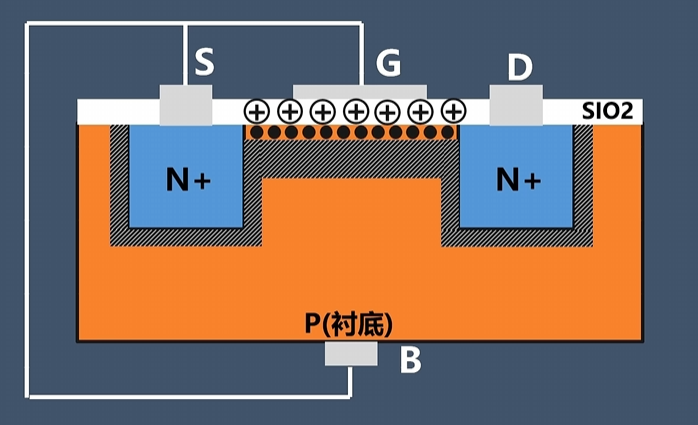
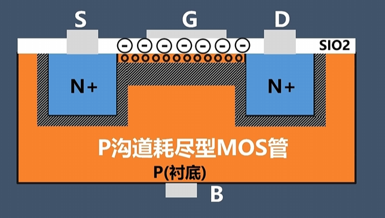
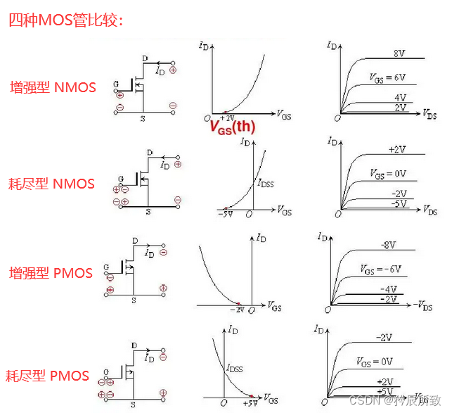
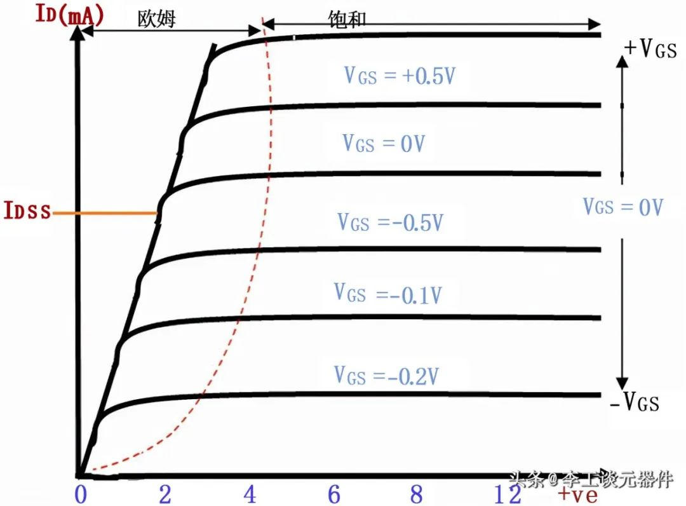

## 1 前言

D(Drain)漏极：载流子（NMOS为负电荷，PMOS为正电荷）离开端。

S(Source)源极：载流子发射端。

G(Gate)珊极：控制MOS开关的管脚。简单理解NMOS高电平导通，PMOS低电平导通。

沟道：D和S之间形成的导电通道。

衬底：向沟道提供电子或从沟道拿电子，与源极连接。

以P型半导体为衬底，在一个 低掺杂容度 的 P 型半导体上，通过扩散技术做出来2块 高掺杂容度 的 N 型半导体，引出去分别作为 源级（S） 和 漏极（D）。

P型衬底在 MOS管内部是和 源级（S）相连。（P材料就是衬底，内部已经跟源极S短接）

在P型衬底和两个N型半导体 之间加一层 二氧化硅（SiO₂）绝缘膜，然后通过多晶硅引出引脚组成栅极（G）。

组成结构如下图（增强型N沟道为例）：

## 2 场效应管和MOS管

- **MOS**：是MOSFET的缩写。MOSFET 金属-氧化物半导体场效应晶体管，简称金氧半场效晶体管（Metal-Oxide-Semiconductor Field-Effect Transistor, MOSFET）。
一般是金属(metal)—氧化物(oxide)—半导体(semiconductor)场效应晶体管，或者称是金属—绝缘体(insulator)—半导体。

- **FET**：场效应晶体管（Field Effect Transistor缩写(FET)）简称场效应管。它是利用控制输入回路的电场效应来控制输出回路电流的一种半导体器件。由于它仅靠半导体中的多数载流子导电，又称单极型晶体管。
  
  场效应管属于电压控制型半导体器件。具有输入电阻高、噪声小、功耗低、动态范围大、易于集成、没有二次击穿现象、安全工作区域宽等优点。

  场效应管主要有两种类型：

    1. 结型场效应管（junction FET—JFET)（不是本文讨论范围）。
    
    2. 金属 - 氧化物半导体场效应管（metal-oxide semiconductor FET，简称MOS-FET）（本文的主角）。

## 3 MOS管分类

按材料分类，可以分为分为耗尽型和增强型：

- 增强型管：栅极-源极电压 Vgs 为零时漏极电流也为零；

- 耗尽型管：栅极-源极电压 Vgs 为零时漏极电流不为零。

## 3.1 增强型

二氧化硅绝缘层没有掺杂任何离子，没有形成的导电沟道，主要靠栅极电压诱导形成。所以栅极-源极电压 Vgs 为零时漏极电流也为零。

## 3.2 耗尽型

N型MOS管是在二氧化硅绝缘层加入了金属正离子（Na+、K+）。所以不通任何电压已有掺杂离子形成的导电沟道。

P型MOS管是在二氧化硅绝缘层加入了金属负离子。所以不通任何电压已有掺杂离子形成的导电沟道。

## 3.3 四种MOS管比较

增强型 PMOS，增强型 NMOS，耗尽型 PMOS，耗尽型 NMOS。

在实际应用中，以 增强型NMOS 和 增强型PMOS 为主。所以通常提到NMOS和PMOS指的就是这两种。

结合下图与上面的内容也能解释为什么实际应用以增强型为主，主要还是电压为0的时候，D极和S极能否导通的问题

## 4 MOS输出特性曲线

为什么没有输入特性：因为有绝缘层的存在，栅极几乎是没有电流，相当于是栅极和衬底是个电容。

## 参考

[参考1： 全面认识MOS管，一篇文章就够了](https://bbs.huaweicloud.com/blogs/375339)

[参考2： 干货 | 这篇文章把MOS管的基础知识讲透了](https://www.oneyac.com/news/detail/6900.html)

[参考3： MOS管各种概念（三个极、沟道、衬底、电流方向、箭头方向、耗尽型和增强型、寄生二极管、封装引脚）](https://blog.csdn.net/qq570437459/article/details/133693417)

https://www.elecfans.com/analog/202306192114417.html

https://zhuanlan.zhihu.com/p/1911728741958268223

https://blog.csdn.net/qq_45420239/article/details/135382655

https://blog.csdn.net/weixin_42328389/article/details/124236340

https://blog.csdn.net/weixin_42328389/article/details/123922558