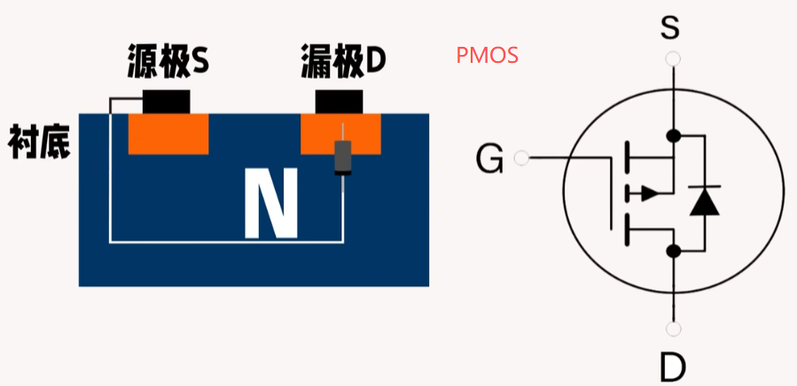

## 1 前言

1. NMOS：一般用大电流控制（如电机驱动），

2. PMOS：一般用作电源开关、电池保护、防反接。

## 2 场效应管和MOS管

- **MOS**：是MOSFET的缩写。MOSFET 金属-氧化物半导体场效应晶体管，简称金氧半场效晶体管（Metal-Oxide-Semiconductor Field-Effect Transistor, MOSFET）。
一般是金属(metal)—氧化物(oxide)—半导体(semiconductor)场效应晶体管，或者称是金属—绝缘体(insulator)—半导体。

- **FET**：场效应晶体管（Field Effect Transistor缩写(FET)）简称场效应管。它是利用控制输入回路的电场效应来控制输出回路电流的一种半导体器件。由于它仅靠半导体中的多数载流子导电，又称单极型晶体管。
  
  场效应管属于电压控制型半导体器件。具有输入电阻高、噪声小、功耗低、动态范围大、易于集成、没有二次击穿现象、安全工作区域宽等优点。

  场效应管主要有两种类型：

    1. 结型场效应管（junction FET—JFET)（不是本文讨论范围）。
    
    2. 金属 - 氧化物半导体场效应管（metal-oxide semiconductor FET，简称MOS-FET）（本文的主角）。

## 3 MOS管分类

## 3.1 增强型

二氧化硅绝缘层没有掺杂任何离子，没有形成的导电沟道，主要靠栅极电压诱导形成。所以栅极-源极电压 Vgs 为零时漏极电流也为零。

## 3.2 耗尽型

工艺组成结构如下图（增强型N沟道为例）：

1. P型半导体为衬底，N型半导体为两极，源极S与衬底连通。（源极S和衬底内部直接短接）

2. 在P衬底和N型半导体之间加一层二氧化硅（SiO₂）绝缘膜，然后通过多晶硅引出引脚组成栅极（G）。

### 3.2.1 NMOS

1. D漏极接正极、S源极接负情况下。如果G栅极不施加正向电压，电流是无法导通，因为有DS直接有两个PN结存在。

    

2. G栅极施加正向电压，吸引P型半导体中的电子到顶部区域，形成N沟道，MOS管导通。

3. NMOS管的体二极管。因为衬底和源极S直接连接，所以S->D存在一个PN结二极管。这时候S施加正向电压，N施加负电压，MOS管会直接导通（无论是否在栅极施加电压），栅极不施加电压的情况下，压降就是一个0.7V二极管压降。
    
    

### 3.2.2 PMOS

1. PMOS是通过空穴，使得MOS管导通。通过空穴导通不如NMOS的效率高，所以PMOS的功耗较高。

2. 如果PMOS的漏极D施加正电压，S源极施加负电压，PMOS直接导通，会使得MOS管失去开关作用，因为存在体二极管。

P型MOS管是在二氧化硅绝缘层加入了金属负离子。所以不通任何电压已有掺杂离子形成的导电沟道。

## 3.3 四种MOS管比较

增强型 PMOS，增强型 NMOS，耗尽型 PMOS，耗尽型 NMOS。

在实际应用中，以 增强型NMOS 和 增强型PMOS 为主。所以通常提到NMOS和PMOS指的就是这两种。

结合下图与上面的内容也能解释为什么实际应用以增强型为主，主要还是电压为0的时候，D极和S极能否导通的问题

## 4 MOS输出特性曲线

为什么没有输入特性：因为有绝缘层的存在，栅极几乎是没有电流，相当于是栅极和衬底是个电容。

## 5 增强型NMOS用法

### 5.1 NMOS开关作用

### 5.2 NMOS防反接

### 5.3 NMOS驱动电机

1N5824最好并联一个电容，防止电机电感放电过程中VCC波动。

## 6 增强型PMOS用法

### 6.1 PMOS开关电源

### 6.2 PMOS防反接

## 参考

[参考1： 全面认识MOS管，一篇文章就够了](https://bbs.huaweicloud.com/blogs/375339)

[参考2： 干货 | 这篇文章把MOS管的基础知识讲透了](https://www.oneyac.com/news/detail/6900.html)

[参考3： MOS管各种概念（三个极、沟道、衬底、电流方向、箭头方向、耗尽型和增强型、寄生二极管、封装引脚）](https://blog.csdn.net/qq570437459/article/details/133693417)
