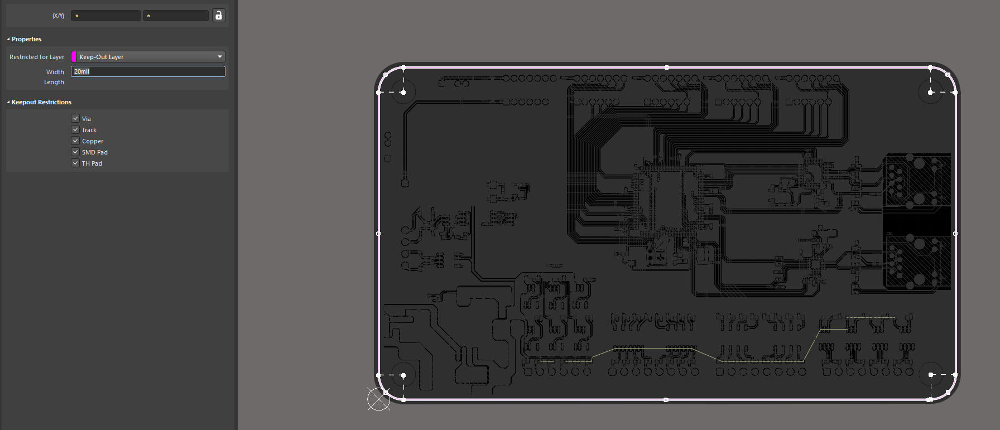
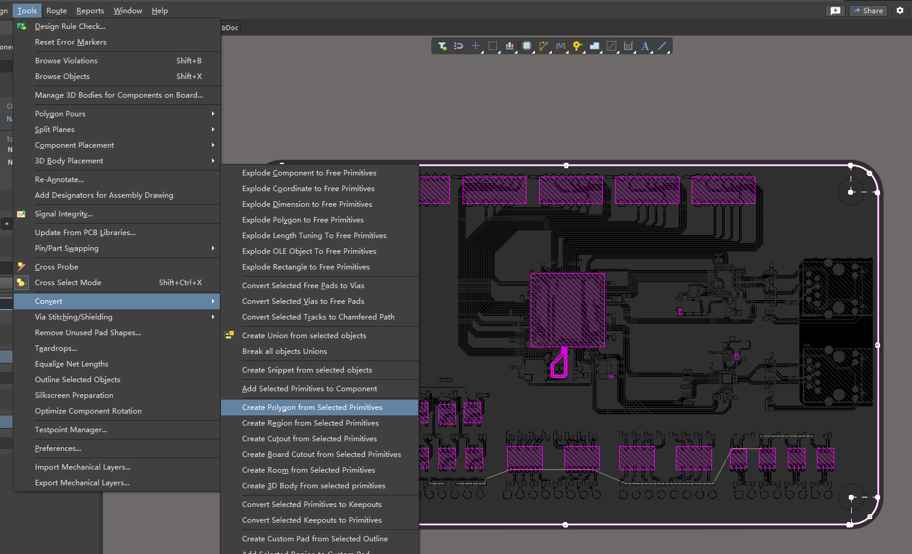
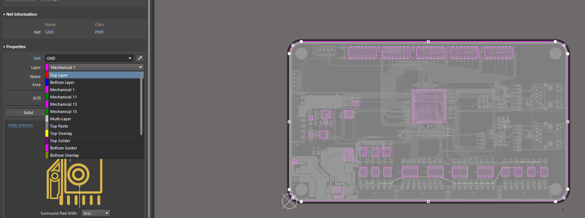
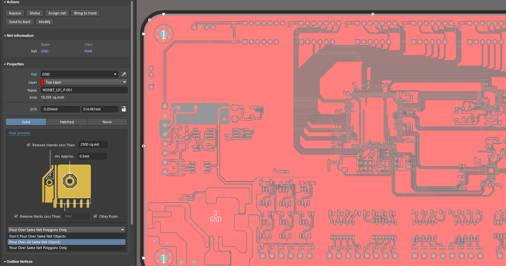

## 1 基础

- 电生磁：安培定则（右手螺旋定则）

- 磁生电：法拉第电磁感应定律（右手定则）

### 1.1 安培定则（安培螺旋定则）

通电导线（无论电流是否恒定或者变化）周围都会产生磁场，磁场的方向与电流方向之间的关系可由“右手螺旋法则”确定。

### 1.2 法拉第电磁感应定律

法拉第电磁感应定律指出：‌当闭合回路中的磁通量（Φ）发生变化时，回路中会产生感应电动势（ε），其大小与磁通量变化率成正比‌。

### 1.3 楞次定律（来拒去留）

感应电流的磁场总要阻碍引起感应电流的磁通量的变化。

磁铁从上向下进入线圈（感应电流的磁场方向与磁场方向相反）：

磁铁从下到上离开线圈（感应电流的磁场方向与磁场方向相同）：

## 2 自感

“自感”（Self‑Inductance）是电感元件对自身电流变化的“抗拒”能力，在开关或交流电路中表现为一种反向电动势。可以根据楞次定律（来拒去留）。

1. 当电流随时间变化增大，磁通也会随之增大，依据楞次定律，就会在同一线圈中产生反向感应电动势。阻碍电流的流过。

    $$
    \mathcal{E}_{\text{自感}} = -L \cdot \frac{dI}{dt}
    $$

   负号（楞次定律）说明：感应电压总是阻碍电流变化——你越想让电流起伏，它就越“反抗”。

    

2. 当电流随时间减小时，磁通也会随着变小，依据楞次定律，就会在线圈中产生同向感应电动势。阻碍电流变小。

    

