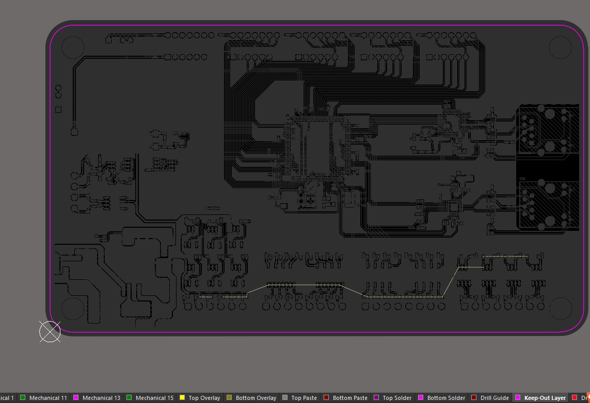
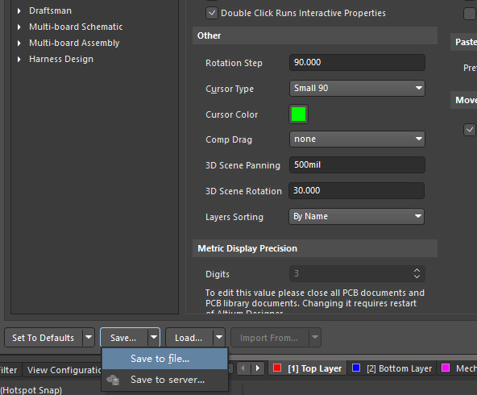

## 1 元器件Component属性

- **Design Item ID**：器件ID/器件名称。用于标识库中元器件的唯一名称，类似于元器件型号或库元件名。比如RES、CAP、STM32F103C8T6等。

- **Designator**：器件编号。用于在原理图中区分每一个器件的唯一编号，如 R1、C2、U3。

- **Comment**：参数注释。通常填写器件的关键参数，常作为 PCB 丝印内容。如 `10k 1%`、`1uF 25V` 等

- **Description**：描述。元件详细描述，便于查找与识别。

- **Part**：可以把元器件分成不同部分。方便各自接不同的电路。
  
  元器件新建不同部分

  

  原理图中需要把器件编号设置为同一个。有几个Part，放置几个器件。所有器件编号设置同一个，如：JP1，就是JP1的PartA和PartB。

  

## 2 管脚Pin属性

- **Designator**：管脚编号。代表该管脚在芯片封装上的物理编号，直接对应 PCB封装焊盘编号。典型示例：1，2，3等。
  
    

- **Name**：管脚名称。代表该管脚的功能或信号名称，主要用于逻辑连接和阅读。如：VCC、GND、TX、SCL等。

- **Electrical Type**：电气类型。是用来定义每个引脚在电路中的电气行为角色，这将影响：

    - 原理图中的电气规则检查（ERC）

    - 信号驱动/接收关系判断

    - 连接合法性判断（如是否有冲突）

    

## 3 快捷操作

### 3.1 阵列式粘贴

1. 先复杂要粘贴的管脚。

2. 编辑 -> 阵列式粘贴。主增量是管脚编号，次增量是管脚名称。通过设置间距，可以放置不同阵列。

### 3.2 原理图生成器件库

