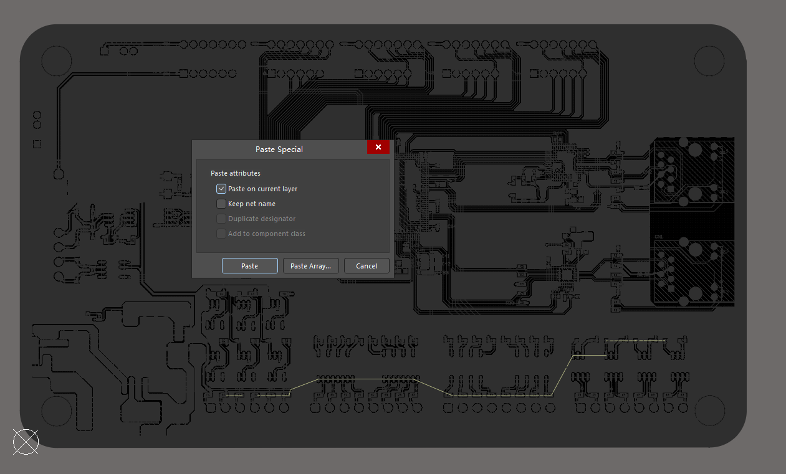

## 1 PCB中各个层

### Solder阻焊层

1. 防止盖绿油的，该区域不允许盖绿油。如果没绘制该区域，焊盘是不能裸露出来的。

2. 阻焊层默认都会比焊盘大一点，需要比焊盘大一些，是因为防止绿油溅到焊盘上面。

故顾名思义，阻止焊接，这个焊接不是焊锡，而是针对绿油层，什么是绿油层呢？扫盲一下（PS:绿油不一定都是绿色的，只是一般都是绿色的，还有黑色的，暗红色，金色等等）

假如PCB板子没盖上绿油，那很容易短路，所以需要盖上一层绿油，起到绝缘的作用。阻焊层（Soldermask）该发挥它的功效了，因为一个板子上面的盖绿油的面积居多，为了方便，AD就把绿油做成负面层，也就是说在负面层没有走线或者标记就都会被盖上绿油，AD为了怕人们忘记这一点，当建立元器件封装的时候就默认为每个管脚加上比焊盘大0.8mm的阻焊层（Soldermask）。这样就可以无忧的盖上绝缘层（PS:阻焊层（Soldermask）就是阻止盖绿油的）。要不然焊盘盖上绿油，那元器件不就焊不上去就尴尬了。

### 