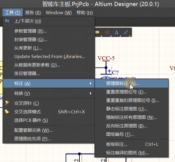
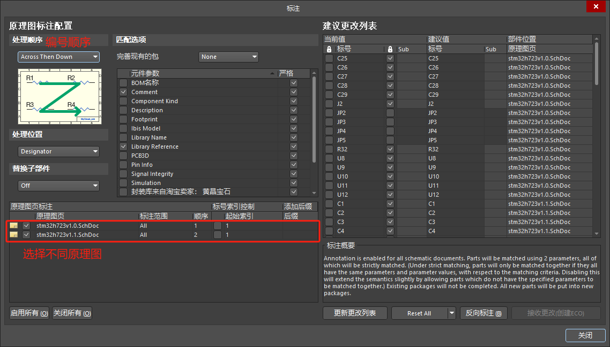
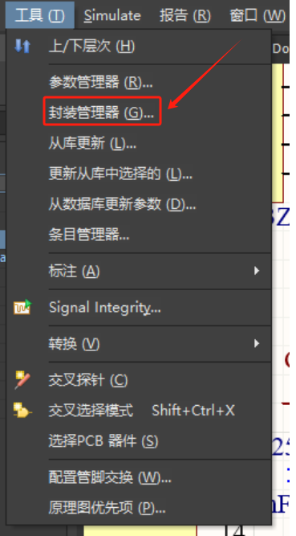
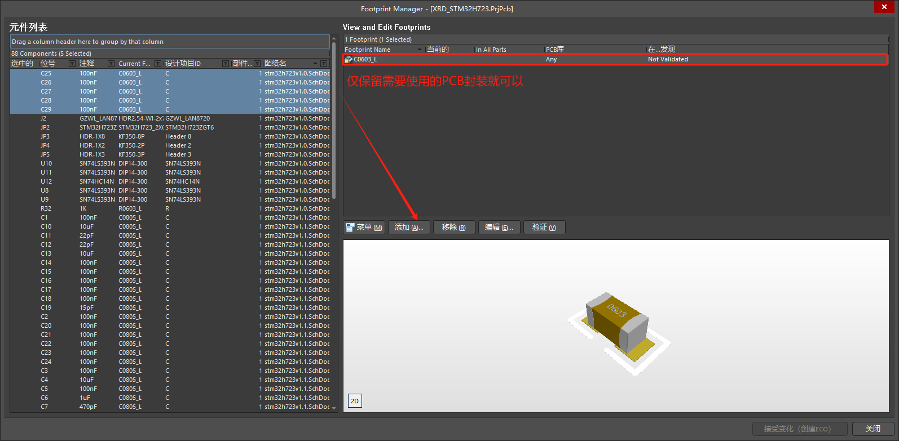
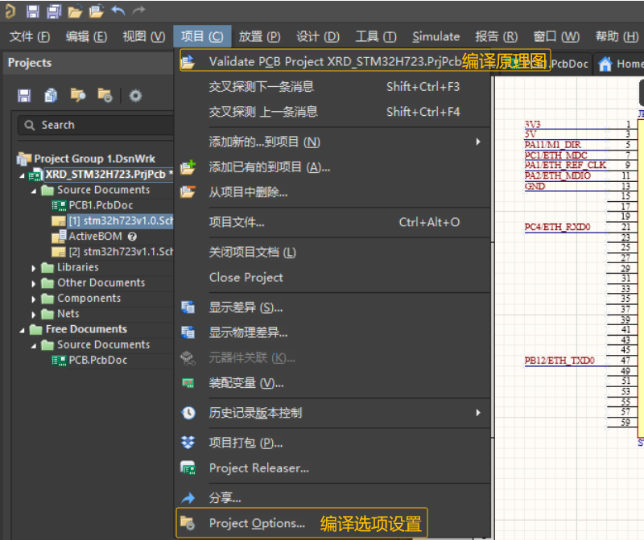
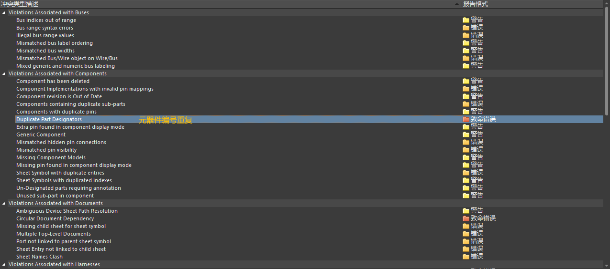
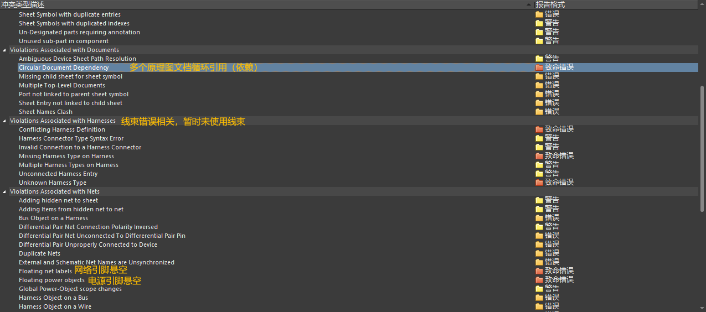
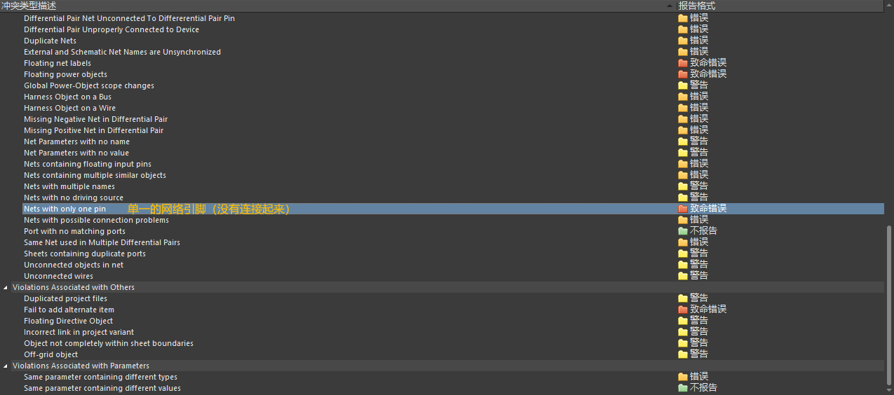

## 1 原理图器件标号（原理图标注）

## 2 封装管理器

添加或者删除其他封装，留下需要的PCB封装

## 3 原理图编译设置及检查

列一下常见的原理图错误：

1. Duplicate Part Designators :存在重复的元件位号

2. Floating Net Labels :网络悬浮

3. Floating Power Objects :存在悬浮的电源端口

4. Nets with only one pin :存在单端网络

5. Net with multiple names：网络名重复

6. Off grid object：对象没有处在栅格点的位置

## 参考

[参考1： AD学习笔记（五）原理图编译规则](http://www.360doc.com/content/24/0516/10/30278962_1123450117.shtml)
