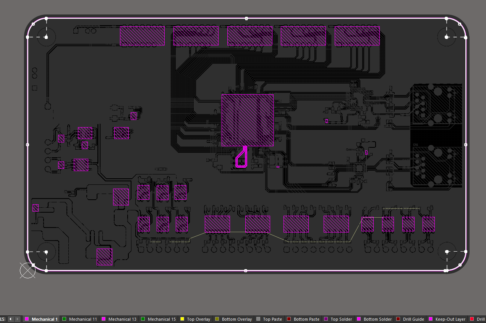

1. 报错规则

2. 层叠管理器（多层）

3. 框选原理图可以选中PCB中的器件

## 1 常用设计规则

### 1.1 信号线

信号线越细越好？

正确。两根信号线的间距大于等于线宽的2倍。

1. 一般线宽5mil、6mil（一般使用6mil）

2. 滴泪

3. 覆铜

4. 顶层和底层走线尽量垂直，减小串扰。

如果两根信号线太紧，有可能会发送串扰。

串扰本质上是一种电磁干扰（EMI），通过两种耦合机制产生：

1. 电容耦合
   
   - 由电场产生，通常发生在信号线之间存在一定电压差时。
   
   - 影响：电压突变在邻线感应出电流，造成噪声。
  
2. 电感耦合
   
   - 由磁场产生，通常发生在信号变化（如上升沿/下降沿）较快的高速信号中。
   
   - 影响：变化的电流在邻线感应出电压。

### 1.2 晶振

1. 晶振内部和底部尽量不走其他信号线