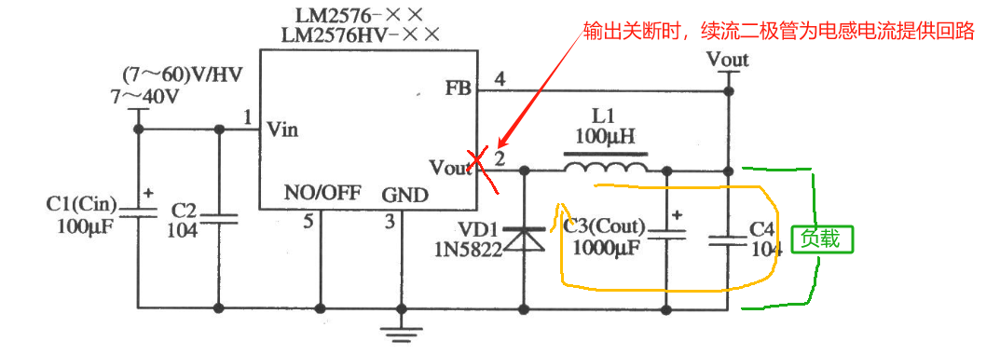

## 1 基础

### 1.1 LDO线性稳压器

- 属于线性稳压，通过调整管（晶体管）的压降来实现输出稳定电压。

- 输入电压与输出电压之间的压差会转化为热能散失。如果压差过大，就会发热严重。当压差 >3V 且电流较大（>100mA） 时，不推荐使用LDO，建议改用DC-DC降压芯片。

  | 输入输出压差     | 使用建议               | 说明             |
  | ---------- | ------------------ | -------------- |
  | **<1V**    | 非常推荐使用             | 效率较高，损耗小       |
  | **1V\~3V** | 推荐使用               | 常规使用，注意散热设计    |
  | **3V\~5V** | 谨慎使用               | 损耗较高，需良好散热     |
  | **≥5V**    | 不建议使用（推荐DC-DC降压芯片） | 热损耗非常大，效率低，不经济 |

### 1.2 DC-DC降压芯片（Buck转换器）

- 属于开关稳压，通过开关管（MOSFET）高速开关，再通过电感和电容储能、放能实现电压变换。

- 效率较高，电压差越大越有优势。

#### 1.2.1 同步整流型 (Synchronous Rectifier)

- 芯片内部集成两个MOS管（上下管），效率较高。

- 不需要外接续流二极管（肖特基二极管）。因为有下mos管。

#### 1.2.2 非同步整流型 (Non-Synchronous Rectifier)

- 内置一个MOS管和需要外接续流二极管（肖特基二极管）。

**常用非同步整流型：**

LM2596（经典常用芯片）
