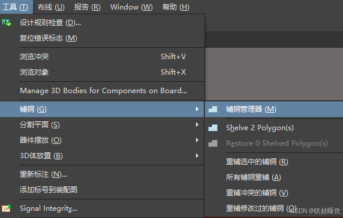
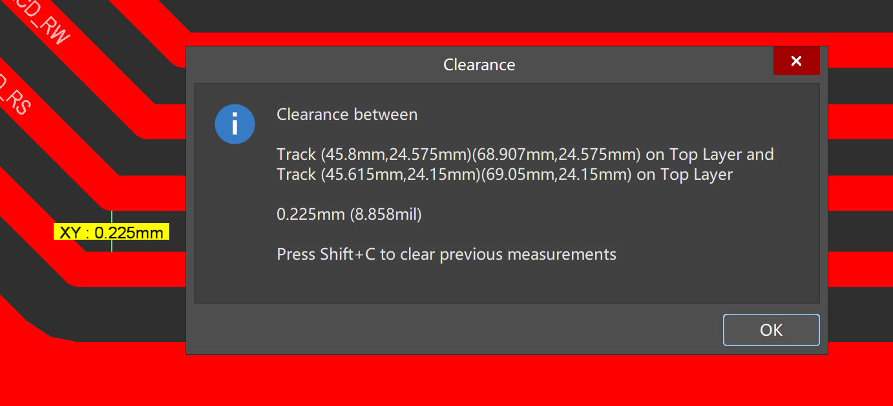

## 1 如何修改快捷键

方式一：右击工具栏->点击 `Customize`，点击 `[All]`。就可以查看所有命令，并进行修改。

方式二：点击某个命令的时候，加入 `Ctrl`，即可弹出快捷键设置。

## 2 常用快捷键

|  快捷键   | 说明  |
|  ----  | ----  |
| F2  | 拉线 |
| F3  | 过孔 |
| F4  | 敷铜 |
| F6  | 器件排列离散 |

## 3 选择

|  快捷键   | 说明  |
|  ----  | ----  |
| 2  | 线选 |
| 3  | 框选 |
| Ctrl + H  | 选择一条布线连接 |

1. 除了 `Ctrl + H`， 还可以通过点击某个Track后，按下Tab键即可选中整条线。

## 4 取消布线

|  快捷键   | 说明  |
|  ----  | ----  |
| Alt + Q  | 删除连接布线（connection是两个器件连接一条线） |

## 5 器件对齐

按下键盘的 `A` 可以调出对接选项

|  快捷键   | 说明  |
|  ----  | ----  |
| Shift + Ctrl + L  | 左对齐 |
| Shift + Ctrl + R  | 右对齐 |
| Shift + Ctrl + T  | 顶对齐 |
| Shift + Ctrl + B  | 底对齐 |
| Shift + Ctrl + H  | 水平等间距分布 |
| Shift + Ctrl + V  | 垂直等间距分布 |
| Shift + H  | 水平中心对齐 |
| Shift + V  | 垂直中心对齐 |
| Ctrl + +=  | 水平间距增加 |
| Ctrl + -  | 水平间距减小 |
| Shift + +=  | 垂直间距增加 |
| Shift + -  | 垂直间距减小 |

等间距的上下左右对齐用的一般比较少。但是：

1. 水平等间距、竖直等间距是中心点的等间距，并不是整个丝印。

2. 等间距的上下左右对齐比单独的水平等间距、竖直等间距要好，貌似是整个器件的等距离。

## 6 显示或隐藏铺铜

在查看PCB线路连接时，通常会遇到一种情况即一整块铺铜遮挡了视线，其会影响视觉效果，使得查找线路连接问题或进行布线分析变得更加困难。为了更有效地进行这些操作，通常需要先将铺铜暂时隐藏起来，以便清晰地看到下方的线路和连接。一旦确认了所需的信息或完成了相应的操作，再将原来的铺铜显示出来以恢复完整的PCB视图。

### 6.1 显示或隐藏指定铜皮

打开铺铜管理器。在工具栏选择tool->Polygons Pours->Polygons Manager(快捷键T+G+M)

在铺铜管理器中，找到想要隐藏的铺铜层，在“Shelved”列下勾选它。勾选后，该层的铺铜将被隐藏。(汉化版直接在“已隐藏”列下勾选需要隐藏的层即可。)

### 6.2 显示或隐藏所有铜皮

通过View Configuration隐藏所有铺铜。打开“View Configuration”对话框（按下快捷键“L”）

切换到“View Options”选项卡，在“Object Visibility”部分，取消勾选“Polygons”，这样所有铺铜层都会被隐藏。

## 7 三种测量距离方式

PCB设计中report下有三个测量距离的命令

- 测量距离（M）：测量选中两个点直接的距离

- 测量（P）：测量选中两个对象边缘到边缘的距离（比如：线间距，两个焊盘边缘直接的距离）

- 测量选中对象（S）：选择对象，测量这个对象的长度（比如：走线的长度）

### 7.1 点到点距离测量（Ctr + M）

测量点到点的距离，鼠标点在哪里就测量哪里

### 7.2 测量

测量选中对象边缘到边缘的距离

下图是测量焊盘到焊盘的边缘距离。

下图是线到线的边缘距离。

### 7.3 测量选中对象

主要用于测量选中线的长度。先选中线，然后执行指令。

## 10 系统设置和快捷键配置导出导入

Tool -> Preferences

Save.. -> Save to file

## 参考

[参考1： AD学习笔记（12）——PCB常用快捷键以及自定义快捷键推荐](https://www.cnblogs.com/xiaochengxin/p/18871427)

[参考2： 【Altium】AD-三种测量距离方式的区别](https://zhuanlan.zhihu.com/p/14758666432)