## 1 PCB中各个层

| English |  中文  |  作用 |
|---------|-------|-------|
| Top Layer      | 顶层信号层 | 主要用来放置走线和元器件 |
| Bottom Layer   | 底层信号层 | 同上，就是一个在上面一个在背面 |
| Keep out Layer | 禁止布线层 | 所选区域外禁止布线。 一般不会用这个层设计板框，因为输出Gerber文件看的是机械层1定义的外形轮廓。 |
| Mechanical 1   | 机械层     | 一般放置有关制板和装配方法的指示性信息，如PCB的外形尺寸、尺寸标记、数据资料、过孔信息、装配说明等信息 |
| Top(Bottom) Overlay| 顶层（底层）丝印层 | 用来标注各种标识，元器件号，商标等 |
| Top(Bottom) Paste  | 顶层（底层）焊盘层 | 定义PCB板的顶层（底层）焊盘位置，这部分不会被绿油覆盖。还用于贴片元件点胶或钢网制作 |
| Top(Bottom) Solder | 顶层（底层）阻焊层 | 定义PCB板顶层（底层）不可焊的区域，以保护铜箔不被氧化等机械性损坏，即在PCB板上刷的绿油。（默认取负，也就是默认整个板子刷绿油，选择的区域不刷 |

### 1.1 信号层

信号层分为TopLayer（顶层）、BottomLayer（底层），这是具有电气连接的层，能放置元器件，也能布置走线。

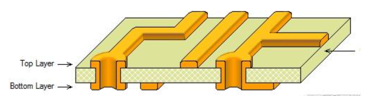

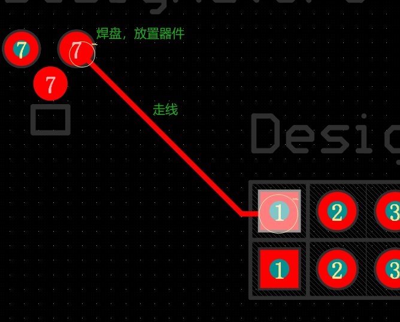

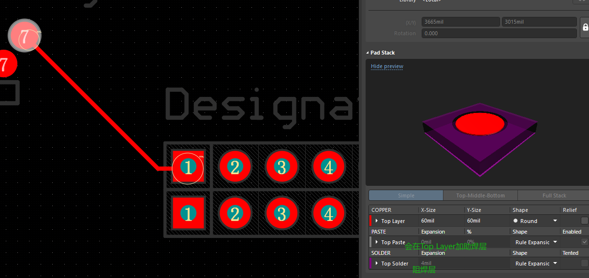

### 1.2 机械层

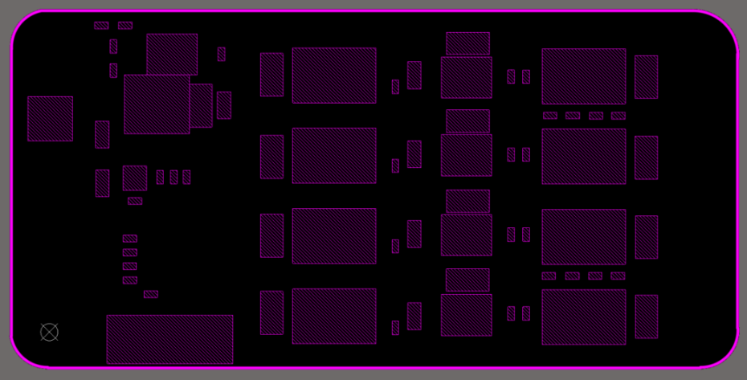

机械层的作用：

1. 板子的外形轮廓、开槽（milling）路径、V-cut 割线、拼板切割线、大型孔洞等。

2. 元器件的定位信息，物理大小、三维尺寸等。

一般是有 `Mechanical 1` 和 `Mechanical 13`。有时候这些不同的Mechanical并不是就必须的是元器件物理大小信息。但是板子外形轮廓都是`Mechanical 1`。

- Mechanical 1：
    
    - 定义PCB的物理外形。Gerber 文件中，通常将 Mechanical 1 层输出为 Board Outline（或将其导入为 Board Shape）。

    - 标注结构信息：包括：开槽（milling）路径、V-cut 割线、拼板切割线等。

    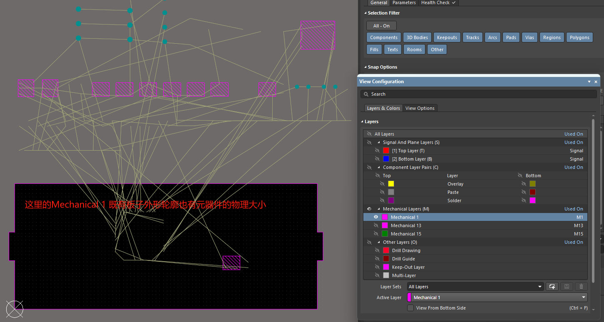

- Mechanical 13：主要用于记录元件的三维尺寸。
    
    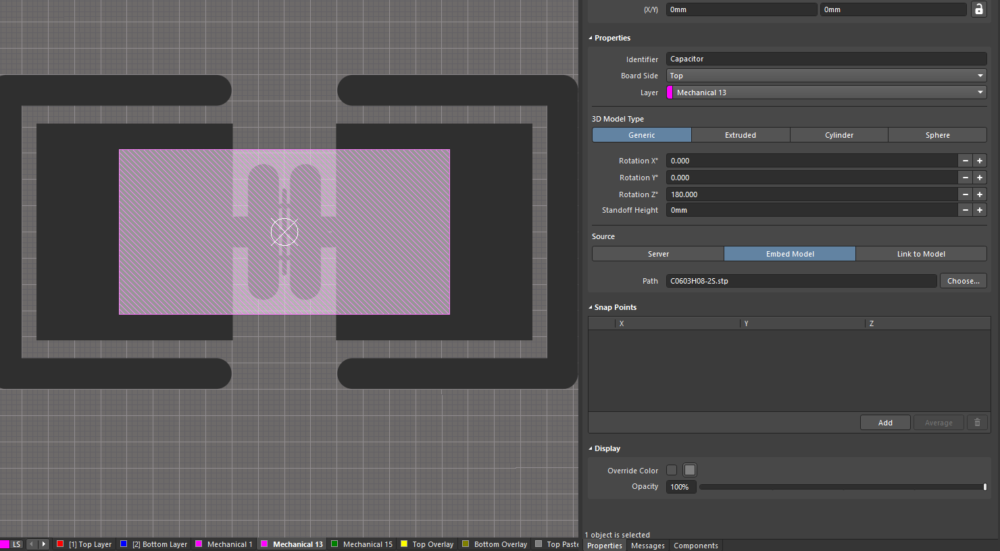

也有可能其他Mechanical层定义元器件的定位信息或者外形大小。

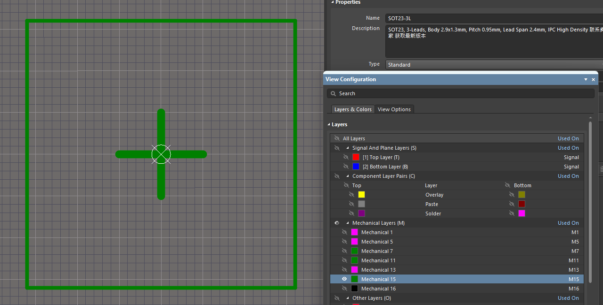

### 1.3 丝印层

Top Overlay（顶层丝印层）、 Bottom Overlay（底层丝印层），用于定义顶层和底层的丝印字符，就是一般在阻焊层之上印的一些文字符号，比如元件名称、元件符号、元件管脚和版权等，方便以后的电路焊接和查错等。

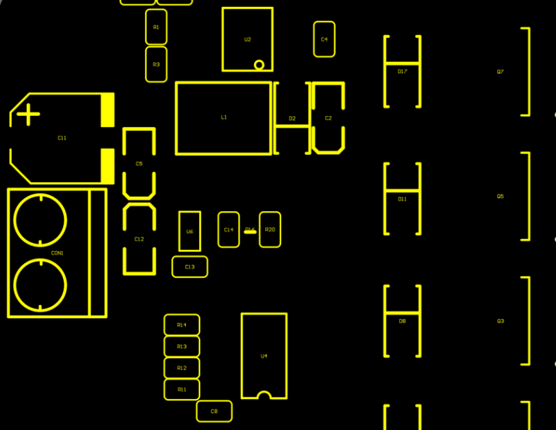

### 1.4 锡膏层（助焊层）

锡膏层包括顶层锡膏层（Top Paste） 和底层锡膏层（Bottom Paste） ，指我们可以看到的露在外面的表面贴装焊盘，也就是在焊接前需要涂焊膏的部分。所以这一层在焊盘进行热风整平和制作焊接钢网时也有用。

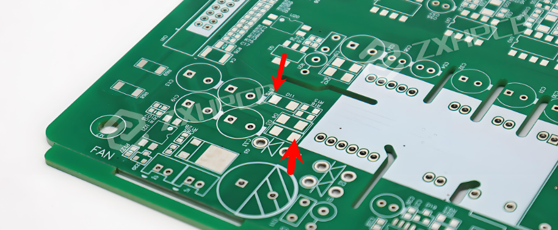

### 1.5 阻焊层

1. 防止盖绿油的，该区域不允许盖绿油。如果没绘制该区域，焊盘是不能裸露出来的。

2. 阻焊层默认都会比焊盘大一点，需要比焊盘大一些，是因为防止绿油溅到焊盘上面。

故顾名思义，阻止焊接，这个焊接不是焊锡，而是针对绿油层，什么是绿油层呢？扫盲一下（PS:绿油不一定都是绿色的，只是一般都是绿色的，还有黑色的，暗红色，金色等等）

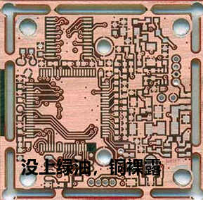

假如PCB板子没盖上绿油，那很容易短路，所以需要盖上一层绿油，起到绝缘的作用。阻焊层（Soldermask）该发挥它的功效了，因为一个板子上面的盖绿油的面积居多，为了方便，AD就把绿油做成负面层，也就是说在负面层没有走线或者标记就都会被盖上绿油，AD为了怕人们忘记这一点，当建立元器件封装的时候就默认为每个管脚加上比焊盘大0.8mm的阻焊层（Soldermask）。这样就可以无忧的盖上绝缘层（PS:阻焊层（Soldermask）就是阻止盖绿油的）。要不然焊盘盖上绿油，那元器件不就焊不上去就尴尬了。

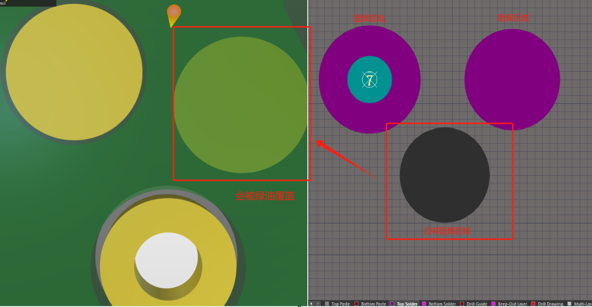

### 1.6 Multi-Layer

1. Multi-Layer（多层） 是一种用于表示跨越多个电路板层的连接或对象的特殊图层（Layer）。

2. Multi-Layer 不是实际的物理层，而是一种 虚拟层，代表：出现在多个层之间，或贯穿整个 PCB 的对象。

典型用途：

1. 过孔（Via）：过孔用于连接不同的电层（如从顶层连到底层，或从一内层连到另一内层）。由于它贯穿多个层，因此它被分配到 Multi-Layer。

2. 元器件通孔焊盘（Pad）：一些焊盘（尤其是通孔元件的焊盘）也会连接多个层，这类焊盘也会标记为 Multi-Layer。

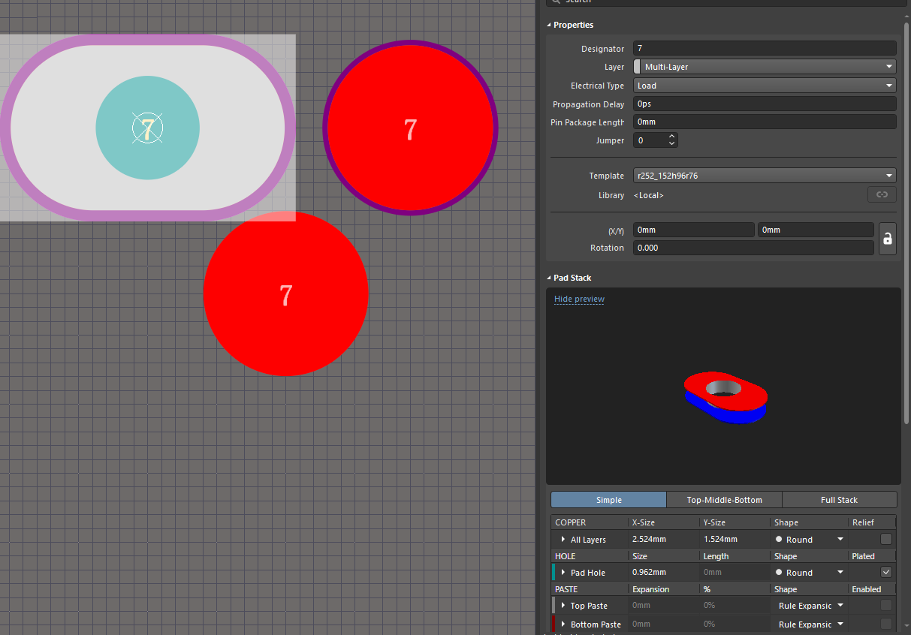

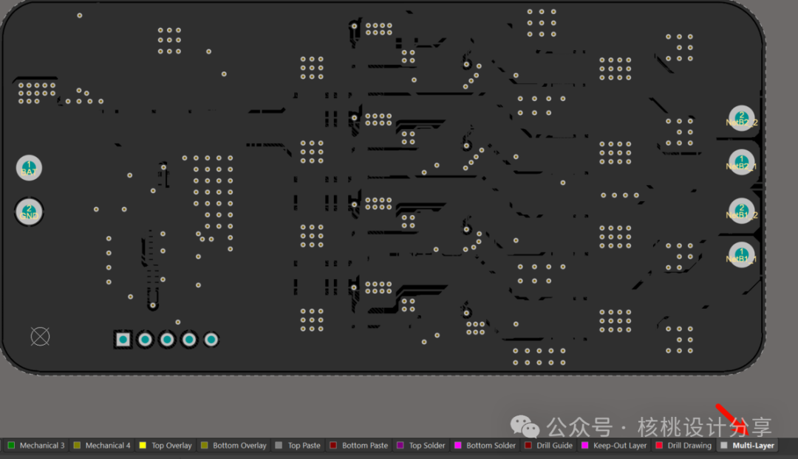

### 1.7 钻孔层

Drill Guide：PCB钻孔引导层，绘制钻孔图，用于gerber文件。显示孔中心点位置，通常用 十字线或小圆点 表示。在手工钻孔或某些特殊钻孔机器中，帮助确认钻头是否对准正确的位置。

Drill Drawing：PCB钻孔位置图层，给出钻孔位置，用于gerber文件。告诉 PCB 工厂“在哪些位置钻哪些大小的孔”。

### 1.8 禁止布线层

Keep Out layer禁止了具备电气特性的走线不能超出这个范围。

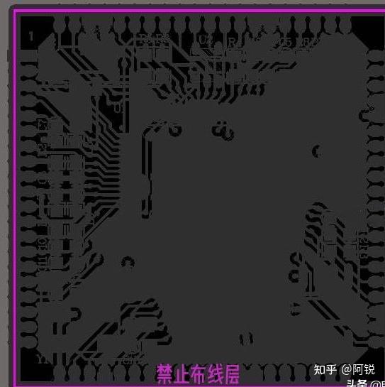

## 2 操作

### 2.1 通过XY移动焊盘

选中焊盘，然后按 `M` 键，通过 `X,Y` 移动选中对象。

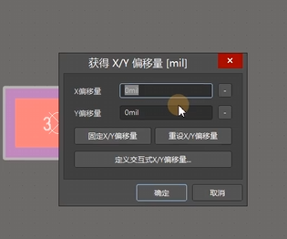

### 2.2 测量

PCB设计中报告菜单下有三个测量距离的指令，分别是“测量距离”和“测量”。两个指令如何使用以及它们之间的区别。

1. 测量距离 `Ctr + M`。测量点到点的距离，鼠标点在哪里就测量哪里。

    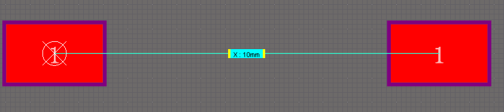

2. 测量。测量选中对象边缘到边缘的距离。

    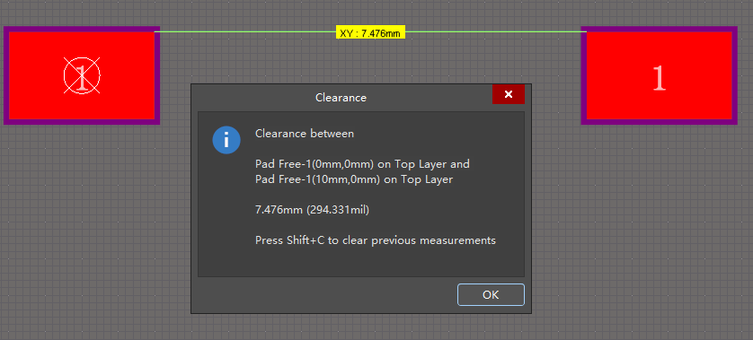

**清除由于测量产生的标记**

1. 只需要按鼠标右键，选择清除过滤器。

2. 快捷键 `Shift + C`。

### 2.3 阵列粘贴

快捷键EA

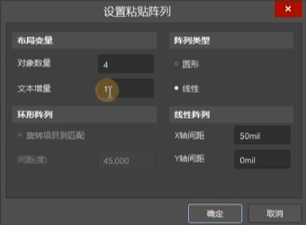

### 2.4 裁剪导线

快捷键：EK

比如丝印画到了焊盘上面。

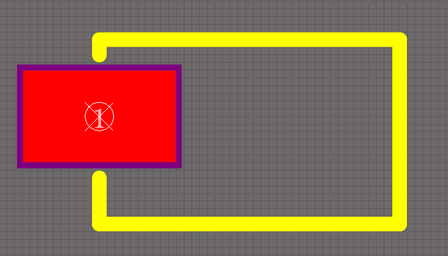

## 参考

[参考1： Altium Designer PCB中各个层的含义，新手必备！](https://blog.csdn.net/peiorrong/article/details/148453128)

[参考2： 【Altium】AD-三种测量距离方式的区别](https://zhuanlan.zhihu.com/p/14758666432)