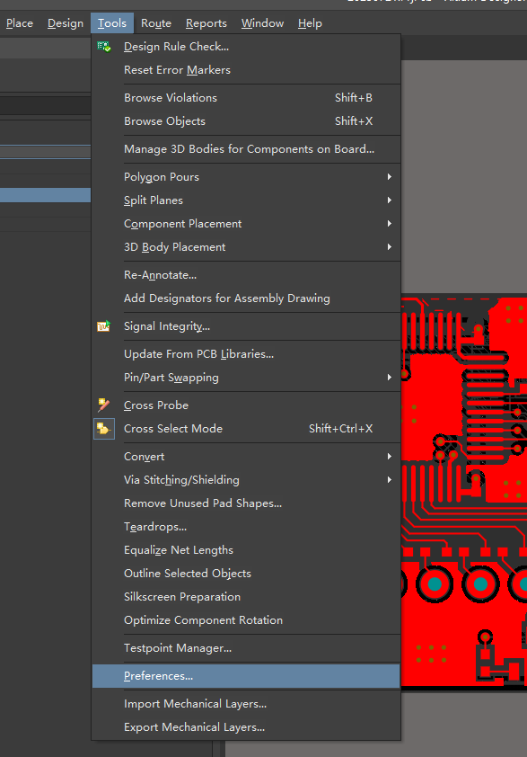
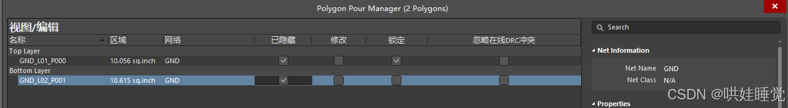
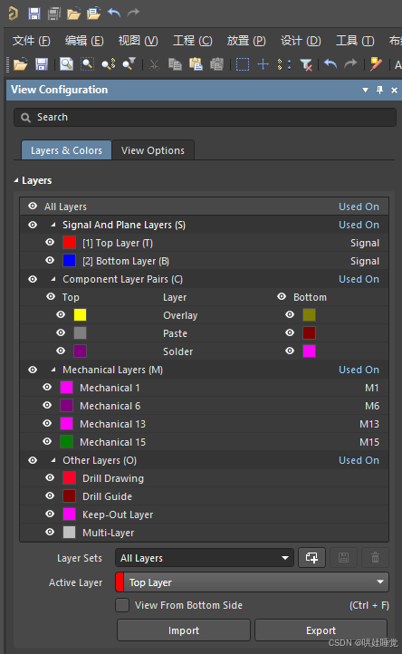
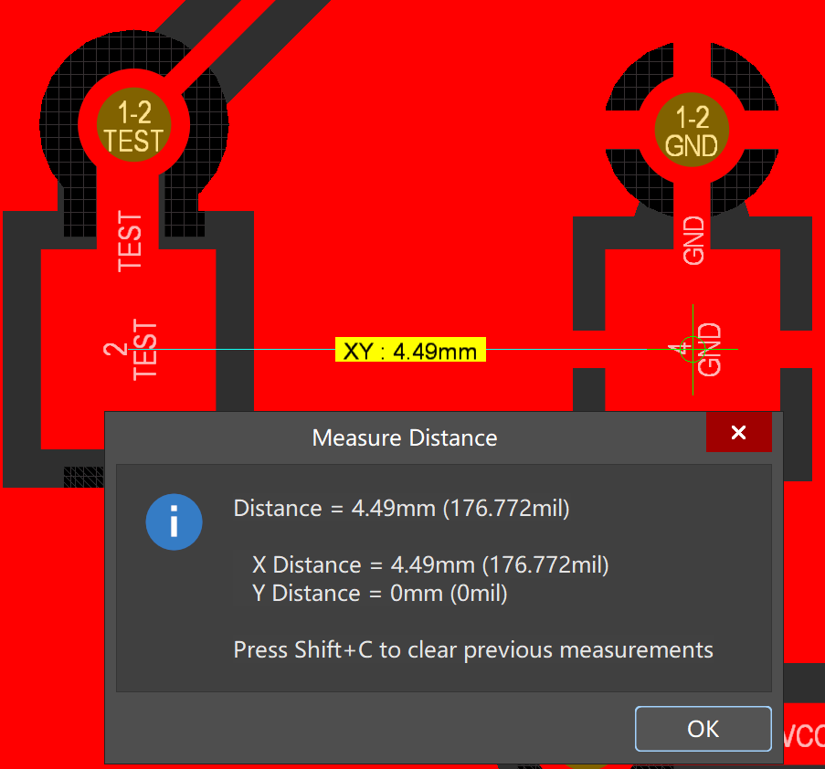
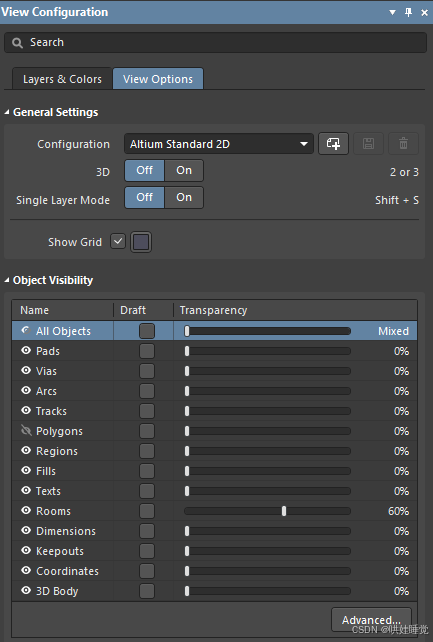
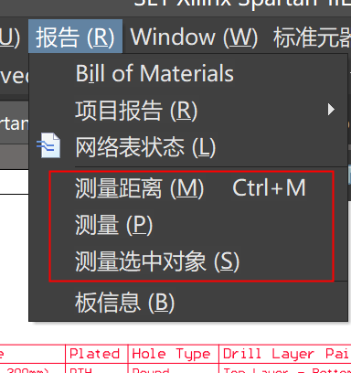

## 1 新建类

当我们对某些线路进行特殊处理的时候，我们把与之有关的网络放在一起，一起处理。

比如：与电源有关的网络的走线需要加粗。

1. 设计 -> 类
   
   

2. Net Class

   

3. 添加类

   

   

## 2 类的使用

调出PCB面板

高亮网络显示

查看某一个或多个的连线情况：

修改飞线的颜色

按下快捷键N弹出显示飞线和隐藏飞线

另外一种隐藏飞线的方式

### 2.1 只显示PWR类飞线

1. 隐藏所有网络飞线，快捷键 `NHA`

   

2. PCB面板，点击PWR类，显示连接
   
   

## 参考

[参考1： AD与电子设计制作](https://blog.csdn.net/qq_38351824/category_8072012.html)