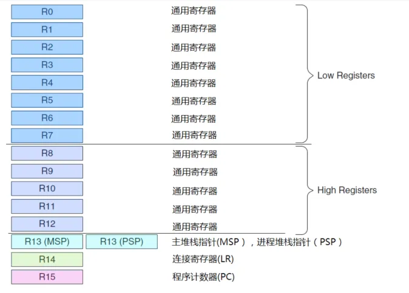

cortex-m3是一个32位处理器内核：总线（数据、地址）宽度是32位、寄存器位宽是32位；内核结构为哈佛结构，拥有独立的数据总线和指令总线，可以并行进行指令执行和数据访问；

## 1 寄存器组

cortex-m3拥有R0-R15寄存器，其中R0-R12为通用寄存器

- **通用寄存器**：通用寄存器用于数据操作，绝大多数16位thumb指令只能访问R0-R7，32位Thumb指令可以访问所有的。

- **Banked R13**：MSP和PSP，两个堆栈寄存器，同一时刻只能使用其中一个，堆栈指针的低两位永远是0，堆栈总是4字节对齐的

  - 主堆栈指针（MSP）：复位后缺省使用的堆栈寄存器，用于操作系统内核和异常处理例程（包含中断服务程序） 
  
  - 进程堆栈指针（PSP）：由用户的应用代码使用 

- **R14连接寄存器LR**：当调用一个函数时，LR记录调用函数返回的地址，当调用关系超过两层时，则会一级一级将函数的返回地址压入栈中

- **R15程序计数寄存器PC**：指向当前的程序运行地址