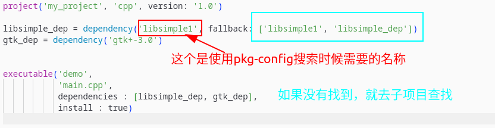

Meson本质上是用 `Python` 编写的，所以这些函数也都是Python函数。

## 1 subproject()

-此功能接受位置参数中指定的项目，并通过返回一个子项目对象将其纳入当前构建规范。子项目必须始终放置在顶级源目录的 subprojects 目录内。例如，名为 foo 的子项目必须位于 `${MESON_SOURCE_ROOT}/subprojects/foo` 中。

## 2 subproject()

```python
# Takes the project specified in the positional argument and brings that
subproject subproject(
  str subproject_name,     # Name of the subproject

  # Keyword arguments:
  default_options : list[str] | dict[str | bool | int | list[str]]  # An array of default option values
  required        : bool | feature                                # Works just the same as in dependency().
  version         : str                                           # Works just like the same as in dependency().
)
```

## 3 示例

### 3.1 使用subproject

子项目目录中必须要有`libsimple`子项目文件夹。


```python
# @filename: subprojects/libsimple/meson.build

project('libsimple', 'cpp', version: '1.0')

inc = include_directories('include')
# 生成动态库 libsimple.so
libsimple = shared_library('simple',
                           'simple.cpp',
                           include_directories : inc,
                           install : true)

# declare_dependency返回一个dependency(.)对象
libsimple_dep = declare_dependency(include_directories : inc,
                                   link_with : libsimple)


# @filename: meson.build
project('libsimple', 'cpp', version: '1.0')

inc = include_directories('include')
# 生成动态库 libsimple.so
libsimple = shared_library('simple',
                           'simple.cpp',
                           include_directories : inc,
                           install : true)

# declare_dependency返回一个dependency(.)对象
libsimple_dep = declare_dependency(include_directories : inc,
                                   link_with : libsimple)
```

### 3.2 使用dep对象的fallback

修改3.1章节中的主`meson.build`文件，子项目目录中必须要有`libsimple`子项目文件夹。

```python
project('my_project', 'cpp', version: '1.0')

libsimple_dep = dependency('libsimple1', fallback: ['libsimple', 'libsimple_dep'])
gtk_dep = dependency('gtk+-3.0')


executable('demo',
           'main.cpp',
           dependencies : [libsimple_dep, gtk_dep],
           install : true)

```



- pkg-config搜索的是`libsimple1`,这跟子项目目录中的文件名名称没有关系

- 子项目目录中的名称与fallback中的名称有关，第一是子项目文件夹名称，第二个是获取子项目中的那个依赖dep对象。

### 3.3 使用dep对象的fallback(Wrap获取子项目)

编写`libsimple.wrap`文件

```
[wrap-git]
directory=simple
url=https://github.com/LieryangStack/libsimple.git

[provide]
simple=libsimple_dep
```