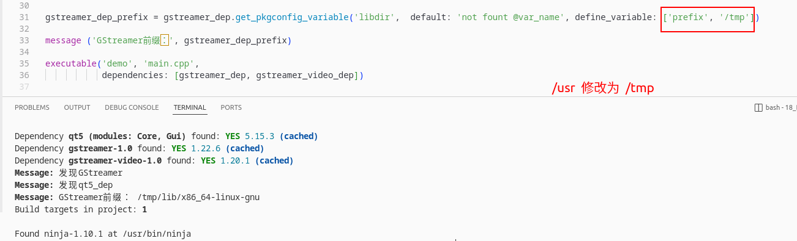

Meson本质上是用 `Python` 编写的，所以这些函数也都是Python函数。

## 1 dependency()

- dependency 用于查找给定名称的外部依赖项（通常是系统上安装的库），首先通过 pkg-config 查找，如果失败则通过 CMake。如果查找失败，可以使用[fallback回退处理](https://mesonbuild.com/Dependencies.html#dependencies-with-custom-lookup-functionality)，支持 `pkg-config`、`cmake`、`extraframework`(OSX only) 、 `qmake` 等。

- 


- 自 0.64.0 版本起，可以通过 WrapDB 提供依赖项fallback的回退。只需使用 meson wrap update-db 命令本地下载数据库，如果系统上未找到依赖项并且项目未自带 .wrap 文件，Meson 将自动回退到 WrapDB 提供的子项目。
- 依赖项还可以通过其他两种方式解决：

- 如果在调用 dependency 之前已经使用 meson.override_dependency 使用了相同的名称，那么无条件返回覆盖的依赖项；也就是说，无论系统中是否安装了外部依赖项，都将使用覆盖的依赖项。通常，meson.override_dependency 会被子项目使用。

- 通过需要时将其纳入当前构建规范的回退子项目，就好像已经调用了 subproject()。可以使用 fallback 参数指定子项目。或者，如果没有 fallback 参数，自 0.55.0 版本起，Meson 可以在 wrap 文件提供依赖项，或子项目与依赖项同名的情况下，自动识别子项目为回退。在后一种情况下，子项目必须使用 meson.override_dependency 来指定替代项，否则 Meson 将报告一个严重错误。有关更多详情，请参见 Wrap 文档。这种自动搜索可以使用 allow_fallback 关键字参数来控制。

- 如果 dependency_name 是 ''，则依赖项始终未找到。因此，对于 required: false，这总是返回一个依赖项对象，其 found() 方法返回 false，并且可以像任何其他依赖项一样传递给构建目标的 dependencies: 关键字参数。这可用于实现有时不需要的依赖项，例如在条件的某些分支中，或者与 fallback: kwarg 一起使用，可以声明一个可选依赖项，该依赖项仅在指定的子项目中查找，并且仅在 --wrap-mode 允许的情况下。

返回的对象 dep 还具有其他方法。

## 2 dependency()定义

```python
dep dependency(
  str names...,  # The names of the dependency to look up

  # Keyword arguments:
  # 指定 Meson 是否应自动选择回退子项目
  allow_fallback    : bool
  # 默认选项值的数组
  default_options   : list[str] | dict[str | bool | int | list[str]]
  # 返回 disabler() 对象，而不是未找到的依赖项 default = false
  disabler          : bool
  # 手动指定一个回退子项目
  fallback          : list[str] | str
  # 一个枚举标志，标记依赖项的包含类型 default = 'preserve'，可以转换成 -isystem 类型头文件搜索路径
  include_type      : str 
  # 定义要查找的特定语言依赖项
  language          : str
  # 定义检测依赖项的方式，默认是 default = 'auto'
  method            : str
  # 如果设置为 `true`，则 Meson 会在本机系统上查找依赖项
  native            : bool
  # 一个可选的字符串，如果未找到依赖项，将作为消息打印
  not_found_message : str 
  # 当设置为 `false` 时，Meson 将继续构建
  required          : bool | feature
  # 告诉依赖项提供者尝试获取静态依赖项
  static            : bool
  version           : list[str] | str
```

## 3 dependency查找依赖项

- 可以设定`@method`变量来设定查找依赖项方式，其中包括：pkg-config、config-tool、cmake、builtin、system、sysconfig、qmake、extraframework 和 dub。

- 如果不指定默认值是 `auto`。auto 的依赖项方法顺序为：

  1. pkg-config

  2. cmake
  
  3. extraframework（仅限 OSX）

### 3.1 查找依赖项示例

```python
qt5_dep = dependency('qt5', modules : ['Core', 'Gui'], method : 'config-tool')
gstreamer_dep        = dependency('gstreamer-1.0', method: 'pkg-config')
gstreamer_video_dep  = dependency('gstreamer-video-1.0', version: '>=1.30')
```

### 3.2 获取依赖项pkgconfig文件中的变量

我们可以获取 `gstreamer-1.0.pc` 文件中的变量，通过 `dep` 对象的 `get_pkgconfig_variable` 函数。

```python
'''
Brief: 
      dependency创建了dep对象，该对象可以调用该函数，返回pkg-config文件中@var_name变量的值。
Argument:
      var_name(str): pkg-config文件中的变量，例如：prefix、includedir、libdir等
      default(str): 如在文件中找不到@var_name变量，则返回@default值
      define_variable: 重定义变量的值，格式如下 ['prefix', 'tmp', 'libdir', '/usr/local/gsreamer-1.22.6']

'''
str get_pkgconfig_variable(
  str var_name,
  default         : str
  define_variable : list[str]
)
```

下面图片表示获取 `libdir` 变量路径，同时修改 `prefix` 变量



也可以使用 `get_variable` 函数，获取其他方式 `method` 中配置文件的值。例如`var = foo_dep.get_variable(cmake : 'CMAKE_VAR', pkgconfig : 'pkg-config-var', configtool : 'get-var', default_value : 'default')`

## 4 提供资源文件的依赖项

有时依赖项提供可安装的文件，其他项目需要使用。例如，wayland-protocols 的 XML 文件。

```python
foo_dep = dependency('foo')
foo_datadir = foo_dep.get_variable('pkgdatadir')
custom_target(
    'foo-generated.c',
    input: foo_datadir / 'prototype.xml',
    output: 'foo-generated.c',
    command: [generator, '@INPUT@', '@OUTPUT@']
)
```

自 0.63.0 版本起，这些实际上可以按预期工作，即使它们来自（格式良好的）内部依赖。这只在将要获取的文件被视为与系统依赖可互换时有效——例如，只能使用公共文件，且不允许离开依赖指向的目录。

## 5 声明您自己的依赖项

你可以声明自己的依赖项对象，它可以与从系统获得的依赖项对象互换使用。语法很直接：

```python
my_inc = include_directories(...)
my_lib = static_library(...)
my_dep = declare_dependency(link_with : my_lib,
  include_directories : my_inc)
```

这声明了一个依赖项，它在任何使用它的目标中添加了给定的包含目录和静态库。

## 6 作为子项目构建依赖项

许多平台没有提供系统包管理器。在这些系统上，必须从源代码编译依赖项。Meson 的子项目使得在系统依赖可用时使用它们，在不可用时手动构建依赖变得简单。

要使其工作，依赖项必须有 Meson 构建定义，并且必须像这样声明自己的依赖项：

```python
    foo_dep = declare_dependency(...)
```

然后，任何想要使用它的项目都可以在其主 meson.build 文件中写出以下声明。

```python
    foo_dep = dependency('foo', fallback : ['foo', 'foo_dep'])
```

这个声明的意思是，首先 Meson 会尝试从系统中查找依赖项（例如通过使用 pkg-config）。如果找不到，那么它会构建名为 foo 的子项目，并从中提取变量 foo_dep。这意味着此函数的返回值要么是外部依赖项对象，要么是内部依赖项对象。由于它们可以互换使用，其余的构建定义不需要关心它是哪一个。Meson 将在幕后处理所有工作以使其正常工作。


### 7.1 System

在这些情况下，Meson 提供了系统依赖项的方便包装。在内部，这些依赖项完全按照用户在构建系统 DSL 中或通过脚本所做的操作，可能调用 compiler.find_library()，设置 link_with 和 include_directories。通过将这些放入 Meson 上游，降低了使用它们的障碍，因为使用 Meson 的项目不必重新实现逻辑。

### 7.2 Builtin

某些依赖项在某些系统上没有提供有效的发现方法，因为它们是由语言内部提供的。其中一个例子是 intl，它内置于 GNU 或 musl libc 中，但在其他情况下作为系统依赖项存在。

在这些情况下，Meson 提供了系统依赖项的便利包装器，但首先检查该功能是否默认可用。

### 7.3 CMake

Meson 可以使用 CMake 的 find_package() 函数来检测带有内置 Find<NAME>.cmake 模块和导出的项目配置（通常在 /usr/lib/cmake 中）的依赖项。Meson 能够使用旧式的 <NAME>_LIBRARIES 变量以及导入的目标。

可以手动指定应该使用的 CMake 目标列表，这通过 modules 属性实现。但这一步是可选的，因为 Meson 会尝试基于依赖项的名称自动猜测正确的目标。

根据依赖项的不同，如果 Meson 无法自动猜测，则可能需要使用 modules 属性显式指定 CMake 目标。

```python
cmake_dep = dependency('ZLIB', method : 'cmake', modules : ['ZLIB::ZLIB'])
```

通过 components 关键字参数（在 0.54.0 中引入）提供了为 CMake find_package 查找添加额外 COMPONENTS 的支持。所有指定的组件将直接传递给 find_package(COMPONENTS)。

对于需要指定版本才能成功进行 CMake find_package 查找的包，通过 cmake_package_version 关键字参数（在 0.57.0 中引入）提供了支持。指定的 cmake_package_version 将直接作为第二个参数传递给 find_package。

还可以通过 cmake_module_path 属性（自 0.50.0 起）重用现有的 Find<name>.cmake 文件。使用这个属性等同于在 CMake 中设置 CMAKE_MODULE_PATH 变量。提供给 cmake_module_path 的路径应该都是相对于项目源代码目录的。只有在 CMake 文件不存储在项目本身时，才应使用绝对路径。

可以使用 cmake_args 属性（自 0.50.0 起）指定额外的 CMake 参数。

### 7.4 Dub

请理解 Meson 只能找到存在于本地 Dub 仓库中的依赖项。你需要手动获取和构建目标依赖项。

对于 urld。

```python
dub fetch urld
dub build urld
```

还需要记住的是，Meson 和 Dub 需要使用相同的编译器。这可以通过使用 Dub 的 -compiler 参数和/或在运行 Meson 时手动设置 DC 环境变量来实现。

```python
dub build urld --compiler=dmd
DC="dmd" meson setup builddir
```

### 7.5 Config tool

CUPS、LLVM、pcap、WxWidgets、libwmf、GCrypt、GPGME 和 GnuStep 要么不提供 pkg-config 模块，要么还可以通过配置工具（如 cups-config、llvm-config、libgcrypt-config 等）进行检测。Meson 对这些工具有原生支持，它们可以像其他依赖项一样被找到：

```python
pcap_dep = dependency('pcap', version : '>=1.0')
cups_dep = dependency('cups', version : '>=1.4')
llvm_dep = dependency('llvm', version : '>=4.0')
libgcrypt_dep = dependency('libgcrypt', version: '>= 1.8')
gpgme_dep = dependency('gpgme', version: '>= 1.0')
```

自 0.55.0 起，Meson 在交叉编译时不再在 `$PATH` 中搜索配置工具二进制文件，如果配置工具没有在交叉文件中有条目的话。

## 8 具有自定义查找功能的依赖项

通用依赖项名称区分大小写，但这些依赖项名称不区分大小写匹配。推荐的写法是全部使用小写字母。

在某些情况下，存在多种检测方法，可以使用 method 关键字选择要使用的检测方法。auto 方法使用 Meson 认为最好的任何检测机制。

例如，libwmf 和 CUPS 既提供 pkg-config 支持，也提供 config-tool 支持。你可以通过 method 关键字强制使用其中一个：

```python
cups_dep = dependency('cups', method : 'pkg-config')
wmf_dep = dependency('libwmf', method : 'config-tool')
```

### 8.1 AppleFrameworks

使用 modules 关键字列出所需的框架，例如：

```python
dep = dependency('appleframeworks', modules : 'foundation')
```

这些依赖项永远不会在非 OSX 主机上找到。

### 8.2 Blocks

启用对 Clang 的 blocks 扩展的支持。

```python
dep = dependency('blocks')
```

（添加于 0.52.0 版本）

### 8.3 Boost

Boost 不是一个单一的依赖项，而是一组不同的库。要使用 Boost 仅头文件库，只需将 Boost 添加为依赖项。

```python
boost_dep = dependency('boost')
exe = executable('myprog', 'file.cc', dependencies : boost_dep)
```

要在 Meson 中链接 Boost，只需列出你想使用的库。

```python
boost_dep = dependency('boost', modules : ['thread', 'utility'])
exe = executable('myprog', 'file.cc', dependencies : boost_dep)
```

你可以多次调用 dependency() 函数，使用不同的模块，并使用这些模块链接到你的目标上。

如果你的 Boost 头文件或库位于非标准位置，你可以设置 BOOST_ROOT，或者 BOOST_INCLUDEDIR 和 BOOST_LIBRARYDIR 环境变量。（在 0.56.0 版本中添加）你也可以在你的本地或跨平台文件中将这些参数设置为 boost_root、boost_includedir 和 boost_librarydir。请注意，机器文件变量优先于环境变量，指定这些参数会禁用系统范围内对 Boost 的搜索。

你可以将 threading 参数设置为 single，以使用为单线程使用编译的 Boost 库。

#### 8.4 CUDA

（添加于 0.53.0 版本）

启用对 CUDA Toolkit 的编译和链接。可以传递 version 和 modules 关键字，分别请求使用特定版本的 CUDA Toolkit 和/或额外的 CUDA 库：

dep = dependency('cuda', version : '>=10', modules : ['cublas'])
请注意，只有在你从 C/C++ 文件或项目中使用 CUDA Toolkit，或者你正在使用需要显式链接的附加工具包库时，才需要显式添加此依赖项。如果在系统的默认路径中找不到 CUDA Toolkit，你可以使用 CUDA_PATH 显式设置路径。

## 参考

[参考1：Dependencies](https://mesonbuild.com/Dependencies.html#dependencies-with-custom-lookup-functionality)


[参考2：Dependency object(dep对象)](https://mesonbuild.com/Reference-manual_returned_dep.html#depget_pkgconfig_variable)


```python

```


```python

```


```python

```


```python

```


```python

```


```python

```


```python

```


