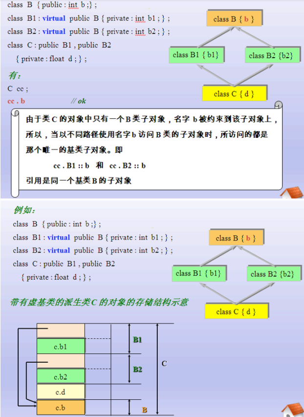

**继承（inheritance）**机制是面向对象程序设计，使代码可以复用的重要的手段，它允许程序员在保持原有类特性的基础上进行扩展，增加功能，这样产生新的类，称派生类。

继承呈现了面向对象程序设计的层次结构，体现了由简单到复杂的认知过程。

## 1 继承定义

定义格式：

下面我们看到 Person 是父类，也称作基类。 Student 是子类，也称作派生类。

## 2 继承的方式

保护继承：基类的公有成员和私有成员都是以保护成员的身份出现在派生类中，不可用访问基类的私有成员。派生类的其他成员可以直接访问从基类继承的公有和保护成员，但是类外部通过派生类的对象无法访问它们，无论派生类的成员，还是派生类的对象，都无法访问基类的私有成员。

**如何恰当的使用public，protected和private为成员声明访问级别？**

1. 需要被外界访问的成员直接设置为public 

2. 只能在当前类中访问的成员设置为private 

3. 只能在当前类和子类中访问的成员设置为protected，protected成
员的访问权限介于public和private之间。

## 3 继承中的构造和析构

- 在子类对象构造时，需要调用父类构造函数对其继承得来的成员进行初始化。

- 在子类对象析构时，需要调用父类析构函数对其继承得来的成员进行清理。

通过[/assets/CPlusPlus/12_inheritance/01_父类与子类的构造与析构.cpp](/assets/CPlusPlus/12_inheritance/01_父类与子类的构造与析构.cpp)示例，可以看见，先构造父类内存区域，再执行子类构造内存区域。析构的时候，先释放子类内存区域，再释放父类内存区域。

通过函数初始化列表，可以执行不同的父类构造函数。

**继承中构造析构调用原则：**

1. 子类对象在创建时会首先调用父类的构造函数

2. 父类构造函数执行结束后，执行子类的构造函数

3. 当父类的构造函数有参数时，需要在子类的初始化列表中显示调用

4. 析构函数调用的先后顺序与构造函数相反

## 4 虚继承virtual

如果一个派生类从多个基类派生，而这些基类又有一个共同的基类，则在对该基类中声明的名字进行访问时，可能产生二义性。

**如何避免这种情况的发生：**

