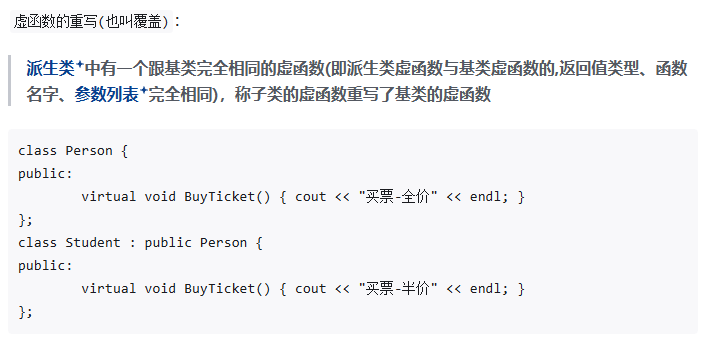

## 1 基本概念

概念: 通俗来说,多态就是多种状态，父子对象完成相同任务会产生不同的结果。

比如：

学生和普通人都去买门票学生是半价,而普通人是全价

在继承中构成多态要有两个条件:

1. 必须通过基类的指针

2. 调用的函数必须是虚函数，并且子类的虚函数要被重写

### 1.1 虚函数的概念

基类中声明为virtual并在一个或多个派生类中重新定义的成员函数叫做虚函数。

关键字virtual加在成员函数前，这个成员函数就是虚函数!

### 1.2 虚函数的核心作用

1. 实现动态联编，在函数运行阶段动态的选择合适的成员函数。

2. 在定义了虚函数后，可实现在派生类中对虚函数进行重写，从而实现统一的接口和不同的执行过程。

### 1.3 示例

## 2 构成多态的两个特列

