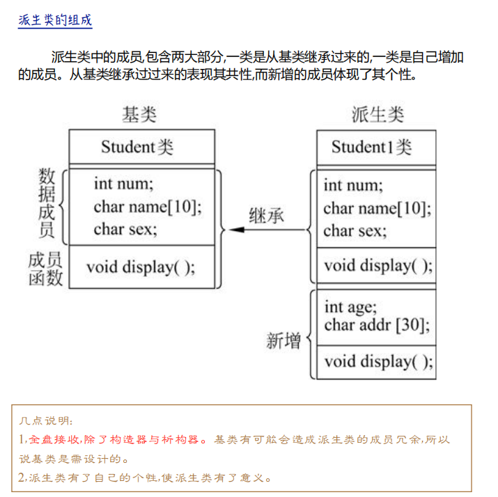
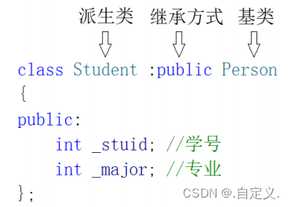
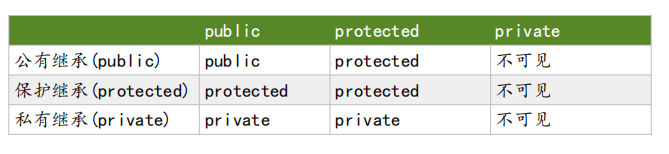
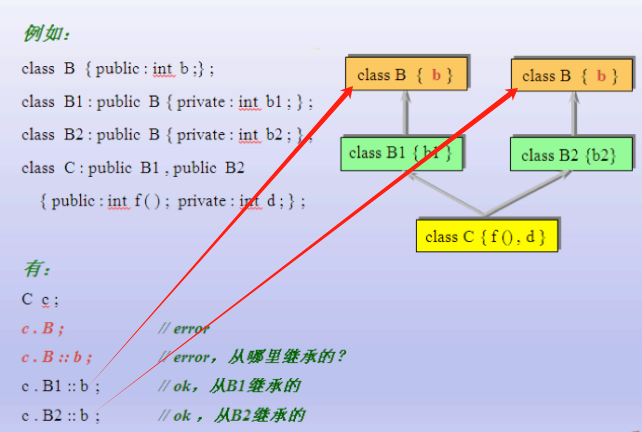

这是我在学习Qt过程中，对于一些未掌握的C++语法进行总结。

## 1 父类构造执行

这是类继承的结构图：



类继承后，比如创建 Student1类，就会先执行父类的构造函数。

我们可以通过初始化列表，指定执行那个父类的构造函数（由于构造函数重载，父类可能有好几个构造函数）

可以参考 [01_测试父类构造函数执行.cpp](/assets/CPlusPlus/16_知识点/01_测试父类构造函数执行.cpp)

## 2 命名空间中前向声明类

**前向声明**：是指在使用某个类、结构体或函数之前，仅仅声明该类、结构体或函数的存在而不定义其实现细节。前向声明可以避免循环依赖和头文件包含问题，提高编译效率和可维护性。

### 2.1 为什么要使用前向声明

A需要B的成员的时候，B需要A对象的指针或者引用的时候。就可以先把A进行前向声明。

<font color="red">前向声明仅仅是可用该对象的指针或者引用</font>




### 2.2 类的前向声明

对于类的前向声明，我们可以使用class关键字来声明类名，而无需包含类的具体实现。例如：

```c++
// 前向声明类B
class B;

class A {
public:
    A();
    void doSomethingWithB(B b);
};

// 类B的实现
class B {
public:
    B() {}
    void doSomething() {
        std::cout << "Doing something in class B." << std::endl;
    }
};

A::A() {}

void A::doSomethingWithB(B b) {
    b.doSomething();
}

int main() {
    A a;
    B b;
    a.doSomethingWithB(b);

    return 0;
}
```

在上面的示例中，类A中使用了类B的一个对象b，但在类A的定义中没有包含类B的头文件。通过class B;的前向声明，编译器可以知晓类B的存在，并正确解析依赖关系。

### 2.3 结构体的前向声明

在C++中，结构体的前向声明与类的前向声明类似，也可以使用struct关键字进行声明。例如：

```c++
// 前向声明结构体S
struct S;

void doSomethingWithS(S* s);

// 结构体S的实现
struct S {
    int value;
    S(int v) : value(v) {}
};

void doSomethingWithS(S* s) {
    if (s) {
        std::cout << "Value of S: " << s->value << std::endl;
    } else {
        std::cout << "Invalid S pointer." << std::endl;
    }
}

int main() {
    S s(42);
    doSomethingWithS(&s);

    return 0;
}
```

### 2.4 函数的前向声明

除了类和结构体，我们也可以对函数进行前向声明。在函数的前向声明中，我们只需要声明函数的原型而无需定义函数的实现。例如：

```c++
// 前向声明函数foo
void foo(int x);

void bar() {
    foo(42);
}

// 函数foo的实现
void foo(int x) {
    std::cout << "Calling foo with parameter " << x << std::endl;
}

int main() {
    bar();

    return 0;
}
```

### 2.5 Qt中的前向声明Ui

使用到的知识点：

1. 多个文件相同的命名空间合并

2. 类的前向声明




