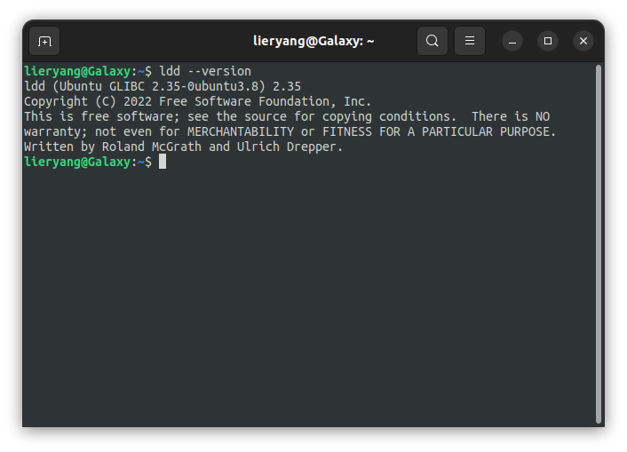
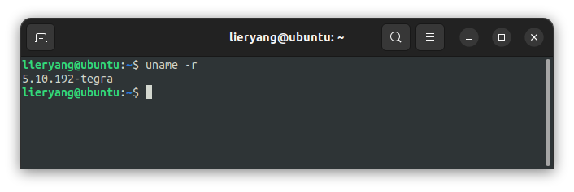
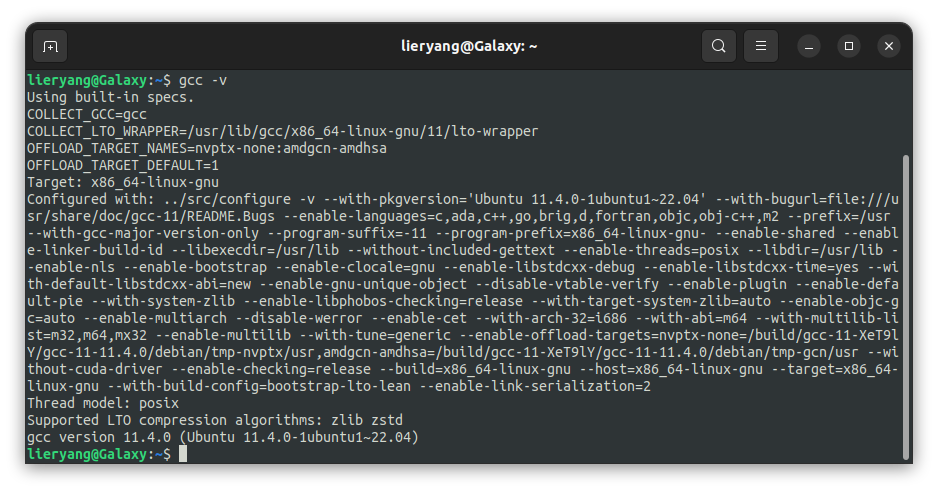

提前安装依赖

```sh
sudo apt-get install -y texinfo libgmp-dev libmpfr-dev libmpc-dev gawk
```

```sh
# 查看glibc版本
ldd --version
```



```sh
# Linux内核版本查看
uname -r
```



```sh
# 查看gcc版本
gcc -v
```



gcc编译过程中，一般需要给你三个机器名称，即编译系统（build）、运行系统（host）、目标系统（target），以便编译器生成对应机器的二进制代码。

- **build**：是指目前我们正在用那个平台来构建gcc编译器。
  
- **host**：我们使用那个平台来运行已经构建好的gcc编译器。（到底表示的是gcc运行平台，还是编译好的代码运行平台）

- **target**： 指的是运行最终生成的代码在那个机器上面运行。


### 下载

[gcc下载：https://ftp.gnu.org/gnu/gcc/](https://ftp.gnu.org/gnu/gcc/)

[glibc下载：https://ftp.gnu.org/gnu/glibc/](https://ftp.gnu.org/gnu/glibc/)

[Linux内核下载：https://mirrors.ustc.edu.cn/kernel.org/linux/kernel/](https://mirrors.ustc.edu.cn/kernel.org/linux/kernel/)

**Binutils**：包含了链接器与汇编器等其他工具。这个可以下载最新的，这个版本无所谓。

[Binutils下载：https://ftp.gnu.org/gnu/binutils/](https://ftp.gnu.org/gnu/binutils/)


### 编译binutils

```sh
../configure --prefix=/home/lieryang/Documents/across_aarch64/aarch64_gcc9.4.0_glibc2.31_linux --target=aarch64-linux-gnu --disable-multilib
make -j20
make install
```

```sh
../configure --prefix=$PREFIX \
    --build=$MACHTYPE --host=$MACHTYPE \
    --target=$TARGET \
    --with-sysroot="$PREFIX/$TARGET/sys-root" \
    --disable-multilib \
    --disable-shared --disable-nls
make -j20
make install
```


### 安装Linux头文件

```sh
make ARCH=arm64 INSTALL_HDR_PATH="$PREFIX/$TARGET/sys-root/usr" headers_install
```

### 编译gcc

```sh
../configure --prefix=/home/lieryang/Documents/across_aarch64/aarch64_gcc9.4.0_glibc2.31_linux --target=aarch64-linux-gnu --with-glibc-version=2.23 --enable-languages=c,c++ --disable-multilib  --with-protoc
make -j20 all-gcc # 一定要指定是all-gcc,否则会出错
make install-gcc
```

```sh
../configure --prefix=$PREFIX \
    --build=$MACHTYPE --host=$MACHTYPE \
    --target=$TARGET \
    --with-sysroot="$PREFIX/$TARGET/sys-root" \
    --with-build-sysroot="$PREFIX/$TARGET/sys-root" \
    --disable-multilib \
    --disable-shared --disable-nls \
    --with-zstd \
    --enable-languages=c,c++,fortran
```

### 编译glibc

```sh
../configure --prefix=/home/lieryang/Documents/across_aarch64/aarch64_gcc9.4.0_glibc2.31_linux --build=$MACHTYPE --host=aarch64-linux-gnu --target=aarch64-linux-gnu --disable-multilib CFLAGS='-Wno-error=array-parameter'

make install-bootstrap-headers=yes install-headers


```


https://www.wannaexpresso.com/2022/02/21/gcc-cross-compiler-make-it-your-own/
https://www.cnblogs.com/zhouronghua/p/15236755.html
https://forums.developer.nvidia.com/t/gcc-jetson-nano/271412

