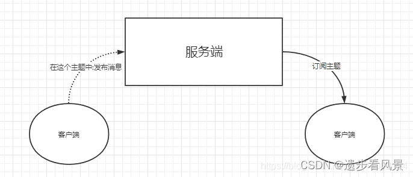

https://blog.csdn.net/baoecit/article/details/122909906

https://blog.csdn.net/zsz_shsf/article/details/130954191

https://www.cnblogs.com/mq0036/p/11187138.html

https://zhuanlan.zhihu.com/p/658787798?utm_id=0

https://www.cnblogs.com/breakpointlab/p/16618170.html

https://www.cnblogs.com/breakpointlab/p/15828119.html

https://zhuanlan.zhihu.com/p/431525275

Edit -> Preferences 

需要分析FU 

https://blog.csdn.net/jinking01/article/details/120483496

https://zhuanlan.zhihu.com/p/569915293

https://blog.csdn.net/wangbuji/article/details/122443023

需要补充H264 H265 Slice的分析