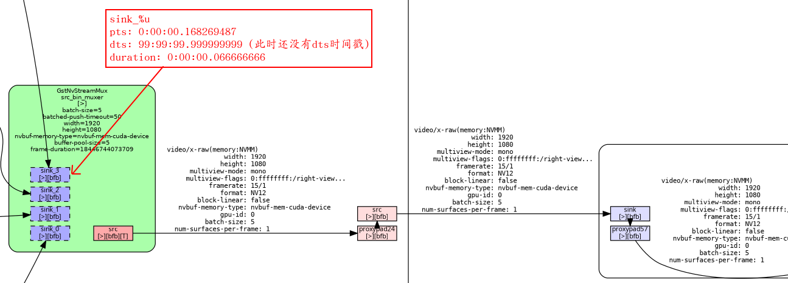
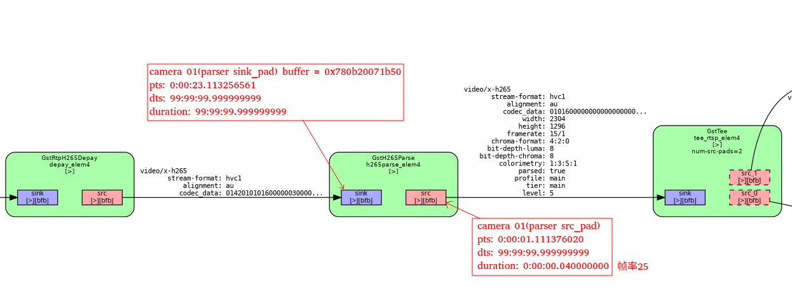
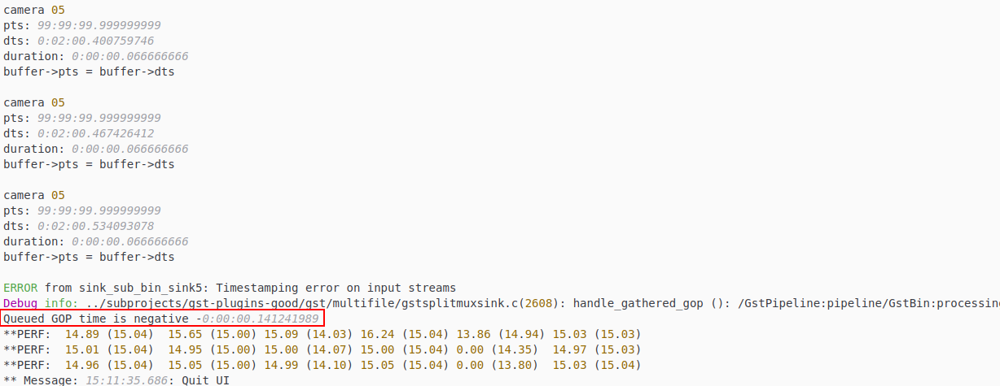

```sh
**PERF:  FPS 0 (Avg)    FPS 1 (Avg)     FPS 2 (Avg)     FPS 3 (Avg)
**PERF:  20.66 (19.75)  20.45 (19.25)   19.83 (18.33)   19.75 (19.11)
**PERF:  14.90 (15.86)  14.92 (13.95)   14.93 (15.60)   13.34 (13.61)
** WARN: <queue_src_pad_probe:275>: Invalid PTS found in stream. Stream recorded by Smart Record might have issues
ERROR from muxer: Could not multiplex stream.
Debug info: ../subprojects/gst-plugins-good/gst/isomp4/gstqtmux.c(5402): gst_qt_mux_add_buffer (): /GstPipeline:pipeline/GstBin:processing_demux_bin_1/GstBin:sink_bin/GstBin:sink_sub_bin2/GstSplitMuxSink:sink_sub_bin_sink2/GstMP4Mux:muxer:
Buffer has no PTS.
0:00:15.438554909 39836 0x716e55e733e0 WARN                 nvinfer gstnvinfer.cpp:2406:gst_nvinfer_output_loop:<primary_gie> error: Internal data stream error.
0:00:15.438562979 39836 0x716e55e733e0 WARN                 nvinfer gstnvinfer.cpp:2406:gst_nvinfer_output_loop:<primary_gie> error: streaming stopped, reason error (-5)
ERROR from primary_gie: Internal data stream error.
Debug info: gstnvinfer.cpp(2406): gst_nvinfer_output_loop (): /GstPipeline:pipeline/GstBin:primary_gie_bin/GstNvInfer:primary_gie:
streaming stopped, reason error (-5)
ERROR from src_elem1: Internal data stream error.
Debug info: ../subprojects/gst-plugins-good/gst/rtsp/gstrtspsrc.c(6252): gst_rtspsrc_loop (): /GstPipeline:pipeline/GstBin:multi_src_bin/GstBin:src_sub_bin1/GstRTSPSrc:src_elem1:
streaming stopped, reason error (-5)
**PERF:  14.89 (15.30)  7.60 (11.54)    14.43 (14.97)   4.40 (9.55)
ERROR from src_elem3: Internal data stream error.
Debug info: ../subprojects/gst-plugins-good/gst/rtsp/gstrtspsrc.c(6252): gst_rtspsrc_loop (): /GstPipeline:pipeline/GstBin:multi_src_bin/GstBin:src_sub_bin3/GstRTSPSrc:src_elem3:
streaming stopped, reason error (-5)
ERROR from src_elem2: Internal data stream error.
Debug info: ../subprojects/gst-plugins-good/gst/rtsp/gstrtspsrc.c(6252): gst_rtspsrc_loop (): /GstPipeline:pipeline/GstBin:multi_src_bin/GstBin:src_sub_bin2/GstRTSPSrc:src_elem2:
streaming stopped, reason error (-5)
ERROR from src_elem0: Internal data stream error.
Debug info: ../subprojects/gst-plugins-good/gst/rtsp/gstrtspsrc.c(6252): gst_rtspsrc_loop (): /GstPipeline:pipeline/GstBin:multi_src_bin/GstBin:src_sub_bin0/GstRTSPSrc:src_elem0:
streaming stopped, reason error (-5)
** INFO: <reset_source_pipeline:1712>: Resetting source 0
ERROR from src_elem0: Internal data stream error.
Debug info: ../subprojects/gst-plugins-good/gst/rtsp/gstrtspsrc.c(6252): gst_rtspsrc_loop (): /GstPipeline:pipeline/GstBin:multi_src_bin/GstBin:src_sub_bin0/GstRTSPSrc:src_elem0:
streaming stopped, reason error (-5)
** INFO: <reset_source_pipeline:1712>: Resetting source 1
** INFO: <reset_source_pipeline:1712>: Resetting source 3
** INFO: <reset_source_pipeline:1712>: Resetting source 2
** INFO: <reset_source_pipeline:1712>: Resetting source 0
ERROR from src_elem1: Internal data stream error.
Debug info: ../subprojects/gst-plugins-good/gst/rtsp/gstrtspsrc.c(6252): gst_rtspsrc_loop (): /GstPipeline:pipeline/GstBin:multi_src_bin/GstBin:src_sub_bin1/GstRTSPSrc:src_elem1:
streaming stopped, reason error (-5)
ERROR from src_elem3: Internal data stream error.
Debug info: ../subprojects/gst-plugins-good/gst/rtsp/gstrtspsrc.c(6252): gst_rtspsrc_loop (): /GstPipeline:pipeline/GstBin:multi_src_bin/GstBin:src_sub_bin3/GstRTSPSrc:src_elem3:
streaming stopped, reason error (-5)
ERROR from src_elem0: Internal data stream error.
Debug info: ../subprojects/gst-plugins-good/gst/rtsp/gstrtspsrc.c(6252): gst_rtspsrc_loop (): /GstPipeline:pipeline/GstBin:multi_src_bin/GstBin:src_sub_bin0/GstRTSPSrc:src_elem0:
streaming stopped, reason error (-5)
ERROR from src_elem2: Internal data stream error.
Debug info: ../subprojects/gst-plugins-good/gst/rtsp/gstrtspsrc.c(6252): gst_rtspsrc_loop (): /GstPipeline:pipeline/GstBin:multi_src_bin/GstBin:src_sub_bin2/GstRTSPSrc:src_elem2:
streaming stopped, reason error (-5)
** INFO: <reset_source_pipeline:1712>: Resetting source 0
ERROR from src_elem0: Internal data stream error.
Debug info: ../subprojects/gst-plugins-good/gst/rtsp/gstrtspsrc.c(6252): gst_rtspsrc_loop (): /GstPipeline:pipeline/GstBin:multi_src_bin/GstBin:src_sub_bin0/GstRTSPSrc:src_elem0:
streaming stopped, reason error (-5)
** INFO: <reset_source_pipeline:1712>: Resetting source 1
** INFO: <reset_source_pipeline:1712>: Resetting source 3
** INFO: <reset_source_pipeline:1712>: Resetting source 0
** INFO: <reset_source_pipeline:1712>: Resetting source 2
** ERROR: <RunUserCallback:207>: No video stream found
** ERROR: <RunUserCallback:207>: No video stream found
ERROR from src_elem1: Internal data stream error.
Debug info: ../subprojects/gst-plugins-good/gst/rtsp/gstrtspsrc.c(6252): gst_rtspsrc_loop (): /GstPipeline:pipeline/GstBin:multi_src_bin/GstBin:src_sub_bin1/GstRTSPSrc:src_elem1:
streaming stopped, reason error (-5)
**PERF:  0.00 (10.55)   0.00 (7.95)     0.00 (10.32)    0.00 (6.58)
ERROR from src_elem3: Internal data stream error.
Debug info: ../subprojects/gst-plugins-good/gst/rtsp/gstrtspsrc.c(6252): gst_rtspsrc_loop (): /GstPipeline:pipeline/GstBin:multi_src_bin/GstBin:src_sub_bin3/GstRTSPSrc:src_elem3:
streaming stopped, reason error (-5)
ERROR from src_elem2: Internal data stream error.
Debug info: ../subprojects/gst-plugins-good/gst/rtsp/gstrtspsrc.c(6252): gst_rtspsrc_loop (): /GstPipeline:pipeline/GstBin:multi_src_bin/GstBin:src_sub_bin2/GstRTSPSrc:src_elem2:
streaming stopped, reason error (-5)
** INFO: <reset_source_pipeline:1712>: Resetting source 0
ERROR from src_elem0: Internal data stream error.
Debug info: ../subprojects/gst-plugins-good/gst/rtsp/gstrtspsrc.c(6252): gst_rtspsrc_loop (): /GstPipeline:pipeline/GstBin:multi_src_bin/GstBin:src_sub_bin0/GstRTSPSrc:src_elem0:
streaming stopped, reason error (-5)
** INFO: <reset_source_pipeline:1712>: Resetting source 1
** INFO: <reset_source_pipeline:1712>: Resetting source 3
** INFO: <reset_source_pipeline:1712>: Resetting source 2
ERROR from src_elem1: Internal data stream error.
Debug info: ../subprojects/gst-plugins-good/gst/rtsp/gstrtspsrc.c(6252): gst_rtspsrc_loop (): /GstPipeline:pipeline/GstBin:multi_src_bin/GstBin:src_sub_bin1/GstRTSPSrc:src_elem1:
streaming stopped, reason error (-5)
ERROR from src_elem2: Internal data stream error.
Debug info: ../subprojects/gst-plugins-good/gst/rtsp/gstrtspsrc.c(6252): gst_rtspsrc_loop (): /GstPipeline:pipeline/GstBin:multi_src_bin/GstBin:src_sub_bin2/GstRTSPSrc:src_elem2:
streaming stopped, reason error (-5)
** INFO: <reset_source_pipeline:1712>: Resetting source 0
ERROR from src_elem0: Internal data stream error.
Debug info: ../subprojects/gst-plugins-good/gst/rtsp/gstrtspsrc.c(6252): gst_rtspsrc_loop (): /GstPipeline:pipeline/GstBin:multi_src_bin/GstBin:src_sub_bin0/GstRTSPSrc:src_elem0:
streaming stopped, reason error (-5)
ERROR from src_elem3: Internal data stream error.
Debug info: ../subprojects/gst-plugins-good/gst/rtsp/gstrtspsrc.c(6252): gst_rtspsrc_loop (): /GstPipeline:pipeline/GstBin:multi_src_bin/GstBin:src_sub_bin3/GstRTSPSrc:src_elem3:
streaming stopped, reason error (-5)
** INFO: <reset_source_pipeline:1712>: Resetting source 1
** INFO: <reset_source_pipeline:1712>: Resetting source 2
ERROR from src_elem1: Internal data stream error.
Debug info: ../subprojects/gst-plugins-good/gst/rtsp/gstrtspsrc.c(6252): gst_rtspsrc_loop (): /GstPipeline:pipeline/GstBin:multi_src_bin/GstBin:src_sub_bin1/GstRTSPSrc:src_elem1:
streaming stopped, reason error (-5)
**PERF:  0.00 (8.05)    0.00 (6.07)     0.00 (7.87)     0.00 (5.02)
** INFO: <reset_source_pipeline:1712>: Resetting source 0
ERROR from src_elem2: Internal data stream error.
Debug info: ../subprojects/gst-plugins-good/gst/rtsp/gstrtspsrc.c(6252): gst_rtspsrc_loop (): /GstPipeline:pipeline/GstBin:multi_src_bin/GstBin:src_sub_bin2/GstRTSPSrc:src_elem2:
streaming stopped, reason error (-5)
ERROR from src_elem0: Internal data stream error.
Debug info: ../subprojects/gst-plugins-good/gst/rtsp/gstrtspsrc.c(6252): gst_rtspsrc_loop (): /GstPipeline:pipeline/GstBin:multi_src_bin/GstBin:src_sub_bin0/GstRTSPSrc:src_elem0:
streaming stopped, reason error (-5)
** INFO: <reset_source_pipeline:1712>: Resetting source 3
ERROR from src_elem3: Internal data stream error.
Debug info: ../subprojects/gst-plugins-good/gst/rtsp/gstrtspsrc.c(6252): gst_rtspsrc_loop (): /GstPipeline:pipeline/GstBin:multi_src_bin/GstBin:src_sub_bin3/GstRTSPSrc:src_elem3:
streaming stopped, reason error (-5)
** INFO: <reset_source_pipeline:1712>: Resetting source 1
** INFO: <reset_source_pipeline:1712>: Resetting source 2
ERROR from src_elem1: Internal data stream error.
Debug info: ../subprojects/gst-plugins-good/gst/rtsp/gstrtspsrc.c(6252): gst_rtspsrc_loop (): /GstPipeline:pipeline/GstBin:multi_src_bin/GstBin:src_sub_bin1/GstRTSPSrc:src_elem1:
streaming stopped, reason error (-5)
** INFO: <reset_source_pipeline:1712>: Resetting source 0
ERROR from src_elem2: Internal data stream error.
Debug info: ../subprojects/gst-plugins-good/gst/rtsp/gstrtspsrc.c(6252): gst_rtspsrc_loop (): /GstPipeline:pipeline/GstBin:multi_src_bin/GstBin:src_sub_bin2/GstRTSPSrc:src_elem2:
streaming stopped, reason error (-5)
ERROR from src_elem0: Internal data stream error.
Debug info: ../subprojects/gst-plugins-good/gst/rtsp/gstrtspsrc.c(6252): gst_rtspsrc_loop (): /GstPipeline:pipeline/GstBin:multi_src_bin/GstBin:src_sub_bin0/GstRTSPSrc:src_elem0:
streaming stopped, reason error (-5)
** INFO: <reset_source_pipeline:1712>: Resetting source 3
ERROR from src_elem3: Internal data stream error.
Debug info: ../subprojects/gst-plugins-good/gst/rtsp/gstrtspsrc.c(6252): gst_rtspsrc_loop (): /GstPipeline:pipeline/GstBin:multi_src_bin/GstBin:src_sub_bin3/GstRTSPSrc:src_elem3:
streaming stopped, reason error (-5)
** INFO: <reset_source_pipeline:1712>: Resetting source 1
** INFO: <reset_source_pipeline:1712>: Resetting source 2
ERROR from src_elem1: Internal data stream error.
Debug info: ../subprojects/gst-plugins-good/gst/rtsp/gstrtspsrc.c(6252): gst_rtspsrc_loop (): /GstPipeline:pipeline/GstBin:multi_src_bin/GstBin:src_sub_bin1/GstRTSPSrc:src_elem1:
streaming stopped, reason error (-5)
**PERF:  0.00 (6.51)    0.00 (4.91)     0.00 (6.36)     0.00 (4.06)
** INFO: <reset_source_pipeline:1712>: Resetting source 0
ERROR from src_elem2: Internal data stream error.
Debug info: ../subprojects/gst-plugins-good/gst/rtsp/gstrtspsrc.c(6252): gst_rtspsrc_loop (): /GstPipeline:pipeline/GstBin:multi_src_bin/GstBin:src_sub_bin2/GstRTSPSrc:src_elem2:
streaming stopped, reason error (-5)
ERROR from src_elem0: Internal data stream error.
Debug info: ../subprojects/gst-plugins-good/gst/rtsp/gstrtspsrc.c(6252): gst_rtspsrc_loop (): /GstPipeline:pipeline/GstBin:multi_src_bin/GstBin:src_sub_bin0/GstRTSPSrc:src_elem0:
streaming stopped, reason error (-5)
** INFO: <reset_source_pipeline:1712>: Resetting source 3
```


```sh
ERROR from muxer: Could not multiplex stream.
Debug info: ../subprojects/gst-plugins-good/gst/isomp4/gstqtmux.c(5402): gst_qt_mux_add_buffer (): /GstPipeline:pipeline/GstBin:processing_demux_bin_3/GstBin:sink_bin/GstBin:sink_sub_bin4/GstSplitMuxSink:sink_sub_bin_sink4/GstMP4Mux:muxer:
Buffer has no PTS.
**PERF:  14.94 (15.14)  15.09 (15.14)   15.01 (15.13)   15.03 (15.11)
0:00:35.631042482 47040 0x6ff8b97c3e40 WARN                 nvinfer gstnvinfer.cpp:2406:gst_nvinfer_output_loop:<primary_gie> error: Internal data stream error.
0:00:35.631052959 47040 0x6ff8b97c3e40 WARN                 nvinfer gstnvinfer.cpp:2406:gst_nvinfer_output_loop:<primary_gie> error: streaming stopped, reason error (-5)
ERROR from primary_gie: Internal data stream error.
Debug info: gstnvinfer.cpp(2406): gst_nvinfer_output_loop (): /GstPipeline:pipeline/GstBin:primary_gie_bin/GstNvInfer:primary_gie:
streaming stopped, reason error (-5)
ERROR from src_elem0: Internal data stream error.
Debug info: ../subprojects/gst-plugins-good/gst/rtsp/gstrtspsrc.c(6252): gst_rtspsrc_loop (): /GstPipeline:pipeline/GstBin:multi_src_bin/GstBin:src_sub_bin0/GstRTSPSrc:src_elem0:
streaming stopped, reason error (-5)
** INFO: <reset_source_pipeline:1712>: Resetting source 0
ERROR from src_elem1: Internal data stream error.
Debug info: ../subprojects/gst-plugins-good/gst/rtsp/gstrtspsrc.c(6252): gst_rtspsrc_loop (): /GstPipeline:pipeline/GstBin:multi_src_bin/GstBin:src_sub_bin1/GstRTSPSrc:src_elem1:
streaming stopped, reason error (-5)
ERROR from src_elem2: Internal data stream error.
Debug info: ../subprojects/gst-plugins-good/gst/rtsp/gstrtspsrc.c(6252): gst_rtspsrc_loop (): /GstPipeline:pipeline/GstBin:multi_src_bin/GstBin:src_sub_bin2/GstRTSPSrc:src_elem2:
streaming stopped, reason error (-5)
** INFO: <reset_source_pipeline:1712>: Resetting source 1
** INFO: <reset_source_pipeline:1712>: Resetting source 2
ERROR from src_elem3: Internal data stream error.
Debug info: ../subprojects/gst-plugins-good/gst/rtsp/gstrtspsrc.c(6252): gst_rtspsrc_loop (): /GstPipeline:pipeline/GstBin:multi_src_bin/GstBin:src_sub_bin3/GstRTSPSrc:src_elem3:
streaming stopped, reason error (-5)
** INFO: <reset_source_pipeline:1712>: Resetting source 3
ERROR from src_elem2: Internal data stream error.
Debug info: ../subprojects/gst-plugins-good/gst/rtsp/gstrtspsrc.c(6252): gst_rtspsrc_loop (): /GstPipeline:pipeline/GstBin:multi_src_bin/GstBin:src_sub_bin2/GstRTSPSrc:src_elem2:
streaming stopped, reason error (-5)
** INFO: <reset_source_pipeline:1712>: Resetting source 2
ERROR from src_elem0: Internal data stream error.
Debug info: ../subprojects/gst-plugins-good/gst/rtsp/gstrtspsrc.c(6252): gst_rtspsrc_loop (): /GstPipeline:pipeline/GstBin:multi_src_bin/GstBin:src_sub_bin0/GstRTSPSrc:src_elem0:
streaming stopped, reason error (-5)
** INFO: <reset_source_pipeline:1712>: Resetting source 0
ERROR from src_elem1: Internal data stream error.
Debug info: ../subprojects/gst-plugins-good/gst/rtsp/gstrtspsrc.c(6252): gst_rtspsrc_loop (): /GstPipeline:pipeline/GstBin:multi_src_bin/GstBin:src_sub_bin1/GstRTSPSrc:src_elem1:
streaming stopped, reason error (-5)
** INFO: <reset_source_pipeline:1712>: Resetting source 1
ERROR from src_elem3: Internal data stream error.
Debug info: ../subprojects/gst-plugins-good/gst/rtsp/gstrtspsrc.c(6252): gst_rtspsrc_loop (): /GstPipeline:pipeline/GstBin:multi_src_bin/GstBin:src_sub_bin3/GstRTSPSrc:src_elem3:
streaming stopped, reason error (-5)
** INFO: <reset_source_pipeline:1712>: Resetting source 3
```


https://blog.csdn.net/Creationyang/article/details/129222779


## 1 Buffer has no PTS

### 1.1 PTS无效原因分析

网络原因,H265parse src 

https://discourse.gstreamer.org/t/rtps-to-mp4-h264parse-dropping-buffer-pts/1283

https://discourse.gstreamer.org/t/h264-via-rtp-through-isofmp4mux-dts-pts-issues/1498/12

answer: new version(1.24) can no issue


**猜测原因1**：由于网络原因造成Buffer顺序混乱。（可能不成立）



大概率是由于parse出现的问题



多次测试后发现，PTS时间戳问题并不是nvstreammux之前产生的。？？？

**猜测原因2**：编码器问题。


f
**解决方案1**：

如果按照推理PTS，设置PTS，将会出现新的问题


