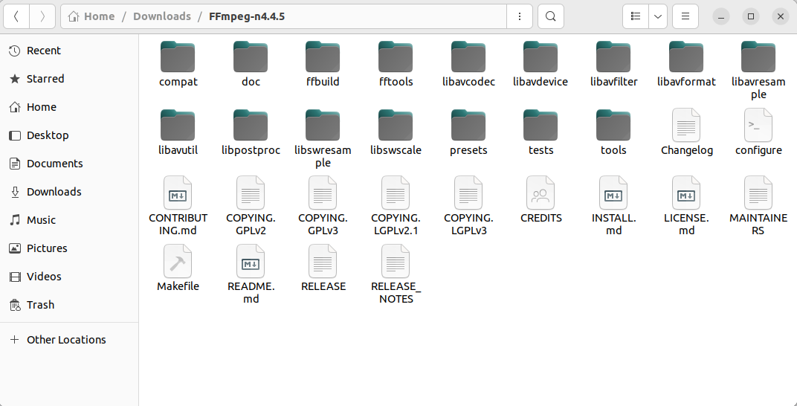

## 1 介绍

FFmpeg（Fast Forward MPEG）是一个开放源代码的自由软件，可以运行音频和视频多种格式的录影、转换、流功能。

### 1.1 FFmpeg目录文件

以下是FFmpeg源代码目录

以下是FFmpeg整体架构

- comppat：该目录存放的是兼容文件，以便兼容早期版本

- doc：说明文档

- libavcodec：编解码库，封装了Codec库，AVCodec中实现了目前多媒体领域绝大多数常用的编解码格式，即支持编码，也支持解码。AVCodec除了支持MPEG4、AAC、MJPEG等自带的媒体编解码格式之外，还支持第三方的编解码器，如H.264（AVC）编码，需要使用x264编码器；H.265（HEVC）编码，需要使用x264编码器；MP3（mp3lame）编码，需要使用libmp3lame编码器。如果希望增加自己的编码格式，或者硬件编解码，则需要在AVCodec中增加相应的编解码模块。默认不会添加libx264、libfdk_aac等三方库的，但可以插件形式添加，然后提供统一接口。

- libavdevice：各种设备的输入输出，比如Video4Linux2，VfW，DShow以及ALSA

- libavfilter：提供了一个通用的音频、视频、字幕等滤镜处理框架。在AVFilter中，滤镜框架可以有多个输入和多个输出。

- libavformat：文件格式和协议库，封装了Protocol层和Demuxer、Muxer层。其中实现了目前多媒体领域中的绝大多数媒体封装格式，包括封装和解封装，如MP4、FLV、KV、TS等文件封装格式，RTMP、RTSP、MMS、HLS等网络协议封装格式。FFmpeg是否支持某种媒体封装格式，取决于编译时是否包含了该格式的封装库。根据实际需求，可进行媒体封装格式的扩展，增加自己定制的封装格式，即在AVFormat中增加自己的封装处理模块。

- libavswresample：音频重采样，格式转换和混音

    - 重采样：改变音频的采样率，比如从44100HZ降低到8000HZ
    
    - 重新矩阵化：改变音频通道数量，比如从立体声道(stereo )变为单身道(mono)
    
    - 格式转换：改变音频采样大小，比如将每个样本大小从16bits降低到8bits

- libavutil：核心工具库，许多其他模块都会依赖该库做一些基本的音视频处理操作，如log信息、版本信息等。

- libpostproc：该模块可用于进行后期处理，当我们使用AVFilter的时 候需要打开该模块的开关，因为Filter中会使用到该模块的一些基础函数。

- libswscale：提供了高级别的图像转换API，例如它允许进行图像缩放和像素格式转换，常见于将图像从1080p转换成720p或者480p等的缩放，或者将图像数据从YUV420p转换成YUYV，或者YUV转RGB等图像格式转换。

### 1.2 FFmpeg命令行工具

FFmpeg框架中还提供了几个用于执行命令行完成音视频数据处理工具，包括ffplay、ffprobe、ffserver，具体解释如下：

- ffplay：Fast forword play，用ffmpeg实现的播放器

- ffserver：Fast forword server，用ffmpeg实现的rtsp服务器

- ffprobe：Fat forword probe，用来输入分析输入流

## 2 下载

### 2.1 Window下载

1. 打开FFmpeg网站：[https://www.ffmpeg.org/download.html#build-windows](https://www.ffmpeg.org/download.html#build-windows)

2. 点击 `Windows builds by BtbN` 下载编译好的程序和动态库。

    

3. 添加程序路径到系统环境变量PATH

    

### 2.2 Ubuntu下载

