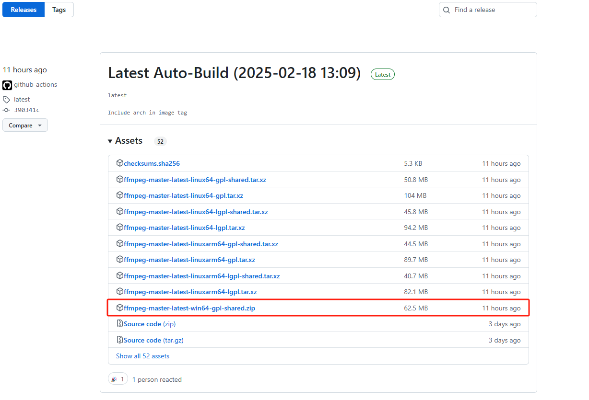

## 1 介绍

FFmpeg（Fast Forward MPEG）是一个开放源代码的自由软件，可以运行音频和视频多种格式的录影、转换、流功能。

## 1 Window配置

1. 打开FFmpeg网站：[https://www.ffmpeg.org/download.html#build-windows](https://www.ffmpeg.org/download.html#build-windows)

2. 点击 `Windows builds by BtbN` 下载编译好的程序和动态库。

    

3. 添加程序路径到系统环境变量PATH

    

https://www.fawdlstty.com/ffmpeg/docs/04_hello_ffmpeg.html#%E6%89%93%E5%BC%80%E8%BE%93%E5%87%BA%E6%B5%81

https://juejin.cn/post/7094619578356989966

https://blog.csdn.net/Javachichi/article/details/131660999

https://www.zl-asica.com/2020/ffmpeg/

https://img.ly/blog/ultimate-guide-to-ffmpeg/