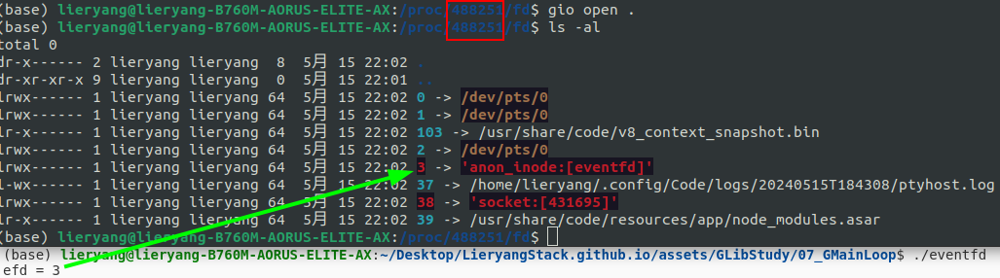

- GMainLoop -> GMainContext -> {GSource1, GSource2,GSource3… }

- 每个GMainLoop都包含一个GMainContext成员，而这个GMainContext成员可以装各种各样的GSource，GSource则是具体的各种Event处理逻辑了。在这里，可以把GMainContext理解为GSource的容器，但是它的用处不只是装GSouce。

- 创建GMainLoop使用函数g_main_loop_new,他的第一个参数就是需要关联的GMainContext，如果这个值为空，程序会分配一个默认的Context给GMainLoop，把GSource加到GMainContext使用g_source_attach。

- g_main_loop_new创建一个main loop对象，一个main loop对象只能被一个线程使用，但一个线程可以有多个main loop对象。
GLib内部实现了几种类型的事件源，分别是文件描述符（文件、管道和socket）、超时、idle事件、自定义事件。

## 1 GPollFD

`GPollFD` 用在事件循环中监听IO事件描述符的状态变化，这部分较为简单，是对 `poll` 和 `struct pollfd` 的封装。

### 1.1 GPollFD结构体

```c
/* filename: gpoll.h */

/**
 * @brief: 表示一个文件描述符，要轮询的事件，以及发生的事件。
 * @fd: 要轮询的文件描述符（或者在 Win32 上是一个句柄）
 * @event: 一个位掩码，包含了要轮询的事件。通常用于从文件描述符读取数据时会使用 %G_IO_IN | %G_IO_HUP | %G_IO_ERR，而写入数据时会使用 %G_IO_OUT | %G_IO_ERR。
 * @event: 从 poll() 函数返回的一组标志，表示发生了哪些事件。
*/
struct _GPollFD
{
  gint		fd;
  gushort 	events;
  gushort 	revents;
};
```

### 1.2 GPollFD相关函数

```c
/* filename: gpoll.c */

gint
g_poll (GPollFD *fds,
	guint    nfds,
	gint     timeout) {

  /**
   * @brief: struct pollfd结构体与struct _GPollFD结构体完全一样
   * @param fds:一个指向 struct pollfd 结构体数组的指针，每个结构体描述一个要监视的文件描述符及其所关注的事件。
   * @param nfds: @fds 数组中结构体的数量。
   * @param timeout: 等待的超时时间，单位是毫秒。传入负数表示无限等待，传入 0 表示立即返回，传入正数表示等待指定的毫秒数后返回。
  */
  return poll ((struct pollfd *)fds, nfds, timeout);
}
```

## 2 GWakeup

- `eventfd` 是LInux提供的一种事件通知机制

- `eventfd` 包含一个由内核维护的64位无符号整型计数器，创建eventfd时会返回一个文件描述符，进程可以通过对这个文件描述符（64位无符号整数）进行read/write来读取/改变计数器的值，从而实现进程间的同步和通信。

**1. eventfd 既然对应了一个“文件”，那么这个“文件”的内容是什么呢？**

答：eventfd 是一个计数相关的fd。计数不为零是有可读事件发生，read 之后计数会清零，write 则会递增计数器。

**2. eventfd 阻塞属性**

答：我们知道读写 fd 的时候，可能会遇到阻塞，对于 socket fd 来说，没有数据的时候来读，则会阻塞。写 buffer 满了的时候来写，则会阻塞。对于 `write eventfd` 一直可写。

   `read eventfd` 的时候，如果计数器的值为 0，就会阻塞（这种就等同于没“文件”内容）。

   这种可以设置 fd 的属性为非阻塞类型，这样读的时候，如果计数器为 0 ，返回 EAGAIN 即可，这样就不会阻塞整个系统。

**3. eventfd() 函数**

```c
/**
 * @brief: 通过eventfd函数，来创建eventfd，该函数会返回eventfd所对应的文件描述符。
 * @param count: 创建eventfd时的初始值（计数器的初始值）
 * @param flags: EFD_CLOEXEC：表示eventfd在exec其他程序时会自动关闭这个文件描述符
 *               EFD_NONBLOCK：表示eventfd非阻塞
 *               EFD_SEMAPHORE：表示eventfd作为一个信号量来使用
 * @return: 成功时，返回一个非负整数的文件描述符，失败时，返回-1
*/
int 
eventfd (unsigned int __count, int __flags);
```

具体示例程序 [](/assets/GLibStudy/09_GMainLoop/eventfd.c)



使用 `write ()` 写入，计数器值累加， `read ()` 函数读取，计数器值清零。可以在进程文件里面查看创建的文件描述符。

### 2.1 GWakeup结构体


```c
/* filename: gwakeup.c */
struct _GWakeup
{
  gint fds[2]; /* 一般情况，系统支持eventfd函数，使用的就是fds[0] */
};
```

### 2.2 GWakeup相关函数

```c
/* 创建一个 #GWakeup，其实内部调用的就是 eventfd () 函数 */
GWakeup *g_wakeup_new (void);

/* 释放 GWakeup 内存空间，关闭 wakeup->fds[0] 句柄 */
void g_wakeup_free (GWakeup *wakeup);

/* 查看是否收到信号（是否可读），这个函数并不会阻塞，因为创建的时候，使用了不阻塞flags，但是使用了 while 循环判断是否读到数据，所以不可读状态，该函数还是会阻塞 */
void g_wakeup_acknowledge (GWakeup *wakeup);

/* 通过写入 wakeup->fds[0]，使得 g_wakeup_acknowledge 退出阻塞 */
void g_wakeup_signal (GWakeup *wakeup);
```

## 3 GSource

```c
/* filename: main.h */
struct _GSource
{
  /*< private >*/
  gpointer callback_data; /* 该源要执行的回调函数的数据 */
  GSourceCallbackFuncs *callback_funcs; /* 该源要执行的回调函数 */

  const GSourceFuncs *source_funcs; /* 该源的函数表，有prepare check dispatch finalize */
  guint ref_count; /* 该源的引用计数 */

  GMainContext *context; /* 该源附加到那个循环上下文上执行 */

  gint priority; /* 该源的执行优先级 */
  guint flags; 
  guint source_id; /* 该源的id序号，通过id序号可以找到该源的结构体地址 */

  GSList *poll_fds; /* 难懂说一个source可以有多个文件描述符进行轮询吗？？？ */
  
  GSource *prev;
  GSource *next;

  char    *name; /* 该源的name */

  GSourcePrivate *priv; 
};
```

`GLib` 系统封装了以下几种事件源类型

- 超时事件

- 空闲事件

- IO事件

**引用计数：**

```c
/* ref_count = 1 */
GSource *source = g_source_new(&g_source_funcs, sizeof(GSource));

/* 设定回调函数不会增加引用计数，所以 ref_count = 1 */
g_source_set_callback(source, (GSourceFunc)source_cb, "Hello, world!", NULL);

/*  把事件源添加到Context引用计数会加1， 所以 ref_count = 2 */
g_source_attach(source, context);

/* 为了程序结束的时候不需要手动释放，只需要释放context即可（因为Context会调用unref一次source）*/
g_source_unref(source); /* 所以此时， ref_count = 1 */
```


### 3.1 GSourceFuns

```c
/* filename: gmain.h */
struct _GSourceFuncs
{
  gboolean (*prepare)  (GSource    *source,
                        gint       *timeout_);/* Can be NULL */
  gboolean (*check)    (GSource    *source);/* Can be NULL */
  gboolean (*dispatch) (GSource    *source,
                        GSourceFunc callback,
                        gpointer    user_data);
  void     (*finalize) (GSource    *source); /* Can be NULL */

  /*< private >*/
  /* For use by g_source_set_closure */
  GSourceFunc     closure_callback;        
  GSourceDummyMarshal closure_marshal; /* Really is of type GClosureMarshal */
};
```

#### 3.1.1 prepare

```c

/**
 * @brief: 每一轮循环loop，都会调用该函数
 * @param GSource: 使用 g_source_new 函数新建的 source （也有可能不是GSource类型，可以是继承于GSource创建的结构体，例如：GIOUnixWatch）
 * @param timeout(out): 超时时间（毫秒单位）。一个循环上下文可以有很多个事件源，这个超时时间是给 poll 循环函数赋值的。
 *                      poll函数的超时时间 = Min { 所有源 } ，所有源事件最小值
 *                      也可以设置为 -1， -1表示不设定超时时间，-1是最大时间。
 * @return: 当事件源的prepare返回TRUE后，check函数就不会执行，会直接调用dispatch函数
 *          当事件源的prepare返回FALSE后，check函数返回TRUE，dispatch函数执行
 *          当事件源的prepare返回FALSE后，check函数返回FALSE，dispatch函数不会执行
 *          删除事件源后，finalize函数执行一次
*/
gboolean
source_prepare_cb(GSource *source, gint *timeout){
  g_print("%s\n",__func__);
  *timeout = -1; /* prepare函数之后，系统会执行poll函数，假如此时所有源都是-1，就会一直阻塞等到poll有事件发生 */
  return TRUE;
}
```

#### 3.1.2 check

```c
/**
 * @brief: 所有事件源的prepare函数执行完毕后，会执行poll轮询检查文件描述符事件是否发生，所有注册IO源文件描述符会在一个链表里面。
 * @return: 返回TRUE，会执行dispatch函数；返回FALSE，dispatch函数不会执行。
 * @note: 如果prepare函数返回TRUE，这个函数则不会执行。
*/
gboolean
source_check_cb(GSource *source){
  g_print("%s\n",__func__);
  return TRUE;
}
```

#### 3.1.3 dispatch

```c
/**
 * @brief: 最终要进行执行的事件回调函数，g_source_set_callback 设定的回调函数
 * @return: 返回TRUE保留事件，返回FALSE表示删除该事件源
 * @note: 回调函数的参数类型不一定要符合GSourceFunc类型，因为最终是通过用户自定义dispatch函数调用的，可以根据dispatch最终执行的回调函数类型定义。比如GstBus
*/
gboolean
source_dispatch_cb(GSource *source,
                   GSourceFunc callback,
                   gpointer data){
  g_print("%s\n",__func__);
  gint ret = callback(data);
  return ret;                  
}
```

#### 3.1.4 finalize


```c
/**
 * @brief: 删除该事件源的时候执行的函数
*/
void
source_finalize_cb(GSource *source){
  g_print("%s\n",__func__);
}

```

### 3.2 GIOUnixWatch

串口，网络，进程间通信，文件等描述符事件源。

```c
/* filename: giounix.c */
typedef struct _GIOUnixWatch GIOUnixWatch;

/* 继承于GSource */
struct _GIOUnixWatch
{
  GSource       source;
  GPollFD       pollfd;
  GIOChannel   *channel;
  GIOCondition  condition;
};

GSourceFuncs g_io_watch_funcs = {
  g_io_unix_prepare,
  g_io_unix_check,
  g_io_unix_dispatch,
  g_io_unix_finalize,
  NULL, NULL
};


static GSource *
g_io_unix_create_watch (GIOChannel   *channel,
			GIOCondition  condition)
{
  GIOUnixChannel *unix_channel = (GIOUnixChannel *)channel;
  GSource *source;
  GIOUnixWatch *watch;

  /* 创建事件源，因为该函数会新建GIOUnixWatch内存，所以要传入结构体大小 */
  source = g_source_new (&g_io_watch_funcs, sizeof (GIOUnixWatch));
  g_source_set_static_name (source, "GIOChannel (Unix)");
  watch = (GIOUnixWatch *)source; /* 通过指针 GSource 转换到 GIOUnixWatch */
  
  watch->channel = channel;
  g_io_channel_ref (channel);
  
  watch->condition = condition;

  watch->pollfd.fd = unix_channel->fd;
  watch->pollfd.events = condition;

  /* 设置的是 source->poll_fds = g_slist_prepend (source->poll_fds, fd);
   * 难懂说一个source可以有多个文件描述符进行轮询吗？？？
   */
  g_source_add_poll (source, &watch->pollfd); 

  return source;
}


```


### 3.3 GIdleSource

```c
/* gmain.c */

struct _GIdleSource
{
  GSource  source;
  gboolean one_shot;
};

GSourceFuncs g_idle_funcs =
{
  g_idle_prepare,
  g_idle_check,
  g_idle_dispatch,
  NULL, NULL, NULL
};

static GSource *
idle_source_new (gboolean one_shot)
{
  GSource *source;
  GIdleSource *idle_source;

  source = g_source_new (&g_idle_funcs, sizeof (GIdleSource));
  idle_source = (GIdleSource *) source;

  idle_source->one_shot = one_shot;

  g_source_set_priority (source, G_PRIORITY_DEFAULT_IDLE);

  /* Set a default name on the source, just in case the caller does not. */
  g_source_set_static_name (source, "GIdleSource");

  return source;
}
```


### 3.4 GTimeoutSource

```c
/* gmain.c */

struct _GTimeoutSource
{
  GSource     source;
  /* Measured in seconds if 'seconds' is TRUE, or milliseconds otherwise. */
  guint       interval;
  gboolean    seconds;
  gboolean    one_shot;
};


GSourceFuncs g_timeout_funcs =
{
  NULL, /* prepare */
  NULL, /* check */
  g_timeout_dispatch,
  NULL, NULL, NULL
};


static GSource *
timeout_source_new (guint    interval,
                    gboolean seconds,
                    gboolean one_shot)
{
  GSource *source = g_source_new (&g_timeout_funcs, sizeof (GTimeoutSource));
  GTimeoutSource *timeout_source = (GTimeoutSource *)source;

  timeout_source->interval = interval;
  timeout_source->seconds = seconds;
  timeout_source->one_shot = one_shot;

  g_timeout_set_expiration (timeout_source, g_get_monotonic_time ());

  return source;
}
```

### 3.5 GUnixSignalWatchSource

```c
/* gmain.c */

struct _GUnixSignalWatchSource
{
  GSource     source;
  int         signum;
  gboolean    pending; /* (atomic) */
};

GSourceFuncs g_unix_signal_funcs =
{
  g_unix_signal_watch_prepare,
  g_unix_signal_watch_check,
  g_unix_signal_watch_dispatch,
  g_unix_signal_watch_finalize,
  NULL, NULL
};

/* filename: glib-unix.c */
GSource *
g_unix_signal_source_new (int signum)
{
  g_return_val_if_fail (signum == SIGHUP || signum == SIGINT || signum == SIGTERM ||
                        signum == SIGUSR1 || signum == SIGUSR2 || signum == SIGWINCH,
                        NULL);

  return _g_main_create_unix_signal_watch (signum);
}
```
