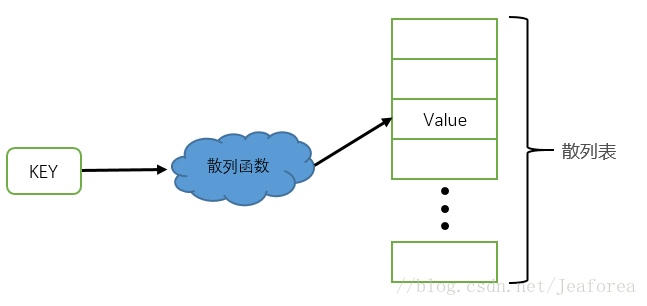

## 1 基本概念

### 1.1 哈希表基本概念

- 哈希表（Hash Table）也叫散列表，哈希表本质上就是一个数组，只不过数组存放的是单一的数据，而哈希表中存放的是键值对，通过Key可以直接找到所映射的Value。

- key通过哈希函数（hash function）得到数组的索引，进而存取索引位置的值。

- 不同的key通过哈希函数可能得到相同的索引值，此时，产生了哈希碰撞。

- 通过在数组中插入链表或者二叉树，可以解决哈希碰撞的问题。

  

### 1.2 哈希表实现原理

1. 通过散列函数（映射函数），将key传入函数，计算出数组的下标值。比如以下time33哈希函数：

    ```c
    uint32_t time33(char const *str, int len) 
    { 
        unsigned long  hash = 0; 
        for (int i = 0; i < len; i++) { 
            hash = hash *33 + (unsigned long) str[i]; 
        } 
        return (hash & 0x7FFFFFFF) % MAX_SIZE; 
    }
    ```

    具体来说，函数接受一个指向字符串的指针和字符串的长度作为输入。然后，它遍历字符串中的每个字符，将当前哈希值乘以33，对当前所有字符进行如此操作，然后累加起来。最后，通过使用位掩码操作（& 0x7FFFFFFF）来确保返回的哈希值为正数（因为哈希值是无符号整数）。最后取余操作是防止值越界。

    

2. 比如上图的情况，汉字拼音是key，对应具体的汉字，比如相同的拼音（字符串）计算出的值是相同的，就产生了哈希碰撞。为了解决碰撞，实现哈希表可以有以下两种方式：
    - 数组 + 链表
    
    - 数组 + 二叉树

    以下以链表举例，使用C语言实现。产生哈希碰撞的时候，可以遍历该点的链表（每个数组元素都是链表的头节点），找到对应的key。

    ```c
    #ifndef MAX_SIZE
    #define MAX_SIZE (1024 ^ 2)
    //  定义哈系表的范围(也就是通过time_33哈系后的值在跟MAX_SIZE整除，从而限定了范围)

    // 一个捅，由key和value组成，同时next为链表所用[解决哈系冲突]
    typedef struct HashNode
    {
        char *key;
        char *value;
        struct HashNode *next;  // 解决Hash冲突

    } HashNode;

    // 一张哈希表，由一个指针组成，该指针起数组作用，内部存储捅的指针
    typedef struct HashTable{
        struct HashNode **HashNode;  // 这是一个指针数组
    } HashTable;

    HashTable *make_HashTable();
    HashNode *make_HashNode(char *key, char *value);
    int login_node(HashTable *ht, HashNode *hn);
    HashNode *find_node(HashTable *ht, char *key);

    #endif

    ```

## 2 GHashTable

- GHashTable提供了键和值之间的关联，其优化使得在给定键的情况下，可以非常快速地找到关联的值。

- 请注意，插入GHashTable时，键和值都不会被复制，因此它们必须在GHashTable的生命周期内存在。这意味着使用静态字符串是可以的，但应在插入之前使用g_strdup()复制临时字符串（即在缓冲区中创建的字符串和由GTK+小部件返回的字符串）。

- 如果键或值是动态分配的，您必须小心确保在从GHashTable中删除它们时释放它们，并且在它们被新插入到GHashTable中覆盖时也要释放它们。在GHashTable中混合使用静态字符串和动态分配的字符串也不可取，因为这样就很难确定字符串是否应该被释放。

- 要创建一个GHashTable，使用g_hash_table_new()。

- 要将键和值插入到GHashTable中，使用g_hash_table_insert()。

- 要查找与给定键对应的值，使用g_hash_table_lookup()和g_hash_table_lookup_extended()。

- 要删除键和值，使用g_hash_table_remove()。

- 要为每个键和值对调用一个函数，使用g_hash_table_foreach()或使用迭代器迭代哈希表中的键/值对，请参阅GHashTableIter。

- 要销毁GHashTable，使用g_hash_table_destroy()。


## 参考

[参考1：图解哈希表及其原理](https://www.cnblogs.com/Steven-HU/p/14505316.html)
[参考2：图解数据结构(04) -- 哈希表](https://blog.csdn.net/jianghao233/article/details/103772274)