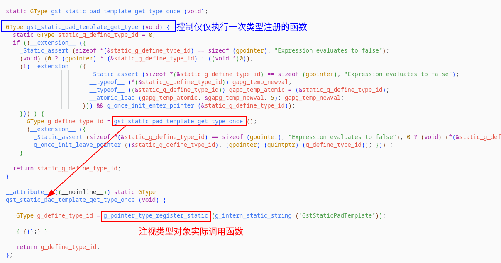
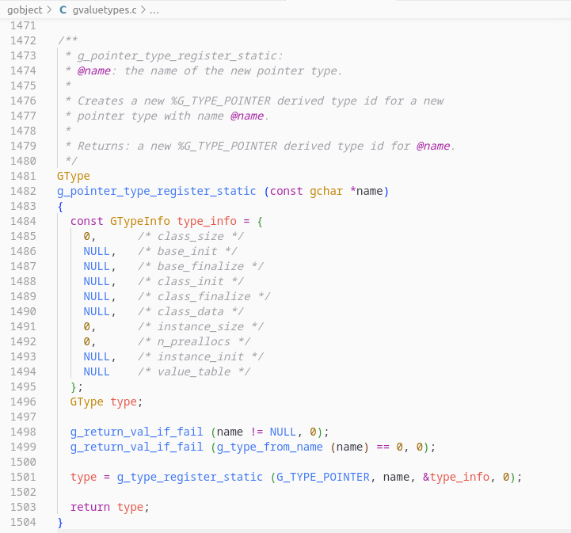

基于前面知识，我们知道GObject是静态类对象，可以创建N个实例，但是只会创建一个类结构体对象。

## 1 类结构体

不难发现，类结构体里面定义的一般都是指针：

1. 类里面的成员函数指针指向信号处理函数（信号的默认处理函数）

2. 类里面的成员函数被子类重写，添加实现新的功能。

## 1 对象初始化过程分析

### 1.1 区分不同父类内存区域

需要主要两部分内存空间：一是父类自身占用的内存空间，另一个是子类复制父类部分的内存空间

比如 `GtkWIdget`：

1. `GTK_WIDGET_GET_CLASS` 得到的是自身拷贝父类部分的内存空间。（这部分有些数据已经被 gtk_widget_class_init函数修改）

2. `gtk_widget_parent_class` 父类的内存部分。（不会被子类修改，两个类是独立的）

### 1.2 分析初始化过程

1. 父类（类结构体）区域直接拷贝（不会调用父类class_init初始化函数），然后调用该对象的类初始化函数 class_init 。

2. 实例（结构体），不是直接拷贝父类实例结构体区别，而且调用父类实例结构体初始化函数。

## 2 对象销毁过程分析

### 2.1 区分两种销毁函数

`g_object_unref`解引用到零的时候执行会先调用dispose，再finalize：

1. `G_OBJECT_GET_CLASS (object)->dispose (object);`，这部分应该释放一些对其他对象的引用，释放信号连接等操作。可以参考`GtkWidget`。

2. `G_OBJECT_GET_CLASS (object)->finalize (object);`，这部分应该释放相关变量的内存。可以参考`GtkWidget`。

通过比较查看 `g_object_unref` 函数发现，dispose中可以重新对对象进行引用，使得最终不会调用finalize函数。`finalize`只用被调用完成后，实例结构体的内存就会被释放。

### 2.2 链式释放分析

先执行完该对象的finalize，最后会执行父类的->finalize，依次链式执行。

## 3 对象属性注册与设置

## 