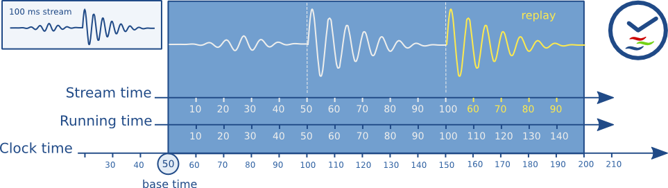

在播放复杂的媒体时，每个声音和视频样本都必须在特定的时间按特定的顺序播放。为此，GStreamer 提供了同步机制。

GStreamer 支持以下用例：

1. 访问速度快于播放速度的非实时源。这是从文件读取媒体并以同步方式播放的情况。在这种情况下，需要同步多个流，如音频、视频和字幕。

2. 从多个实时源捕获和同步混流/混合媒体。这是一个典型的用例，你可以从麦克风/摄像头录制音频和视频，并将其混流到一个文件中进行存储。

3. 通过缓冲从（慢速）网络流进行流媒体播放。这是典型的网页流媒体情况，通过HTTP从流媒体服务器访问内容。

4. 从实时源捕获并具有可配置延迟的播放。例如，在从摄像头捕获、应用效果并显示结果时使用。这也用于通过UDP在网络上传输低延迟内容。

5. 同时进行实时捕获和预录内容的播放。这是在音频录制时使用的，你可以播放之前录制的音频并录制新样本，目的是使新音频与之前录制的数据完全同步。

<font color="red">GStreamer使用GstClock对象、buffer timestamps和SEGMENT事件来同步管道中的流，如下几节将会介绍。</font>


## 1 Clock running-time

在典型的计算机中，有许多可以用作时间源的来源，例如系统时间、声卡、CPU 性能计数器等。出于这个原因，GStreamer 提供了多种 GstClock 实现。需要注意的是，时钟时间不一定要从 0 或任何其他已知值开始。比如：`GST_CLOCK_TYPE_REALTIME`时钟从特定的起始日期（1970.1.1 0:0.0）开始计时，`GST_CLOCK_TYPE_MONOTONIC` 则从计算机启动开始计时等。

GstClock 使用 gst_clock_get_time() 返回根据该时钟的绝对时间absolute-time。时钟的绝对时间（或时钟时间）是单调递增的。

运行时间running-time是基准时间base-time和任何其他绝对时间之间的差值。

```sh
running-time = absolute-time - base-time
```

GStreamer 的 GstPipeline 对象在进入 PLAYING 状态时维护一个 GstClock 对象和一个基准时间base-time。管道将所选择的 GstClock 对象和所选的基准时间base-time传递给管道中的每个元素。管道将选择一个基准时间，使得运行时间反映在 PLAYING 状态下所花费的总时间。结果，当管道处于 PAUSED 状态时，运行时间保持不变。

因为管道中的所有对象都有相同的时钟GstClock对象和基准时间base-time，所以它们都可以根据管道时钟计算运行时间。


## 2 Buffer running-time

要计算缓冲区运行时间 `running-time` ，我们需要一个 `buffer timestamp` 和在该buffer之前的 `SEGMENT` 事件。首先，我们可以将 SEGMENT 事件转换为一个 GstSegment 对象，然后使用 gst_segment_to_running_time() 函数来执行缓冲区运行时间的计算。

同步现在是确保具有特定运行时间的buffer在时钟达到相同运行时间时播放的过程。通常，这项任务由sink元素执行。这些元素还必须考虑配置的管道延迟latency，并在与管道时钟同步之前将其添加到缓冲区运行时间。

- 非实时源会以从 0 开始的运行时间为缓冲区打时间戳。刷新搜索后，它们会再次以 0 的运行时间生成缓冲区。

- 实时源需要以缓冲区的第一个字节被捕获时的管道运行时间为缓冲区打时间戳。

## 3 BUffer stream-time

缓冲区流时间(buffer stream-time)，也称为流中的位置，是一个介于 0 和媒体总时长之间的值，它根据缓冲区时间戳和之前的 SEGMENT 事件计算得出。

流时间用于：

- 通过 POSITION 查询报告流中的当前位置。

- 在搜索事件和查询中使用的位置。

- 用于同步受控值的位置。

流时间从不用于同步流，这仅通过运行时间running-time来完成。

## 4 Time overview

以下是 GStreamer 中使用的各种时间线概述。

下图展示了在播放一个100毫秒的样本并重复播放50毫秒到100毫秒之间的部分时，管道中的不同时间。




可以看到，缓冲区的运行时间running-time总是与时钟GstClock对象时间一起单调递增。当缓冲区的运行时间等于时钟时间减去基准时间时，缓冲区buffer被播放。流时间stream-time表示流中的位置，当重复播放时会向后跳跃。

## 5 Clock providers

时钟提供者是管道中可以提供 GstClock 对象的元素。当元素处于 PLAYING 状态时，时钟对象需要报告单调递增的绝对时间。在元素处于 PAUSED 状态时，允许暂停时钟。

时钟提供者的存在是因为它们以某种速率播放媒体，这个速率不一定与系统时钟速率相同。例如，声卡可能以 44.1 kHz 的速率播放，但这并不意味着系统时钟显示的正好 1 秒后，声卡已经播放了 44100 个样本。这只是大致如此。实际上，音频设备有一个基于播放样本数量的内部时钟，我们可以公开这个时钟。

如果具有内部时钟的元素需要同步，它需要估计根据管道时钟的时间何时会发生。为了估计这个时间，它需要将其时钟从属于管道时钟。

如果管道时钟正好是某个元素的内部时钟，那么该元素可以跳过从属步骤，直接使用管道时钟来调度播放。这既可以更快又更准确。因此，通常具有内部时钟的元素（如音频输入或输出设备）将是管道的时钟提供者。

当管道进入 PLAYING 状态时，它会从接收器到源遍历管道中的所有元素，并询问每个元素是否可以提供时钟。最后一个能够提供时钟的元素将被用作管道中的时钟提供者。这种算法在典型的播放管道中倾向于选择音频接收器的时钟，在典型的捕获管道中倾向于选择源元素的时钟。

存在一些总线消息让您了解管道中的时钟和时钟提供者。通过查看总线上的 NEW_CLOCK 消息，可以看到管道中选择了哪个时钟。当时钟提供者从管道中移除时，会发布 CLOCK_LOST 消息，应用程序应转到 PAUSED 再返回到 PLAYING 以选择新的时钟。

## 6 Latency

延迟是指从时间戳 X 处捕获的样本到达接收器所需的时间。这个时间是相对于管道中的时钟测量的。对于只有接收器与时钟同步的管道，延迟始终为 0，因为没有其他元素会延迟缓冲区。

对于具有实时源的管道，会引入延迟，主要是因为实时源的工作方式。考虑一个音频源，它会在时间 0 开始捕获第一个样本。如果源以 44100Hz 的速率一次推送 44100 个样本的缓冲区，它将在第 1 秒收集到缓冲区。由于缓冲区的时间戳为 0，而时钟时间现在 >= 1 秒，接收器会丢弃这个缓冲区，因为它太晚了。如果接收器没有任何延迟补偿，所有缓冲区都会被丢弃。

### 6.1 Latency compensation

在管道进入 PLAYING 状态之前，它会在选择时钟和计算基准时间的同时，计算管道中的延迟。它通过对管道中的所有接收器执行 LATENCY 查询来实现这一点。然后，管道选择管道中的最大延迟并用 LATENCY 事件配置它。

所有接收器元素将根据 LATENCY 事件中的值延迟播放。由于所有接收器的延迟时间相同，它们将相对同步。

### 6.2 Dynamic Latency

向管道添加或移除元素或更改元素属性可能会改变管道中的延迟。元素可以通过在总线上发布 LATENCY 消息来请求管道中的延迟更改。然后，应用程序可以决定是否查询并重新分配新的延迟。改变管道中的延迟可能会导致视觉或听觉上的故障，因此只有在允许时才应由应用程序进行更改。


## 参考

[参考1：Clocks and synchronization in GStreamer](https://gstreamer.freedesktop.org/documentation/application-development/advanced/clocks.html?gi-language=c)
