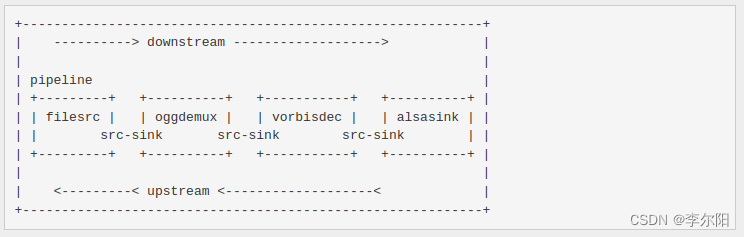

## 1 GstTask基本概念

- GstTask是由GstElement和GstPad用于提供在GstPipeline中进行数据传递的线程的工具。

- 通常情况下，GstPad会启动一个GstTask来将数据推送到到对等GstPad中，或者从对等GstPad中获取数据。大多数source元素会启动一个GstTask来推送push数据。在某些情况下，分离器demuxer元素可以启动一个GstTask来从对等元素中拉取数据。这通常在分离器demuxer可以对上游对等元素执行随机访问以提高性能时执行。

- 尽管GstPad上存在用于启动start/暂停pause/停止stop任务tasks的便捷函数，但如果与GstPad无关，有时可能需要手动创建GstTask。

- 在GstTask可以运行之前，它需要一个可以使用gst_task_set_lock设置的GRecMutex。

- 可以使用gst_task_start、gst_task_pause和gst_task_stop或gst_task_set_state函数启动、暂停和停止任务。GstTask将重复调用GstTaskFunction，并提供在使用gst_task_new创建任务时提供的用户数据。在调用函数时，它将获取提供的锁。提供的锁在任务暂停或停止时释放。

- 使用gst_task_stop停止任务不会立即确保任务不再运行。使用gst_task_join确保任务完全停止并且线程已停止。

- 创建GstTask后，请使用gst_object_unref释放其资源。这只能在任务不再运行时执行。

- 任务函数可以发送GstMessage以发送带外out-of-band数据给应用程序。应用程序可以在其主循环中从GstBus接收消息。

- 出于调试目的，任务将其对象名称配置为Linux上的线程名称。请注意，应在启动任务之前配置对象名称；在任务启动后更改对象名称对线程名称没有影响。



## 2 GstTask类型结构

### 2.1 GstTask类型注册宏定义

```c
/* filename: gsttask.h */
#define GST_TYPE_TASK                   (gst_task_get_type ())

/* filename: gsttask.c */
G_DEFINE_TYPE_WITH_CODE (GstTask, gst_task, GST_TYPE_OBJECT,
    G_ADD_PRIVATE (GstTask) _do_init);
```

### 2.2 GstTaskState枚举类型

```c
/* filename: gsttask.h */
/**
 * GstTaskState:
 * @GST_TASK_STARTED: 任务被开始或者正在运行
 * @GST_TASK_STOPPED: 任务被停止
 * @GST_TASK_PAUSED: 任务被暂停
 *
 * The different states a task can be in
 */
typedef enum {
  GST_TASK_STARTED,
  GST_TASK_STOPPED,
  GST_TASK_PAUSED
} GstTaskState;
```

### 2.3 GstTask相关结构体

#### 2.3.1 GstTask

```c
/* filename: gsttask.h */
struct _GstTask {
  GstObject      object;

  /*< public >*/ /* with LOCK */
  /* 初始化创建后，默认是GST_TASK_STOPPED状态 */
  GstTaskState     state;  /* 任务的状态 GstTaskState枚举 */
  GCond            cond; /* 被使用暂停或者恢复任务 */

  /* 任务开始或者停止之前必须调用gst_task_set_lock， gst_task_set_lock就是设定lock */
  GRecMutex       *lock; /* 在迭代任务函数时获取的锁 */

  GstTaskFunction  func; /* 由此任务执行的函数 */
  gpointer         user_data; /* 传递给任务函数的用户数据 */
  GDestroyNotify   notify; /* 用于@user_data的GDestroyNotify */

  gboolean         running; /* 指示任务是否正在运行的标志 */

  /*< private >*/
  GThread         *thread;

  GstTaskPrivate  *priv;  /* 指向私有结构体指针 */

  gpointer _gst_reserved[GST_PADDING];
};
```

#### 2.3.2 GstTaskClass

```c
/* filename: gsttask.h */
struct _GstTaskClass {
  GstObjectClass parent_class;

  /*< private >*/
  GstTaskPool *pool;

  /*< private >*/
  gpointer _gst_reserved[GST_PADDING];
};
```

#### 2.3.3 GstTaskPrivate

```c
/* filename: gsttask.c */
struct _GstTaskPrivate
{
  /* 通过函数 gst_task_set_enter_callback () 设定任务开始前调用回调函数的相关参数 */
  GstTaskThreadFunc enter_func;
  gpointer enter_user_data;
  GDestroyNotify enter_notify;

  /* 通过函数 gst_task_set_leave_callback () 设定任务结束后调用回调函数的相关参数 */
  GstTaskThreadFunc leave_func;
  gpointer leave_user_data;
  GDestroyNotify leave_notify;

  /* 该使用使用的线程池 */
  GstTaskPool *pool;

  /* remember the pool and id that is currently running. */
  gpointer id;
  GstTaskPool *pool_id;
};
```

## 3 GstTask对象相关函数