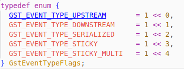
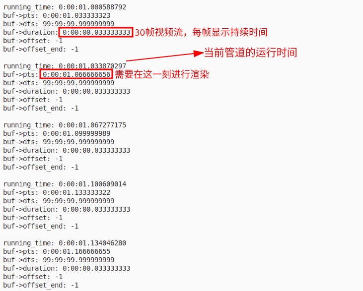

## 1 GstElement

- **clock**: 这里的时钟对象使用的是 `GST_TYPE_SYSTEM_CLOCK` 类型对象，获取的时钟是系统运行时间。具体可以参考 `GstClock` 部分。

- **base_time**: NULL和READY状态时候为0，暂停状态的时候就等于当前系统运行时间。播放状态就是开始运行那一刻的时间。（running time = now - base_time）

- **start_time**: 是指元素最后一次处于 PAUSED 状态时的 running_time,这个时间值表示当元素从 PAUSED 状态恢复到 PLAYING 状态时，从哪个时间点继续运行。它确保元素在暂停后能从正确的时间点继续播放，而不是重新开始。

## 2 GstBuffer

运行示例程序：[02_GstBuffer渲染和解码时间.c](/assets/GStreamerCoreObject/27_时钟相关总结/02_GstBuffer渲染和解码时间.c) 我们播放的视频流每秒是30帧。

## 3 GstBaseSink

同步问题