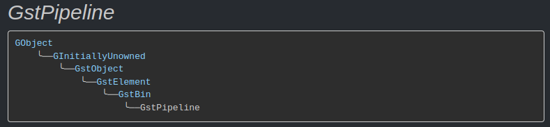

## 1 Pad (de)activation

### 1.1 激活

改变状态时，一个 <span style="color:red;">bin 会按照从sink到source的顺序</span>为其所有子元素设置状态。当元素经历 READY→PAUSED 过渡时，它们的Pad会被激活以准备数据流。一些Pad会启动任务以驱动数据流。

<span style="color:red;">一个元素会从sourcepads到sinkpads依次激活其Pad。</span>这是为了确保当sinkpads被激活并准备接收数据时，sourcepads已经激活以向下游传递数据。

Pads可以在 PUSH 和 PULL 两种模式下激活。PUSH 模式是正常情况，其中链接中的source pad通过 gst_pad_push() 将数据发送到对端的sink pad。而 PULL 模式则是由source pad请求数据通过 gst_pad_pull_range()。

要激活一个Pad，核心会以 TRUE 参数调用 gst_pad_set_active()，表示该Pad应该处于激活状态。如果Pad已经处于激活状态，无论是在 PUSH 还是 PULL 模式下，gst_pad_set_active() 将不执行任何操作而直接返回。否则将调用Pad的激活函数。

因为核心不知道以那种模式激活一个端口（PUSH 还是 PULL），它将这个选择委托给了端口的 activate() 方法。一个端口的 activate() 函数应该选择在 PUSH 或 PULL 模式下操作。一旦做出选择，它应该使用所选的激活模式调用 activate_mode()。默认的 activate() 函数会使用 #GST_PAD_MODE_PUSH 调用 activate_mode()，因为这是数据流的默认机制。如果支持两种操作模式的sinkpad，在上游进行 SCHEDULING 查询包含 #GST_PAD_MODE_PULL 调度模式时，可能会调用 activate_mode(PULL)，否则调用 activate_mode(PUSH)。

考虑 fakesrc ! fakesink 的情况，其中 fakesink 配置为以 PULL 模式运行。pipeline中的状态变化将从 fakesink 开始，它是最下游的元素。核心将在 fakesink 的sinkpad上调用 activate()。为了让 fakesink 进入 PULL 模式，它需要实现一个自定义的 activate() 函数，该函数将在其sinkpad上调用 activate_mode(PULL)（因为默认情况下使用的是 PUSH 模式）。然后 activate_mode(PULL) 负责启动从 fakesrc:src 拉取数据的任务。显然，即使pipeline尚未改变 fakesrc 的状态，fakesrc 也需要被通知即将在其src pad上拉取数据。因此，GStreamer 将首先在 fakesink:sink 的对等Pad上调用 activate_mode(PULL)，然后才在 fakesink:sinks 上调用 activate_mode(PULL)。

简而言之，在 PULL 模式下运行的上游元素必须在 READY 中准备好产生数据，在其src pad上调用 activate_mode(PULL) 之后。此外，对 activate_mode(PULL) 的调用需要通过管道pipeline传播到每个 gst_pad_pull() 能到达的Pad。在 fakesrc ! identity ! fakesink 的情况下，对 identity 的src pad调用 activate_mode(PULL) 将需要激活其sink pad进入 PULL 模式，这应该传播到 fakesrc。

另一方面，如果 fakesrc ! fakesink 以 PUSH 模式运行，则激活顺序不同。首先，在 fakesink:sink 上调用 activate() 将在 fakesink:sink 上调用 activate_mode(PUSH)。然后激活 fakesrc 的端口：先src pad，然后是sink pad（fakesrc 没有sink pad）。然后调用 fakesrc:src 的激活函数。

请注意，设置源端口的激活函数是没有意义的。源端口的对等端口在下游，意味着它应该首先被激活。如果它以 PULL 模式激活，源端口应该已经对其进行了 activate_mode(PULL) 调用，因此不需要进一步激活。否则它应该处于 PUSH 模式，这是默认激活函数的选择。

所以，在 PUSH 模式下，默认激活函数选择 PUSH 模式，调用 activate_mode(PUSH)，然后开始在源端口上启动任务并开始推送。这样 PUSH 调度会更加简单，因为它遵循管线中状态变化的顺序。fakesink 在 fakesrc 开始推送数据时已经处于 PAUSED 状态，并具有活跃的sink pad。

### 1.2 取消激活（停用）

端口的停用发生在其父级进入 READY 状态时，或者当应用程序或元素明确地停用端口时。调用 gst_pad_set_active() 并使用 FALSE 参数，然后根据端口的当前激活模式调用 activate_mode(PUSH) 或 activate_mode(PULL) 并使用 FALSE 参数。

### 1.3 参考

[GStreamer design documents, Pad (de)activation](https://gstreamer.freedesktop.org/documentation/additional/design/activation.html?gi-language=c#pad-deactivation)

## 2 push-pull

通常，源source元素会使用 gst_pad_push() 方法将数据推送到下游元素。下游对等pad（也就是sink pad）将在链式chain函数中接收缓冲区。在推送模式中，源元素是管道中的驱动力，因为它启动了数据传输。

元素也可以从上游元素那里拉取数据。下游元素通过在其一个sinkpad上调用 gst_pad_pull_range() 来实现这一点。在这种模式下，下游元素是管道中的驱动力，因为它启动了数据传输。

重要的是，元素要处于正确的状态以处理来自对等元素的 push() 或 pull_range()。对于基于 push() 的元素，这意味着所有下游元素应处于正确的状态；对于基于 pull_range() 的元素，这意味着所有上游元素应处于正确的状态。

大多数sinkpad实现了一个链式函数。这是最常见的情况。实现循环函数的sinkpad将是一个例外。同样，实现 getrange 函数的sourcepad也将是一个例外。

### 2.1 State changes

GstBin设置所有sink元素的状态。这些元素是没有sourcepad的元素。

在一个元素上设置状态首先会激活所有的sourcepad，然后是sinkpad。对于每个sinkpad，都会执行 gst_pad_check_pull_range()。如果sinkpad支持循环函数，并且对等pad在 GstPadCheckPullRange 函数中返回 TRUE，那么对等pad会首先被激活，因为它必须处于正确的状态以处理 _pull_range()。注意，元素的状态变更尚未执行，只是在sourcepad上调用了激活函数。这意味着实现 getrange 函数的元素必须准备好在它们的状态变更函数之前调用它们的激活函数。

那些有多个sinkpad且需要所有这些pad以相同模式（推送/拉取）操作的元素，可以在它们所有的pad上使用 _check_pull_range()，然后如果其中一个pad不支持基于拉取的模式，可以移除循环函数。

### 2.2 参考

[GStreamer design documents, push-pull](https://gstreamer.freedesktop.org/documentation/additional/design/push-pull.html?gi-language=c#pushpull)

## 3 Scheduling

在GStreamer中，调度是基于pad主动推送（产生）数据或从其他pad拉取（消费）数据。

### 3.1 Pushing

一个pad可以产生数据并将其推送到下一个pad。以这种方式行为的pad暴露了一个循环函数，这个函数将被重复调用，直到它返回 false。这个循环函数可以在任何时候阻塞。但当pad被停用时，循环函数应该解除阻塞。

以推送模式运行的pad只能向暴露（有）链式函数的pad产生数据。这个链式函数将被调用，并传入由推送pad产生的缓冲区。

这种产生数据的方法被称为流媒体模式，因为生产者产生一个持续的数据流。

### 3.2 Pulling

以拉取模式运行的pad只能从暴露（有）了 pull_range() 函数的pad拉取数据。在这种情况下，sinkpad垫片暴露了（有）一个循环函数，这个函数将被重复调用，直到任务停止。

从对等pad拉取数据后，循环函数通常会调用推送函数，将结果从srcpad推送到对等的sinkpad。

### 3.3 Deciding the scheduling mode

当一个pad被激活时，会调用 _activate() 函数。然后，pad可以选择根据上游的能力以推送或拉取模式激活自己。

当pad没有激活函数时，GStreamer核心默认会以推送模式激活pad。

### 3.4 The chain function

当上游元素在pad上执行 _push() 时，将调用链式函数。上游元素可以是另一个基于链式的元素或推送源。

### 3.5 The getrange function

当对等pad在pad上执行 _pull_range() 时，将调用 getrange 函数。这个下游pad可以是一个拉取元素或另一个基于 _pull_range() 的元素。

### 3.6 Scheduling Query

一个sinkpad可以向上游的srcpad询问其调度属性。它是通过 SCHEDULING 查询来实现的。

- **(out)modes**：G_TYPE_ARRAY（默认值为 NULL）：一个包含所有支持的调度模式的 GST_TYPE_PAD_MODE 枚举的数组。

- **(out)flags**：GST_TYPE_SCHEDULING_FLAGS（默认值为 0）：

    ```c
    typedef enum {
      GST_SCHEDULING_FLAG_SEEKABLE           = (1 << 0),
      GST_SCHEDULING_FLAG_SEQUENTIAL         = (1 << 1),
      GST_SCHEDULING_FLAG_BANDWIDTH_LIMITED  = (1 << 2)
    } GstSchedulingFlags;
    ```

   -**_SEEKABLE**：拉取操作的偏移量可以被指定，如果这个标志为假，偏移量应该是 -1。

   -**_SEQUENTIAL**：建议按顺序访问数据。如果指定了 _SEEKABLE，允许进行搜索，但应避免。这对于网络流来说很常见。

   -**_BANDWIDTH_LIMITED**：建议元素支持缓冲数据以帮助下游应对带宽限制。如果这个标志开启，下游元素可能会请求比正常播放需要更多的数据。这种用例对于磁盘上的缓冲场景来说很有趣。搜索操作可能也会很慢，因此下游元素应考虑到这一点。

- **(out)minsize**: G_TYPE_INT (default 1): 建议的拉取请求的最小尺寸

- **(out)maxsize**: G_TYPE_INT (default -1, unlimited): 建议的拉取请求的最大尺寸

- **(out)align**: G_TYPE_INT (default 0): 建议的拉取请求的对齐方式

### 3.7 Plugin-in techniques

#### 3.7.1 Multi-sink elements

拥有多个sinkpad的元素可以在每个pad上暴露一个循环函数，以主动拉取数据（pull_range），或者可以在每个pad上暴露一个链式函数。

~~实现链式函数通常比较简单，并且允许所有可能的调度方法。~~

### 3.8 Pad select

如果基于链式的sink想等待其中一个pad接收到缓冲区，只需在链式函数中实现要执行的操作。请注意，该操作可能在不同的线程中执行，并且可能同时执行，因此需要获取 STREAM_LOCK。

### 3.9 Collect pads

如果基于链式的sink pads都需要一个缓冲区才能操作数据，那么在链式函数中收集所有的缓冲区，并在所有链式pad接收到缓冲区时执行操作。

在这种情况下，你可能也不想在已经排队缓冲区的pad上接受更多数据。这可以通过以下代码片段轻松实现：【接下来应该是代码片段，但原始请求中没有提供具体代码】。

```c
static GstFlowReturn _chain (GstPad *pad, GstBuffer *buffer)
{
  LOCK (mylock);
  while (pad->store != NULL) {
    WAIT (mycond, mylock);
  }
  pad->store = buffer;
  SIGNAL (mycond);
  UNLOCK (mylock);

  return GST_FLOW_OK;
}

static void _pull (GstPad *pad, GstBuffer **buffer)
{
  LOCK (mylock);
  while (pad->store == NULL) {
    WAIT (mycond, mylock);
  }
  **buffer = pad->store;
  pad->store = NULL;
  SIGNAL (mycond);
  UNLOCK (mylock);
}
```

### 3.10 Cases

pad内部的括号中说明了该pad支持的功能：

- **l**：暴露（expose）一个loop函数，所以该pad可以作为驱动源（调用者）。
- **g**：暴露一个getrange函数
- **c**：暴露一个chain函数

根据Pad暴露的调度方法，做出以下调度决策：

- (g)-(l)：srcpad将从srcpad拉取数据。
- (l)-(c)：srcpad主动向sinkpad推送数据。
- ()-(c)：-将向sinkpad推送数据。
- ()-()：不可调度。
- ()-(l)：不可调度。
- (g)-()：不可调度。
- (g)-(c)：不可调度。
- (l)-()：不可调度。
- (l)-(l)：不可调度。
- ()-(g)：不可能。
- (g)-(g)：不可能。
- (l)-(g)：不可能。
- (c)-()：不可能。
- (c)-(g)：不可能。
- (c)-(l)：不可能。
- (c)-(c)：不可能。

```sh
+---------+    +------------+    +-----------+
| filesrc |    | mp3decoder |    | audiosink |
|        src--sink         src--sink         |
+---------+    +------------+    +-----------+
        (l-g) (c)           ()   (c)
```

激活pad时：

- audiosink 有一个链式函数，且对等pad没有循环函数，不进行调度。

- mp3decoder 和 filesrc 暴露了 (l) - (c) 连接，创建一个线程来调用srcpad的循环函数。

```sh
+---------+    +------------+    +----------+
| filesrc |    | avidemuxer |    | fakesink |
|        src--sink         src--sink        |
+---------+    +------------+    +----------+
        (l-g) (l)          ()   (c)

```

- fakesink 有一个链式函数，且对等pad没有循环函数，不进行调度。

- avidemuxer 和 filesrc 暴露了 (g) - (l) 连接，创建一个线程来调用接收pad的循环函数。

```sh
+---------+    +----------+    +------------+    +----------+
| filesrc |    | identity |    | avidemuxer |    | fakesink |
|        src--sink       src--sink         src--sink        |
+---------+    +----------+    +------------+    +----------+
        (l-g) (c)        ()   (l)          ()   (c)
```

- fakesink 有一个链式函数，且对等pad没有循环函数，不进行调度。

- avidemuxer 和 identity 没有可调度连接，因此这个管道不可调度。

```sh
+---------+    +----------+    +------------+    +----------+
| filesrc |    | identity |    | avidemuxer |    | fakesink |
|        src--sink       src--sink         src--sink        |
+---------+    +----------+    +------------+    +----------+
        (l-g) (c-l)      (g)  (l)          ()   (c)
```

- fakesink 有一个链式函数，且对等pad没有循环函数，不进行调度。

- avidemuxer 和 identity 暴露了 (g) - (l) 连接，创建一个线程来调用接收pad的循环函数。

- identity 知道源pad是基于 getrange 的，并使用来自 avidemux 的线程从 filesrc 获取数据。

```sh
+---------+    +----------+    +------------+    +----------+
| filesrc |    | identity |    | oggdemuxer |    | fakesink |
|        src--sink       src--sink         src--sink        |
+---------+    +----------+    +------------+    +----------+
        (l-g) (c)        ()   (l-c)        ()   (c)
```

- fakesink 有一个链式函数，且对等。没有循环函数，不进行调度。

- oggdemuxer 和 identity 暴露了 () - (l-c) 连接，oggdemux 必须以链式模式操作。

- identity 只能基于链式工作，因此 filesrc 创建一个线程来向它推送数据。