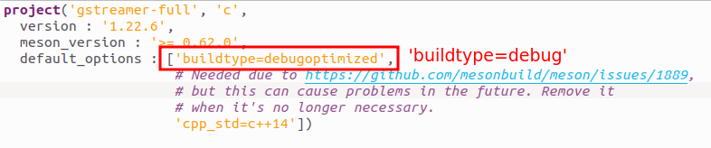
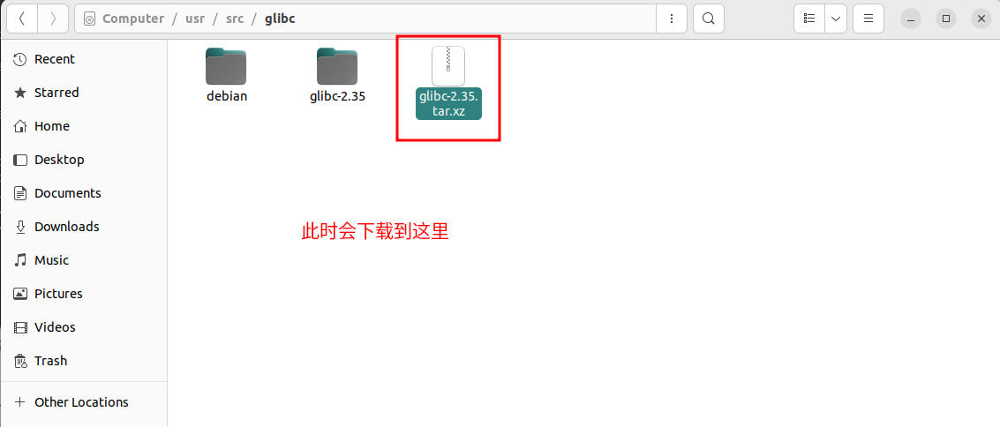

## 1 源代码准备

按照以下包，避免编译 `GStreamer` 的时候再次下载，进而影响系统。

```sh
sudo apt install -y libcairo2-dev libpng-dev libffi-dev
```

### 1.1 gstreamer和glib

其实不用修改也行，如果debug时候出现没有找到源代码，可以将 `debugoptimized` 修改为 `debug`。

我在使用 `ximagesink` 插件的时候出现无法找到源代码问题，我修改 `debugoptimized` 为 `debug`



按照到 `/opt/gstreamer-1.22.6` 和 `/opt/glib-2.80.2` 文件夹。

### 1.2 glibc

<font color="red">切勿直接下载glibc源代码，使用debug编译，按照到/usr目录，会出现内核错误。</font>

```sh
sudo apt install glibc-source -y
```



```sh
# 在该文件夹解压源代码
sudo tar -xvf glibc-2.35.tar.xz
```

