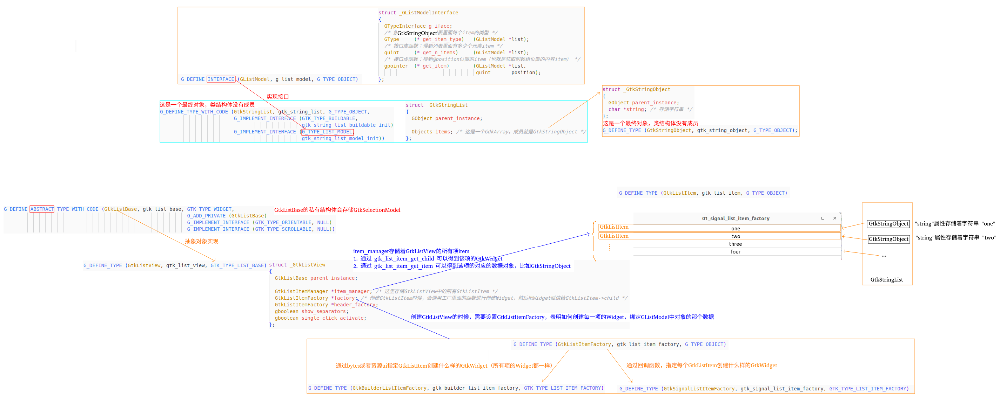

## 1 基本概念（补充）

以前学习的过程中，使用的 `Glib` 和 `Gtk4` 都是使用 `C语言` 版本。这些库也支持其他语言编写，Python、JavaScript、Vala等。

### 1 GObject Introspection Repository

GObject Introspection Repository (GIR) 是 GNOME 开发中的一个重要工具，用于描述和提供 GObject 类型系统的信息。这些信息包括类、对象、方法、属性等的结构和特性，以及它们在底层 C 语言中的实现细节。

GIR 的主要作用是为各种编程语言（如Python、JavaScript、Vala等）生成绑定（bindings），使得这些语言可以与 GNOME 库进行交互和使用。它通过解析 GObject 类型系统的头文件，并生成对应的元数据描述文件（.gir 文件），从而使得开发者可以在其他语言中直接调用和使用 GNOME 库的功能，而无需手动编写对应的绑定代码。

通过 GObject Introspection，开发者可以更方便地利用 GNOME 开发的丰富功能和工具来构建应用程序，同时也促进了跨语言开发和互操作性。

GObject Introspection 提供以下工具：

- **g-ir-scanner**：通过解析头文件、包含注释的 GTK-Doc 注释块和 GObject 库，生成 GIR XML 文件的工具。

- **g-ir-compiler**：一个 typelib 编译器。它将一个或多个 GIR 文件转换为一个或多个 typelib blob。

- **g-ir-generate**：使用存储库 API 生成 GIR 文件的工具。它从共享对象或原始 typelib blob 中的二进制 typelib 生成 GIR 文件。

- **g-ir-annotation-tool**：从源代码文件中提取注释。
g-ir-doc-tool：从 GIR XML 文件生成 API 参考文档。

#### 1.1 Gtk-4.0.gir

## cambalache

https://gitlab.gnome.org/jpu/cambalache

## handy

[libhandy下载链接：https://gitlab.gnome.org/GNOME/libhandy/-/tags](https://gitlab.gnome.org/GNOME/libhandy/-/tags)

## C++使用GTK

https://www.gtk.org/docs/language-bindings/cpp

## C++使用GObject

https://thinkingeek.com/2023/01/15/wrapping-gobjects-in-cpp/

https://thinkingeek.com/2023/02/04/writing-gobjects-in-cpp/

## GDK broadway后端

https://docs.gtk.org/gtk4/broadway.html