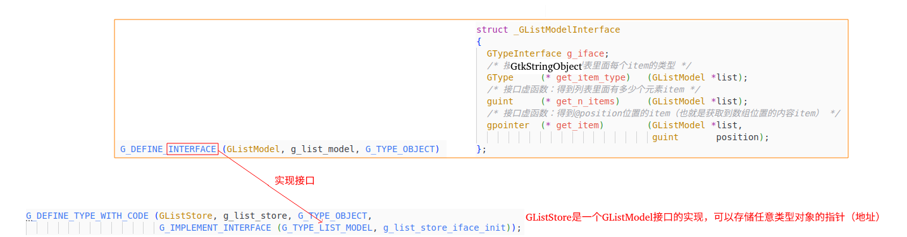

## 2 安装cambalache

[cambalache下载链接：https://gitlab.gnome.org/jpu/cambalache]

## handy

[libhandy下载链接：https://gitlab.gnome.org/GNOME/libhandy/-/tags](https://gitlab.gnome.org/GNOME/libhandy/-/tags)

## GTK4编译选项

为了使用 `cambalache` 我们在编译gtk4的时候，必须要编译网页版后端和GIR。

网页运行GTK程序，可以参考[https://docs.gtk.org/gtk4/broadway.html](https://docs.gtk.org/gtk4/broadway.html)