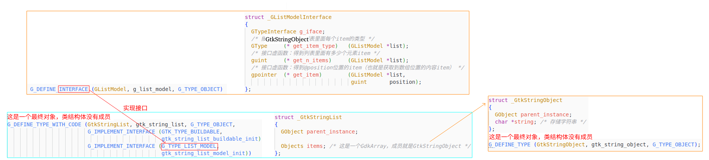

## Live Chart

https://github.com/lundmar/gtkchart/tree/master

https://github.com/lcallarec/live-chart?tab=readme-ov-file#chart-widget

https://codeberg.org/grindhold/libgtkflow

https://blog.gtk.org/2020/04/24/custom-widgets-in-gtk-4-drawing/

https://github.getafreenode.com/Akascape/CTkPieChart

https://github.com/aluntzer/gtknodes

## Cambalache UI Demo

https://github.com/Nokse22/ascii-draw

https://blogs.gnome.org/xjuan/category/programming/cambalache-ui-maker/

https://github.com/qarmin/czkawka/tree/2a32a52aa882f6ff52ba4d3e24a666dc2a86cf9b

