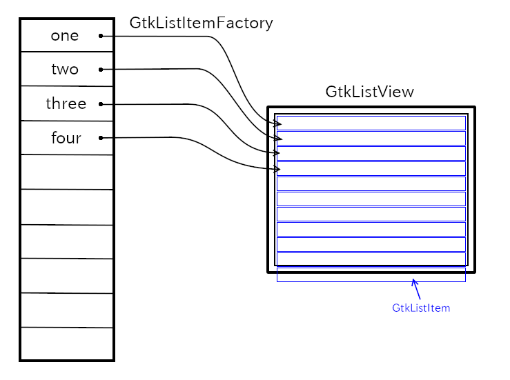

1. GtkListView 显示一个大的动态项目列表。每项Item，也就是每行，都可以根据 `GtkListItemFactory` 生成指定的 `GtkWidget`，根据 `GListModel` 用相应数据赋值给 `GtkWidget` 显示。

2. GtkListView 使用其工厂为每个可见项目生成一个行小部件，并在垂直或水平的线性显示中显示它们。可以指定属性是否显示行分割符。

3. GtkListView 允许用户根据模型的选择特性选择项目。可以进行单选、多选。


## 1 GListModel

`GListModel` 是一种接口（必须是GObject对象，才能去实现该接口）。

通过该接口一般都是实现一个数据列表或者数组，该接口可以获取到数组的每一项（item），该数组有多少个元素，每个元素是什么类型，数组元素（每项）发送变化，发射`items-changed` 变化信号。

比如：`GtkStringList` 对象就是存储字符串的一个对象，通过`items`(这实际是一个GdkArray)，存储字符串 "one", "two", "three" 等等。


### 1.1 GtkStringList

1. `GtkStringList` 列表实现了 `GListModel` 模型接口。

2. `GtkStringList` 中的每一项都是 `GtkStringObject`，这是一个封装字符串的 `GObject` 对象。

    ```c
    struct _GtkStringObject
    {
      GObject parent_instance;
      char *string;
    };
    ```

    

#### 1.1.1 GtkStringList函数总结
```c
/**
 * 共同点：都是在List的最后添加一项（item）字符串。
 * 不同点： gtk_string_list_append 添加的是常量字符串（内部会进行 g_strdup ）
 *         gtk_string_list_take 已经是堆区创建的字符串 （里面会自动进行 g_free，不需要我们释放）
*/
void 
gtk_string_list_append (GtkStringList *self, const char*string);

void 
gtk_string_list_take (GtkStringList *self, char *string);                                                 
```

### 1.2 GListStore

`GListStore` 是 `GListModel` 接口的实现，可以存储任意类型对象的地址。


## 2 GtkSelectionModel

1. 继承 `GListModel` 的一种接口，为了判断那个位置，那个 `item` 被选中。（并不是GtkListItem，而是数据对象，比如GtkStringList的GtkStringObject）

    ```c
    G_DECLARE_INTERFACE (GtkSelectionModel, gtk_selection_model, GTK, SELECTION_MODEL, GListModel)
    ```

2. GtkSelectionModel是一个支持选择的接口。有了这个模型，用户可以通过点击来选择项目。它由GtkMultiSelection、GtkNoSelection和GtkSingleSelection对象实现。这三个对象通常足以构建应用程序。它们是用GListModel创建的。你也可以单独创建它们，然后添加一个GListModel

    - `GtkNoSelection`不支持选择。当需要GtkSelectionModel时，它是GListModel的包装器
  
    - `GtkSingleSelection`支持单选。
  
    - `GtkMultiSelection`支持多选。


## 3 GtkListItemFactory

1. 根据工厂对象 `GtkListItemFactory` 要求去创建 `GtkWidget` ，并且赋值给 `GtkListItem` 的 child。

2. `GtkListItemFactory` 的绑定函数会有 `GtkListItem` 参数，通过`GtkListItem`可以获取到数据对象，然后绑定到GtkWidget的属性中。


### 3.1 GtkSignalListItemFactory

根据信号，我们指定如何创建 GtkWidget，并且设置该构件是 `GtkListItem` 的 child。

### 3.2 GtkBuilderListItemFactory

根据 bytes、resource等，指定如何创建 GtkWidget。

## 4 GtkListItem

GtkListView中的每一行，都是一项，都各自对应着一个 `GtkListItem` ，这个 `GtkListItem` 后期无法直接获取（除非使用信号工厂GtkSignalListItemFactory创建的时候获取）。

`GtkListItem` 存储着每行要显示的GtkWidget和每行对应的GListModel中的item（比如GtkStringList的GtkStringObject）。



```c
/**
 * @brief: 获取到该项对应的GListModel的item数据对象
 * @note: 我们不能手动指定每项对应的数据对象，这是按照列表顺序，系统自动对应数据对象。
*/
gpointer
gtk_list_item_get_item (GtkListItem *self)

/**
 * @brief: 得到该项对应的GtkWidget
*/
GtkWidget *
gtk_list_item_get_child (GtkListItem *self)

/**
 * @brief: 设定该项要显示的GtkWidget
*/
void
gtk_list_item_set_child (GtkListItem *self,
                         GtkWidget   *child)
```