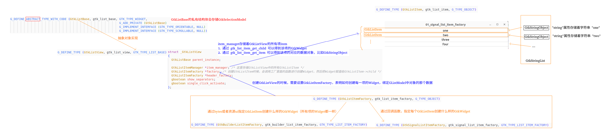

## 1 主要对象

首先分清楚那些 `GDK对象` 中包含 EGL变量，因为GTK默认使用的也是EGL进行渲染。

### 1 GdkDisplay

1. GdkDisplay对应的就是X11的显示（XOpenDisplay）。一般全局只有一个默认显示对象，主要是连接到X11显示服务器。

2. 每个显示后端都会实现各自的GdkDisplay、GdkSurface、GdkGLContext。 GdkX11Display 含有 GdkGLContext、GdkSurface。 

3. GdkDisplay含有 egl_display、egl_config。

### 2 GdkSurface

1. GdkSurface对应的就是X11中的窗口（XCreateSimpleWindow）

2. 每个窗口都会有对应的Surface

### 3 GdkGLContext

1. GdkGLContext对应的就是EGL的上下文

2. GdkGLContext 继承于 GdkDrawContext（创建的时候，需要指定GdkDisplay和GdkSurface）

#### 1.1 GdkX11Display创建流程分析

gtk_init() 初始化函数中要执行的内容:

1. 先创建默认的GdkX11Display（继承于GdkDisplay）  这个Surface一般不需要刷新

2. 创建GdkX11DragSurface （继承于GdkSurface）

3. 最后创建GdkX11GLContextEGL（继承于GdkGLContext、GdkDrawContext）

    

### 1.2 GtkWindow显示流程分析

gtk_window_present(win) 函数中调用执行的内容:

1. 创建GdkX11Toplevel（继承于GdkSurface）    这个Surface一般需要刷新

2. 通过默认的GdkX11GLContextEGL 创建共享GdkX11GLContextEGL（继承于GdkGLContext、GdkDrawContext）

## 关于GdkGLContext创建

1. GdkDisplay中创建GdkGLContext

2. GdkSurface中创建GdkGLContext

