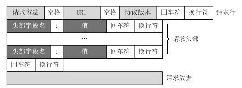
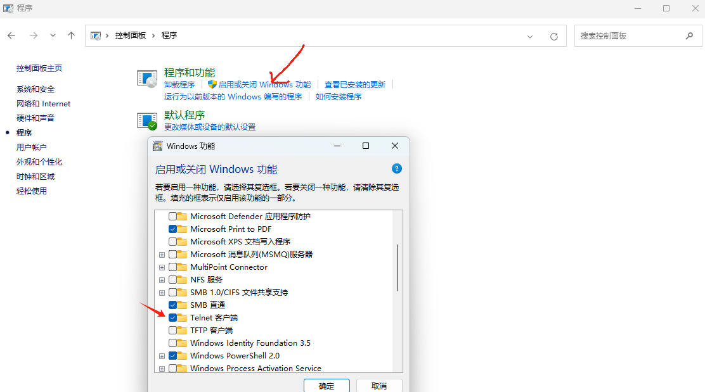
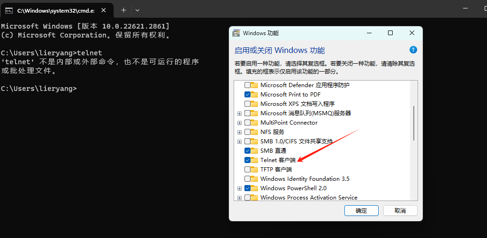
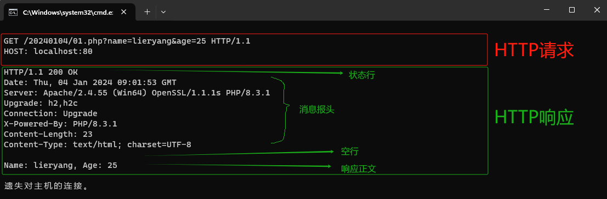

## 1 URI结构

`HTTP` 使用统一资源标识符（`URI`）来传输数据和建立连接。`URL`（统一资源定位符）是一种特殊种类的URI，包含了用于查找的资源的足够的信息，我们一般常用的就是 `URL`，而一个完整的`URL` 包含下面几部分：

[http://www.fishbay.cn:80/mix/76.html?name=kelvin&password=123456#first](http://www.fishbay.cn:80/mix/76.html?name=kelvin&password=123456#first)

**1. 协议部分**：该 `URL` 的协议部分为 `http:`，表示网页用的是HTTP协议，后面的 `//` 为分隔符。

**2. 域名部分**：域名是 `www.fishbay.cn` ，发送请求时，需要向 `DNS` 服务器解析 `IP` 。如果为了优化请求，可以直接用IP作为域名部分使用。

**3. 端口部分**：域名后面的 `80` 表示端口，和域名之间用:分隔，端口不是一个 `URL` 的必须的部分。如果端口是 `80`，也可以省略不写。

**4. 虚拟目录部分**：从域名的第一个 `/` 开始到最后一个 `/` 为止，是虚拟目录的部分。其中，虚拟目录也不是 `URL` 必须的部分，本例中的虚拟目录是 `/mix/`。

**5. 文件名部分**：从域名最后一个 `/` 开始到 `?` 为止，是文件名部分；如果没有 `?` ，则是从域名最后一个 `/` 开始到 `#` 为止，是文件名部分；如果没有 `?` 和 `#`，那么就从域名的最后一个 `/` 从开始到结束，都是文件名部分。本例中的文件名是 `76.html` ，文件名也不是一个 `URL` 的必须部分，如果没有文件名，则使用默认文件名。

**6. 锚部分**：

  - 它的主要作用是指向网页中的一个特定部分或元素，而不是整个页面（比如：定位到页面中的特定部分，这在长网页文档中非常有用，用户可以快速定位到他们感兴趣的部分）。

  - 从 `#` 开始到最后，都是锚部分。本部分的锚部分是 `first` ，锚也不是一个 `URL` 必须的部分。

**7. 参数部分**：从 `?` 开始到 `#` 为止之间的部分是参数部分，又称为搜索部分、查询部分。本例中的参数是 `name=kelvin&password=123456` ，如果有多个参数，各个参数之间用 `&` 作为分隔符。

## 2 Request

HTTP的请求包括：请求行(request line)、请求头部(header)、空行 和 请求数据 四个部分组成。

<p style="color:red;">请求头部和请求数据之间必须有一个空行</p>



我们在Windows环境下，使用 `telnet` 请求和接受 `HTTP` 协议。Windows下默认不能使用 `telnet`，我们需要手动启动。





### 2.1 GET请求方法

#### 2.1.1 编写PHP文件

1. 创建PHP文件：`C:\Apache24\htdocs\01.php`
2. 输入以下内容：
```php
<?php
if (isset($_GET['name']) && isset($_GET['age'])) {
    // 如果 name 和 age 变量都存在
    $name = $_GET['name'];
    $age = $_GET['age'];

    // 打印 name 和 age
    echo "Name: " . $name . ", Age: " . $age;
} else {
    // 如果 name 和 age 变量中有任何一个不存在
    echo "没有输入";
}
?>
```

3. 发送请求

   打开 `cmd` 终端，输入 `telnet 127.0.0.1 80`，键盘按下 `Ctl + ]` ，然后回车 `ENTER` ，把下面内容粘贴进入，然后回车（有时候可能不需要）。

    ```
    GET /20240104/01.php?name=lieryang&age=25 HTTP/1.1
    HOST: localhost:80

    ```



### 2.2 POST请求方法

## 3 Response


GET /01.php HTTP/1.1
HOST: 127.0.0.1:80


POST /02.php HTTP/1.1
HOST: localhost
Content-Type:application/x-www-form-urlencoded
Content-Length:20

name=zhangsan&age=19


## 参考

[参考1：哔哩哔哩————HTTP协议详解](https://www.bilibili.com/video/BV1js411g7Fw?p=1&vd_source=e6b01e2e688ed9241677df121e4b897a)

[参考2：HTTP协议格式详解](https://www.jianshu.com/p/8fe93a14754c)

[参考3：HTTP 方法：GET 对比 POST](https://www.runoob.com/tags/html-httpmethods.html)
