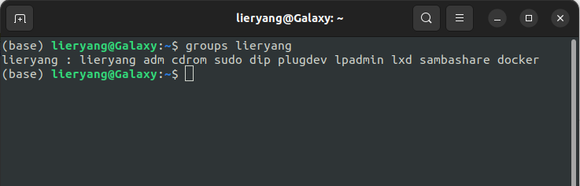
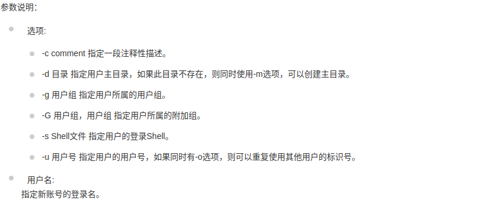
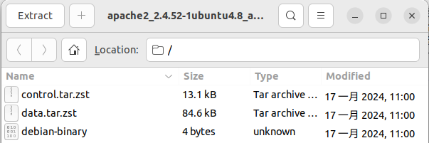

这节介绍包管理命令，他们直接的关系可以这样理解：

dpkg（底层工具）->apt-get（上层工具）->apt（apt-get的再封装）

不同的 Linux 发行版使用不同的包管理系统，一般而言，大多数发行版分别属于两大包管理技术阵营： Debian 的`.deb`，和红帽的`.rpm`。

- **dpkg**：这个机制最早是由Debian Linux社群所开发出来的﹐通过dpkg 的机制，Debian提供的软件就能够简单的安装起来，同时还能提供安装后的软件信息。只要是衍生于

  Debian 的其他Linux distributions 大多使用dpkg这个机制来管理软件的，包括B2D, Ubuntu等等。

- **RPM**：这个机制最早是由Red Hat这家公司开发出来的﹐后来实在很好用﹐因此很多distributions 就使用这个机制来作为软件安装的管理方式。包括Fedora, CentOS, SuSE等等知名的开发商都是使用RPM。

软件包管理系统通常由两种工具类型组成：**底层工具**用来处理这些任务，比方说安装和删除软件包文件，**上层工具**完成元数据搜索和依赖解析。

## 1 dpkg

dpkg命令来自英文词组Debian package的缩写，其功能是管理软件安装包，是在Debian系统中最常用的软件安装、管理、卸载的实用工具。（Ubuntu系统基于Debian构建）

dpkg与apt的不同：dpkg主要是用来安装已经下载到本地的deb软件包，或者对已经安装好的软件进行管理，而apt-get可以直接从远程的软件仓库里下载安装软件。

## 2 apt-get

Advanced Package Tool，又名apt-get，是一款适用于Unix和Linux系统的应用程序管理器。Apt-get成名的原因之一在于其出色的解决软件依赖关系的能力。

最初于1998年发布，用于检索应用程序并将其加载到Debian Linux系统。主要用于自动从互联网的软件仓库中搜索、安装、升级、卸载软件或操作系统。

### 2.1 为什么出现apt

如果你已阅读 apt-get 命令指南，可能已经遇到过许多类似的命令，如 `apt-cache`、`apt-config` 等。这些命令都比较低级又包含众多功能，普通的 Linux 用户也许永远都不会使用到。换种说法来说，最常用的 Linux 包管理命令都被分散在了 apt-get、apt-cache 和 apt-config 这三条命令当中。apt 命令的引入就是为了解决命令过于分散的问题，它包括了 apt-get 命令出现以来使用最广泛的功能选项，以及 apt-cache 和 apt-config 命令中很少用到的功能。

比如：

| apt | apt-cache | 功能 |
|-------|-------|-------|
| apt search | apt-cache search | 搜索应用程序 |
| apt show   | apt-cache show | 显示包详细信息 |

| apt | apt-get | 功能 |
|-------|-------|-------|
apt install | apt-get install | 安装软件包 |
apt remove  | apt-get remove  | 移除软件包 |
apt purge   | apt-get purge   | 删除除软件包及配置文件 |
apt update  | apt-get update  | 刷新存储库索引        |
apt upgrade | apt-get upgrade | 升级所有可升级的软件包 |
apt autoremove | apt-get autoremove | 自动删除不需要的包 | 
apt full-upgrade | apt-get dist-upgrade | 在升级软件包时自动处理依赖关系 |

## 3 apt

apt 命令行实用程序于2014年推出第一个稳定版本，用于 Debian 发行版 .deb 软件包安装。它最初在不稳定的Debian版本中使用，然后在Debian 8中成为标准。

在Ubuntu 16.04发行后，apt 开始流行，并以某种方式取代了 apt-get 。

随着 `apt install package` 命令的使用频率和普遍性逐步超过`apt-get install package`，越来越多的其它Linux发行版也开始遵循 Ubuntu 的脚步，开始鼓励用户使用`apt`而不是`apt-get`。

简单来说就是：apt = apt-get、apt-cache 和 apt-config 中最常用命令选项的集合。

## 包删除

`sudo apt autoremove`

从list里面搜索包： `apt search flameshot`

查看包的详细信息：`apt show flameshot`

`sudo apt install flameshot`

## apt和apt-get、apt-cache、区别

apt 是一个命令行工具，是用来和用户进行交互的，可以简单理解为不能在脚本中使用。

apt-get 命令应该用在脚本中。

对于语法而言，apt 和 apt-get 在大多数情况下都是一样的。

https://www.eet-china.com/mp/a36246.html

https://cloud.tencent.com/developer/article/1484940

https://www.linuxcool.com/dpkg

https://www.runoob.com/linux/linux-comm-apt.html

https://cloud.tencent.com/developer/article/1880466

https://www.cnblogs.com/infodriven/p/16385705.html

https://www.jianshu.com/p/e6f436f785ed