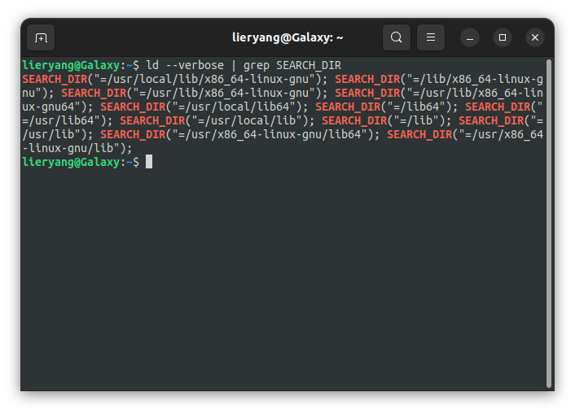
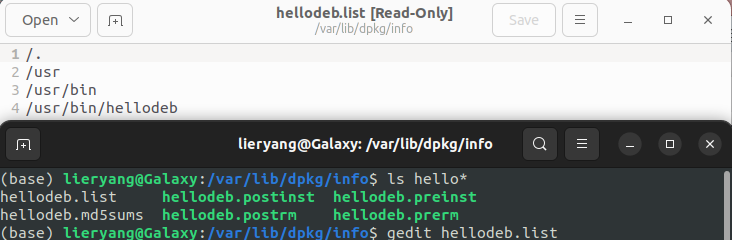
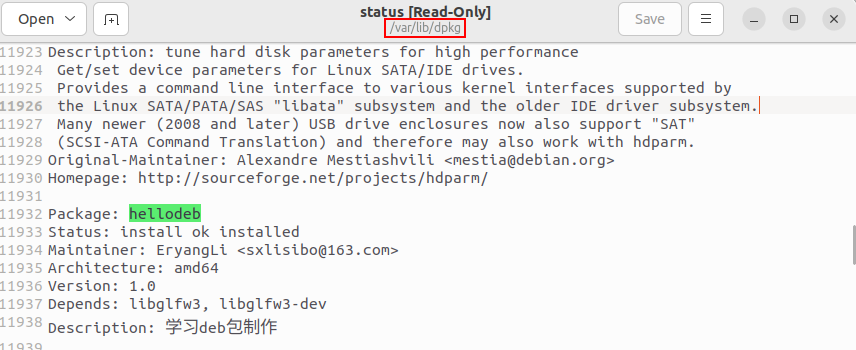

deb文件是包含数据的存档。用于轻松分发和安装Linux Debian及其衍生发行版适合的程序。当您的应用程序需要处理其他依赖项、将自身与桌面集成、运行安装前和安装后脚本等时，Deb文件非常方便。（与deb格式功能类似的另一种包格式是Fedora系列发行版常用的rpm文件。）

## 1 deb包命名约定

`<软件名称>_<主版本号>-<修订版本号>_<硬件架构>.deb`

- 软件包名称： `libglfw3`

- 主版本号： `3.3.6`

- 修订版本号： `1`

- 硬件架构：`amd64`

https://www.cnblogs.com/davis12/p/14365981.html

https://doc.embedfire.com/lubancat/build_and_deploy/zh/latest/linux_basis/make_pakage_of_deb/make_pakage_of_deb.html

https://www.51cto.com/article/779736.html