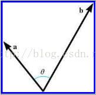
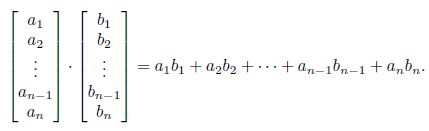
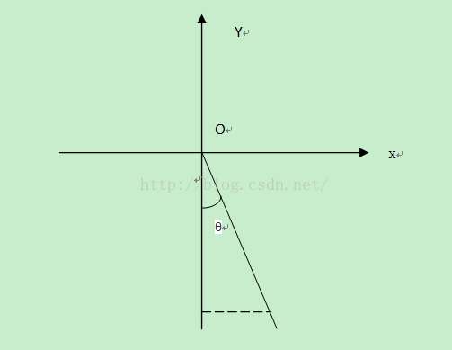
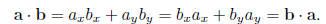
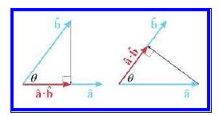
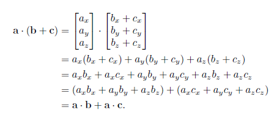
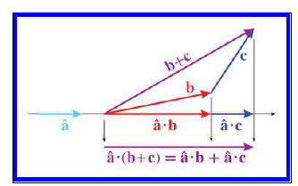
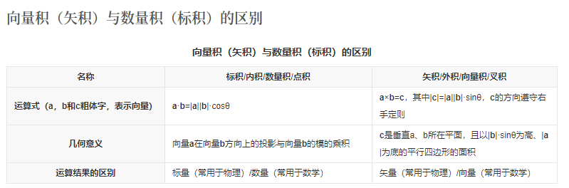

## 1 向量点乘
### 1.1 向量点乘公式推导和几何解释

<font color="red">
一般来说，点乘结果描述了两个向量的“相似”程度，点乘结果越大，两向量越相近。
</font>



#### 1.1.1 向量点乘(dot product)是其各个分量乘积的和，公式：



用连加号写：


#### 1.1.2 几何解释

点乘的结果是一个标量，等于向量大小与夹角的cos值的乘积。

`a•b = |a||b|cosθ`

如果a和b都是单位向量，那么点乘的结果就是其夹角的cos值。

`a•b = cosθ`

#### 1.1.3 推导过程

假设a和b都是二维向量，θ1是a与x轴的夹角，θ2是b与x轴的夹角，向量a与b的夹角θ等于θ1 - θ2

```sh
a•b = ax*bx + ay*by 

=  (|a|*sinθ1) * (|b| * sinθ2) +   (|a| * cosθ1) * (|b| * cosθ2)

= |a||b|(sinθ1*sinθ2 + cosθ1*cosθ2)

= |a||b|(cos(θ1-θ2))

= |a||b|cosθ
```



### 1.2 点乘交换率和分配率的推导

#### 1.2.1 交换律





#### 1.2.2 分配律





## 2 向量叉乘


