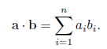

## 1 向量点乘
### 1.1 向量点乘公式推导和几何解释

<font color="red">
一般来说，点乘结果描述了两个向量的“相似”程度，点乘结果越大，两向量越相近。
</font>


#### 1.1.1 向量点乘(dot product)是其各个分量乘积的和，公式：


用连加号写：



#### 1.1.2 几何解释

点乘的结果是一个标量，等于向量大小与夹角的cos值的乘积。

`a•b = |a||b|cosθ`

如果a和b都是单位向量，那么点乘的结果就是其夹角的cos值。

`a•b = cosθ`

#### 1.1.3 推导过程

假设a和b都是二维向量，θ1是a与x轴的夹角，θ2是b与x轴的夹角，向量a与b的夹角θ等于θ1 - θ2

```sh
a•b = ax*bx + ay*by 

=  (|a|*sinθ1) * (|b| * sinθ2) +   (|a| * cosθ1) * (|b| * cosθ2)

= |a||b|(sinθ1*sinθ2 + cosθ1*cosθ2)

= |a||b|(cos(θ1-θ2))

= |a||b|cosθ
```


### 1.2 点乘交换率和分配率的推导

#### 1.2.1 交换律


#### 1.2.2 分配律


## 2 向量叉乘


我们再次走到一起，应该都是感到以前那段感情抱有遗憾吧。我心里认为：我们的感情很纯粹，没有任何目的性，是发自内心的喜欢。这几次吵架，你说了很多次，我在装，我在骗你。我说我没什么，可是好像在你视角里看来，我说的话都是装的，都是在骗你。我恼羞成怒不是因为我无理，是对你说的话感到深深的不满。我如果要装，要去骗，为什么要选择你，你觉得你好骗，可是并不是那样。我想和你认真的用心的去相爱，你几次这样说我，还感觉我的行为廉价，可我也在自己能做的范围内去做，这样一次次的说，我也开始无法接受，我也感到委屈啊。

这次在一起，我确实比同龄人落后的很多。我觉得这只是表面上落后大部分人很多吧。一直很优秀的那部分人，他们一直也在更努力珍惜时间的学，我们这样圈子，可能还没有接触到多少那样优秀的人，和那部分人比起来，我可能一辈子都无法追上，因为从小到大我已经浪费了很多很多时间。但是我想比大部分普通人优秀那么一点，我也开始去做，去学，我想做别人没做过的事情，我想自己做的东西有我自己的创新性，这就需要大量的基础知识，如果没有扎实的基础知识，根本无法构造出新的创新点。

我也知道这次在一起你压力很大，我想我能多忍让你一些，不要对不起你。可是我发现我也接受不了，你数落的我一无是处，以及我对这份感情满是虚情假意。其实我也很难过，很不开心，可你从来看到的只是我笑哈哈的一面，所以你可能感到我从来不会难过。

上大学以来，我从来没有想过我要做一个一无是处的人。去年虚度的时光，是因为我没有什么压力去攒钱买车买房，因为我就没打算找对象，那些东西对我来说也并不着急。那时心想，既然不找对象，不着急结婚，我也不差这一年时间，趁着这一年有空，路上的盘缠勉强也够，我去忘掉忧愁和烦恼的乌托邦（音乐节）和我喜欢很多年却一直没有去尝试的滑雪。其实这一年里时常会想起你，以及我们的遗憾。我也不喜欢你说，我给你画的都是大饼，我也是根据自己能不能做到，我的知识最低能变现多少去和你说的。和你再在一起后，我知道你没有安全感，我也没有底气去你家，我慢慢的调整状态，把我学过的东西重新整理，重新想办法变现。让我们的生活能好一些。

你工作后应该能够理解挣钱并没有那么容易，辛苦工作一个月，可能还不够日常开销，如果没有特别优秀的产品，别人凭什么给你钱。所以人生起起伏伏，我不放弃每天变好一点。即使现在我看起来比别人差，我也要把我想做的做完，十年饮冰，难凉热血。我从来也不怕失败，你看不起我，但我自己看得起自己，人活着，困难肯定在。

你来之后，你好像过得也并不舒心，如果你真的感到我这里委屈很大，离开我会好一些，你收到短信就不要回复了，这不是我的手机。东西如有需要，我打包后会给你寄过去。