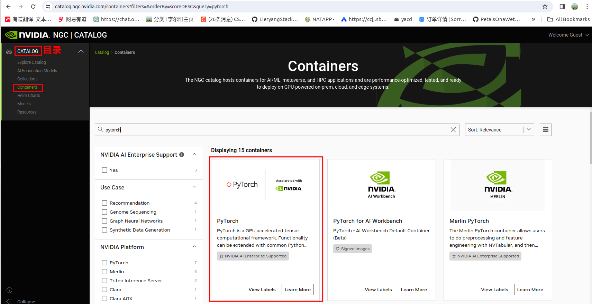
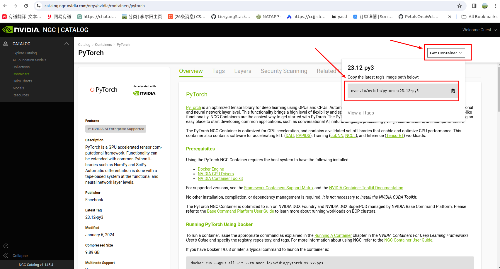
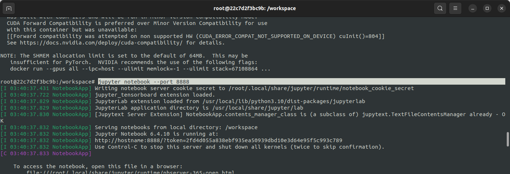
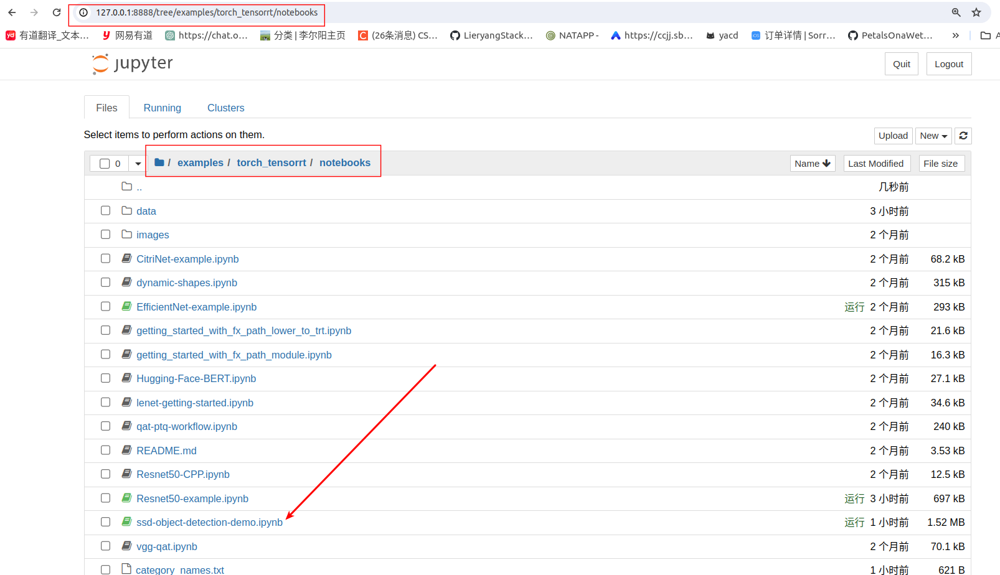
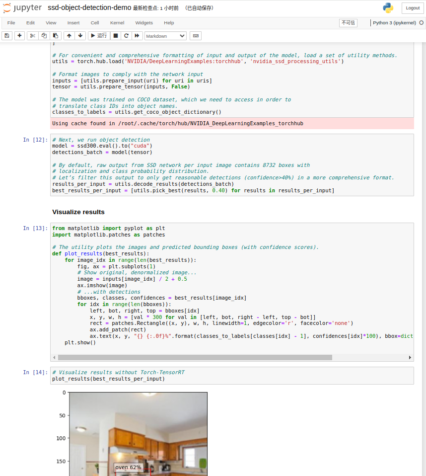
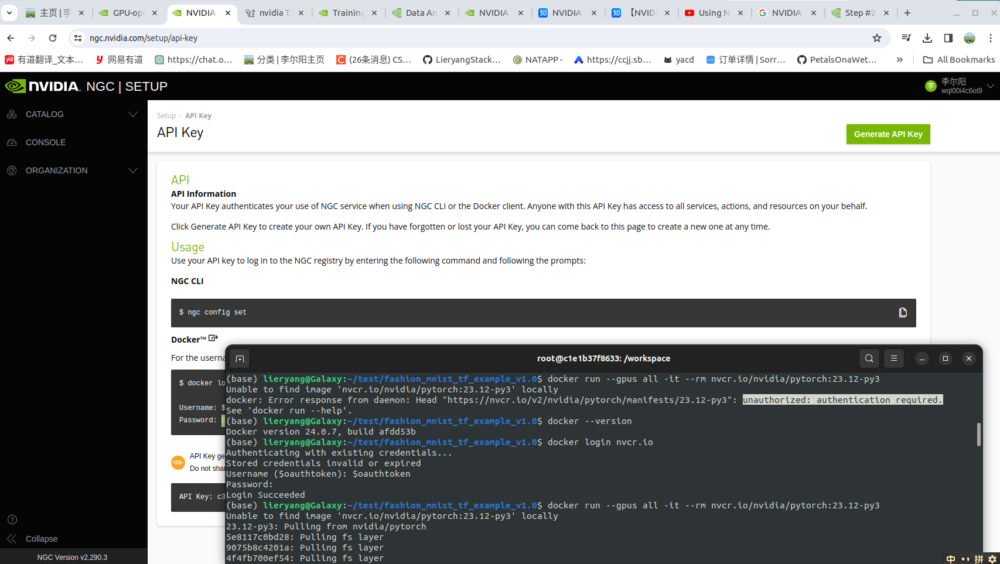

NGC，全称 NVIDIA GPU Cloud，是一款基于GPU加速，用于深度学习和高性能计算的<font color='red'>容器</font>。

## 1 Pytorch



官网的概述中提供了两种运行方式：

1. 使用Docker容器运行
2. 使用ngc命令运行

我这里先学习第一种容器方式运行：

### 1.1 使用Docker运行PyTorch



```sh
sudo docker run --gpus all -it -p 8888:8888 nvcr.io/nvidia/pytorch:23.12-py3
```

- **--gpus all**：这个选项告诉 Docker 在容器中启用所有可用的 GPU 设备。这使容器可以利用所有的 GPU 进行计算。
- **-it**：这两个选项结合在一起，表示以交互式模式运行容器，并将终端连接到容器的标准输入、输出和错误。（其中-i表示将标准输入连接到容器的终端，-t表示为容器分配一个伪终端）
- **-p选项**：选项用于指定将容器内部的端口映射到主机上的端口。（为了使用Jupter notebook）

### 1.2 运行Jupter Notebook

1. 运行 `jupyter notebook --port 8888`


2. 网页打开Jupter Notebook



3. 使用目标检测SSD示例



## 2 相关错误问题

### 2.1 authentication required错误

重新 `docker login nvcr.io`



