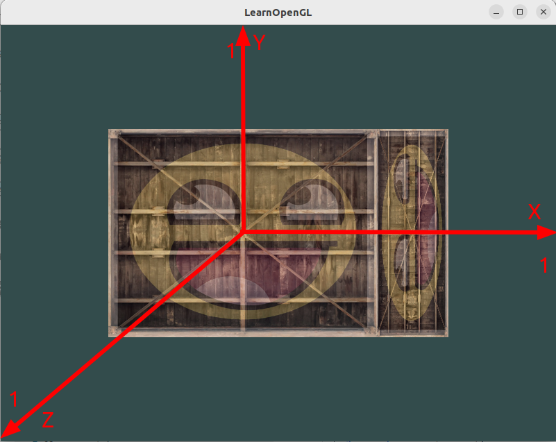
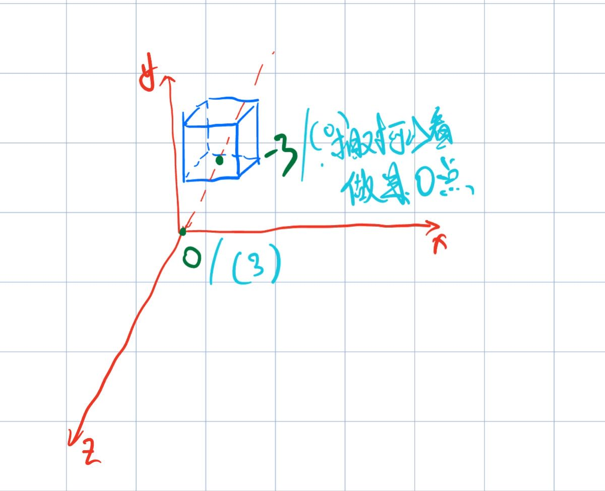
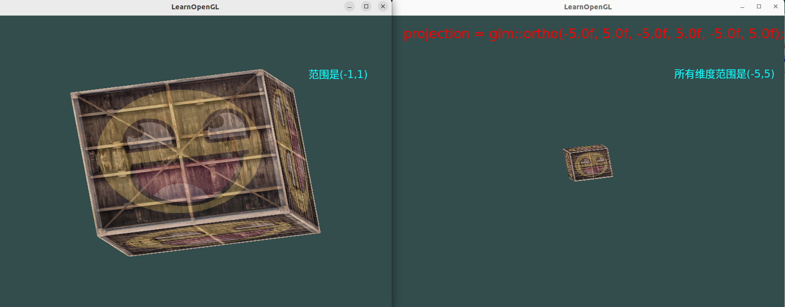

## 1 数学知识

### 1.1 单位矩阵

在OpenGL中，由于某些原因我们通常使用4×4的变换矩阵，而其中最重要的原因就是大部分的向量都是4分量的。我们能想到的最简单的变换矩阵就是`单位矩阵(Identity Matrix)`。单位矩阵是一个除了对角线以外都是0的N×N矩阵。在下式中可以看到，这种变换矩阵使一个向量完全不变：

注意：向量在矩阵的右侧

### 1.2 缩放

对(x, y)坐标继续缩放，比如x轴坐标缩小一半，y轴坐标放大一倍，向量`v¯`缩放后`s¯`如图所示：

上面这种缩放操作是`不均匀缩放`，因为每个轴的缩放因子不一样。如果每个轴的缩放因子都一样那么就叫`均匀缩放`。

如果我们把缩放变量表示为(S1,S2,S3)，我们可以为任意向量(x,y,z)定义一个缩放矩阵：

注意，第四个缩放向量仍然是1，因为在3D空间中缩放w分量是无意义的。w分量另有其他用途，在后面我们会看到。

### 1.3 位移

位移(Translation)是在原始向量的基础上加上另一个向量从而获得一个在不同位置的新向量的过程，从而在位移向量基础上移动了原始向量。我们已经讨论了向量加法，所以这应该不会太陌生。

和缩放矩阵一样，在4×4矩阵上有几个特别的位置用来执行特定的操作，对于位移来说它们是第四列最上面的3个值。如果我们把位移向量表示为`(Tx,Ty,Tz)`
，我们就能把位移矩阵定义为：

向量（x，y，z，w）如果没有`w`行，位移值就没有地方可乘可加了。

### 1.4 旋转

在3D空间中旋转需要定义一个角和一个旋转轴(Rotation Axis)。物体会沿着给定的旋转轴旋转特定角度。

旋转矩阵需要指定旋转轴`(Rx,Ry,Rz)`和旋转角度 `θ`。

### 1.5 矩阵的组合