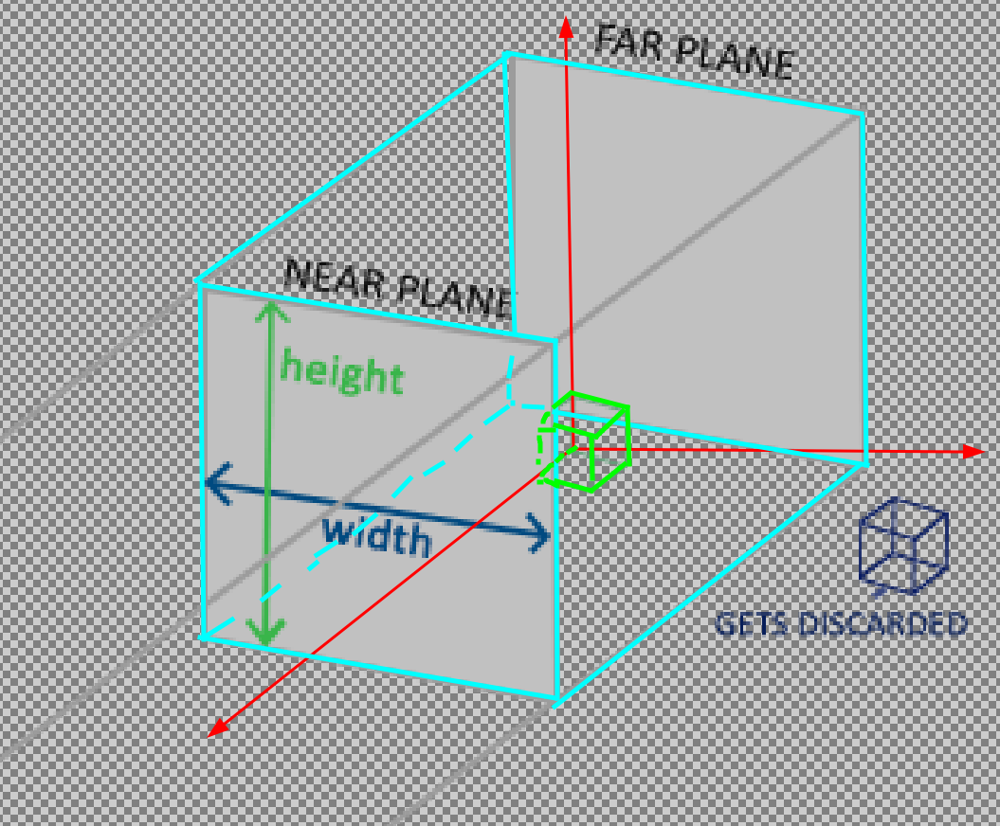

## 1 数学知识

### 1.1 单位矩阵

在OpenGL中，由于某些原因我们通常使用4×4的变换矩阵，而其中最重要的原因就是大部分的向量都是4分量的。我们能想到的最简单的变换矩阵就是`单位矩阵(Identity Matrix)`。单位矩阵是一个除了对角线以外都是0的N×N矩阵。在下式中可以看到，这种变换矩阵使一个向量完全不变：

<font color="red">注意：向量在矩阵的右侧</font>


### 1.2 缩放

对(x, y)坐标继续缩放，比如x轴坐标缩小一半，y轴坐标放大一倍，向量`v¯`缩放后`s¯`如图所示：


上面这种缩放操作是`不均匀缩放`，因为每个轴的缩放因子不一样。如果每个轴的缩放因子都一样那么就叫`均匀缩放`。

<font color="color">
如果我们把缩放变量表示为(S1,S2,S3)，我们可以为任意向量(x,y,z)定义一个缩放矩阵：
</font>


注意，第四个缩放向量仍然是1，因为在3D空间中缩放w分量是无意义的。w分量另有其他用途，在后面我们会看到。

### 1.3 位移

位移(Translation)是在原始向量的基础上加上另一个向量从而获得一个在不同位置的新向量的过程，从而在位移向量基础上移动了原始向量。我们已经讨论了向量加法，所以这应该不会太陌生。

和缩放矩阵一样，在4×4矩阵上有几个特别的位置用来执行特定的操作，对于位移来说它们是第四列最上面的3个值。如果我们把位移向量表示为`(Tx,Ty,Tz)`
，我们就能把位移矩阵定义为：


向量（x，y，z，w）如果没有`w`行，位移值就没有地方可乘可加了。



### 1.4 旋转

在3D空间中旋转需要定义一个角和一个旋转轴(Rotation Axis)。物体会沿着给定的旋转轴旋转特定角度。


旋转矩阵需要指定旋转轴`(Rx,Ry,Rz)`和旋转角度 `θ`。


### 1.5 矩阵的组合

<font color="red">矩阵的乘法是不遵守交换律的，这意味着它们的顺序很重要。在最后边的矩阵是第一个与向量相乘的，所以你应该从右向左读这个乘法。</font>

所以建议：

1. 先进行缩放操作。
2. 进行旋转操作。
3. 最后再进行位移操作。

`trans = 位移 x 旋转 x 缩放` 

## 2 实践

我们已经了解了背后的所有理论，OpenGL没有自带任何的矩阵和向量知识，所以我们必须定义自己的数学类和函数。幸运的是，有个易于使用，专门为OpenGL量身定做的数学库，那就是 `GLM`。

GLM是OpenGL Mathematics的缩写，它是一个只有头文件的库，也就是说我们只需包含对应的头文件就行了，不用链接和编译。GLM可以在它们的网站上下载。把头文件的根目录复制到你的includes文件夹，然后你就可以使用这个库了。

<font color="red">
GLM库从0.9.9版本起，默认会将矩阵类型初始化为一个零矩阵（所有元素均为0），而不是单位矩阵（对角元素为1，其它元素为0）。所以需要初始化：
</font>

```cpp
glm::mat4 mat = glm::mat4(1.0f)
```

### 2.1 glm小练习

我们来看看是否可以利用我们刚学的变换知识把一个向量(1, 0, 0)位移(1, 1, 0)个单位。

```cpp
#include "glm/glm.hpp"
#include "glm/gtc/matrix_transform.hpp"
#include "glm/gtc/type_ptr.hpp"
#include <iostream>


int 
main(int argc, char const *argv[]) {

  /* 新建一个向量变量 vec，该向量齐次坐标设定为 1.0 */
  glm::vec4 vec(1.0f, 0.0f, 0.0f, 1.0f);
  /* 初始化4x4单位矩阵 */
  glm::mat4 trans = glm::mat4(1.0f);

  /* 通过单位矩阵，创建位移变化矩阵 */
  trans = glm::translate(trans, glm::vec3(1.0f, 1.0f, 0.0f));

  /* 矩阵相乘，此时称号操作符已经重载 */
  vec = trans * vec;

  printf ("(%0.2f, %0.2f, %0.2f)\n", vec.x, vec.y, vec.z);

  return 0;
}
```
