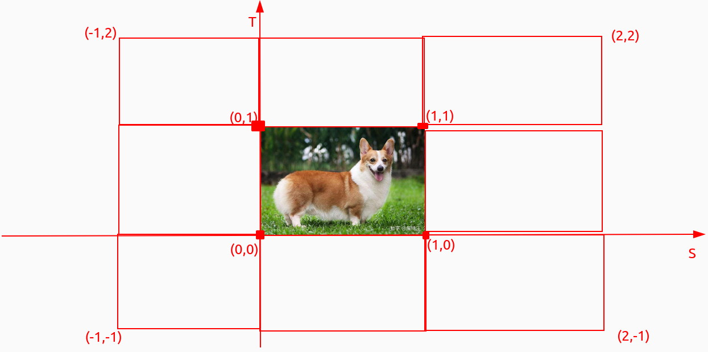

## 世界空间

如果我们将我们所有的物体导入到程序当中，它们有可能会全挤在世界的原点(0, 0, 0)上，这并不是我们想要的结果。我们想为每一个物体定义一个位置，从而能在更大的世界当中放置它们。世界空间中的坐标正如其名：是指顶点相对于（游戏）世界的坐标。如果你希望将物体分散在世界上摆放（特别是非常真实的那样），这就是你希望物体变换到的空间。物体的坐标将会从局部变换到世界空间；该变换是由模型矩阵(Model Matrix)实现的。

模型矩阵是一种变换矩阵，它能通过对物体进行位移、缩放、旋转来将它置于它本应该在的位置或朝向。你可以将它想像为变换一个房子，你需要先将它缩小（它在局部空间中太大了），并将其位移至郊区的一个小镇，然后在y轴上往左旋转一点以搭配附近的房子。你也可以把上一节将箱子到处摆放在场景中用的那个矩阵大致看作一个模型矩阵；我们将箱子的局部坐标变换到场景/世界中的不同位置。

## 观察空间

观察空间经常被人们称之OpenGL的摄像机(Camera)（所以有时也称为摄像机空间(Camera Space)或视觉空间(Eye Space)）。观察空间是将世界空间坐标转化为用户视野前方的坐标而产生的结果。因此观察空间就是从摄像机的视角所观察到的空间。而这通常是由一系列的位移和旋转的组合来完成，平移/旋转场景从而使得特定的对象被变换到摄像机的前方。这些组合在一起的变换通常存储在一个观察矩阵(View Matrix)里，它被用来将世界坐标变换到观察空间。在下一节中我们将深入讨论如何创建一个这样的观察矩阵来模拟一个摄像机。